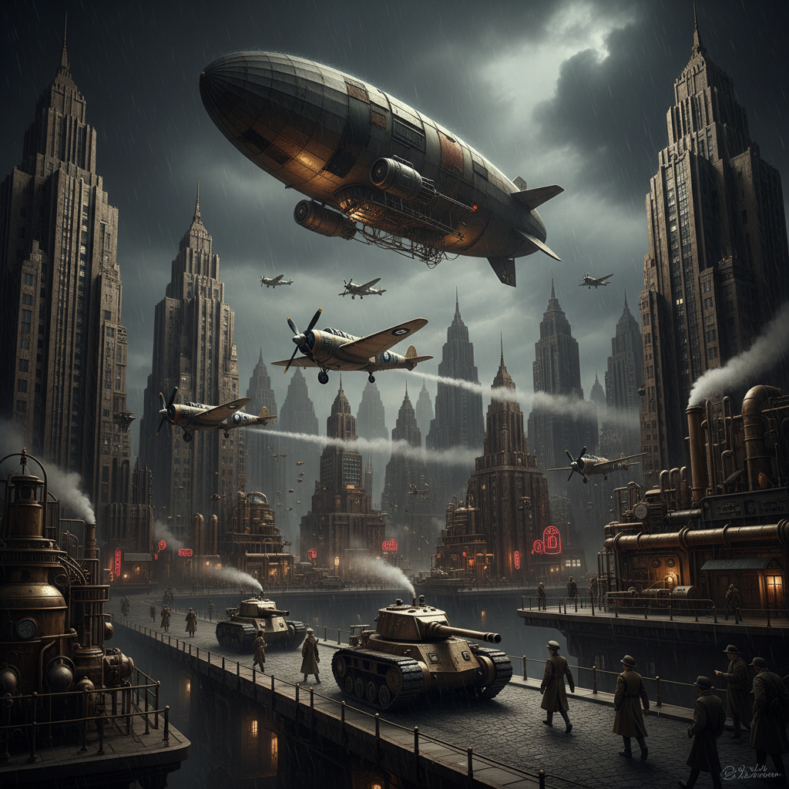

# Dieselpunk 柴油朋克



> **"Art Deco 的流线型飞机、二战时期的铆钉坦克——一个永远停在1940年代的平行世界。"**

## 概述

| 维度 | 描述 |
|------|------|
| 时期 | 2000s 命名 / 1920s–1950s 设定 |
| 别名 | Dieselpunk, Decopunk, Atompunk (部分重叠) |
| 核心色彩 | 军绿、铁灰、铆钉银、Art Deco 金、深红 |
| 关键元素 | 螺旋桨飞机、铆钉装甲、Art Deco 建筑、柴油引擎 |
| 代表人物 | Fritz Lang《大都会》、Sky Captain、Bioshock |
| 关联风格 | Steampunk, Retrofuturism, Art Deco, Military |

---

## 历史脉络

### 命名与定义

"Dieselpunk" 一词在 2001 年由游戏设计师 Lewis Pollak 创造，用来描述一种设定在**两次世界大战之间到冷战初期**的复古未来主义：

| 对比 | Steampunk | Dieselpunk |
|------|-----------|------------|
| 时代 | 维多利亚 (1837–1901) | 战间期–冷战 (1920–1955) |
| 动力 | 蒸汽 | 柴油/内燃机 |
| 美学 | 黄铜+齿轮 | 铆钉+流线型 |
| 建筑 | 哥特复兴 | Art Deco |
| 情绪 | 浪漫/探险 | 硬朗/战争 |

### 两种子类型

| 类型 | 描述 |
|------|------|
| **Ottensian** (乐观) | Art Deco 的黄金时代、爵士乐、摩天大楼 |
| **Piecraftian** (暗黑) | 二战的机械恐怖、极权主义、工业废墟 |

### 文化基因

| 来源 | 贡献 |
|------|------|
| Fritz Lang《大都会》(1927) | 机械城市的视觉原型 |
| Art Deco 运动 | 几何装饰、流线型设计 |
| 二战军事装备 | 坦克、战斗机、军服 |
| 黑色电影 (Film Noir) | 暗影、侦探、城市夜景 |
| 1930s 科幻杂志封面 | 复古未来主义插画 |

---

## 视觉语法

### 色彩系统

```
主色：
  军绿 (#4B5320) — 军事装备
  铁灰 (#434343) — 金属、机械
  Art Deco 金 (#CFB53B) — 装饰、建筑
  深红 (#8B0000) — 旗帜、危险
  黑色 (#000000) — 阴影、权力

辅色：
  铆钉银 (#C0C0C0) — 铆钉、飞机蒙皮
  皮革棕 (#8B4513) — 飞行员夹克
  天空蓝 (#4682B4) — 天空、海洋

质感：
  铆钉金属 — 飞机、坦克
  皮革 — 飞行员装备
  Art Deco 几何 — 建筑装饰
  油污/锈迹 — 机械
  烟雾/蒸汽 — 工厂、战场
```

### 标志性元素

| 类别 | 元素 |
|------|------|
| 交通 | 螺旋桨飞机、齐柏林飞艇、蒸汽火车、老爷车 |
| 军事 | 铆钉坦克、机枪、军服、钢盔 |
| 建筑 | Art Deco 摩天楼、工厂烟囱、地下城市 |
| 服装 | 飞行员夹克、军大衣、礼帽、吊带裤 |
| 科技 | 巨型机器人、射线枪、机械义肢 |
| 氛围 | 烟雾、霓虹、爵士乐、黑色电影 |

---

## 与千禧怀旧的关系

### 2000s 的复古未来热潮
- 《Sky Captain and the World of Tomorrow》(2004)
- 《Bioshock》(2007) 的 Art Deco 水下城市
- 《钢铁苍穹》(2012) 的纳粹月球基地
- 这些作品让 Dieselpunk 进入主流视野

---

## 中国语境

- 上海外滩 Art Deco 建筑群
- 民国时期的工业美学
- 《流浪地球》中的重工业视觉
- 军事题材游戏/影视中的机械美学

---

## 设计应用

| 场景 | 应用方式 |
|------|----------|
| 品牌 | Art Deco 字体+金色几何+深色背景 |
| 空间 | 铆钉金属+皮革+Art Deco 装饰 |
| 游戏 | 战间期世界观+巨型机械+地下城市 |
| 时尚 | 飞行员夹克+军装元素+复古配饰 |

---

## 相关风格

← [Steampunk 蒸汽朋克](steampunk.md) | [Cyberpunk 赛博朋克](cyberpunk.md) →

↑ [返回千禧怀旧目录](README.md) | [返回总目录](../README.md)
