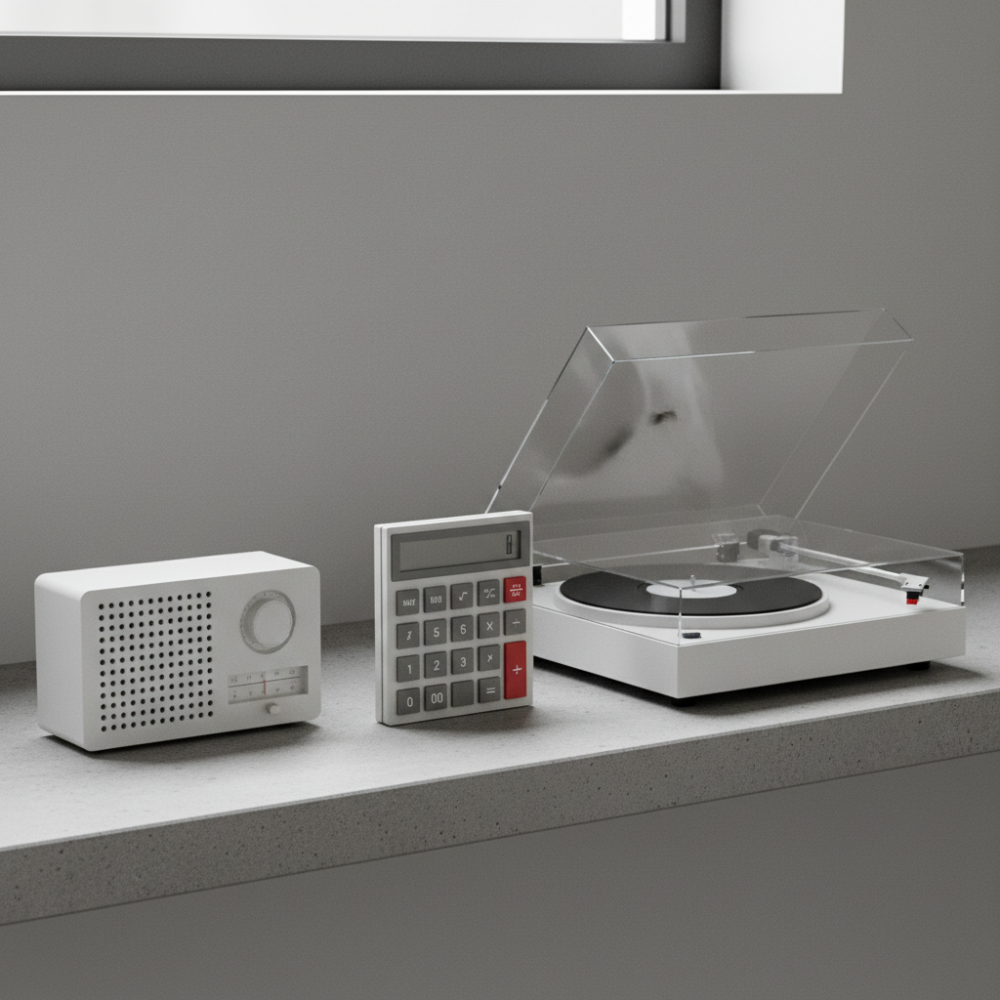

# Dieter Rams 迪特·拉姆斯

> **时期：** 1932–至今  
> **关键词：** 少即是多、博朗设计、十项原则、功能主义

## 概述

Dieter Rams 是德国工业设计师，博朗（Braun）公司首席设计师。他提出的"好设计十项原则"深刻影响了当代设计——从苹果产品到无印良品，几乎所有追求简洁的设计都能追溯到他的理念：好的设计是尽可能少的设计。

## 风格特征

- **极简形式**：去除一切不必要的装饰
- **功能可见**：形式直接表达功能，不隐藏不伪装
- **中性色彩**：白色、灰色、黑色为主，偶尔点缀绿色或橙色
- **网格秩序**：严格的几何网格和对齐
- **持久性**：设计不追随潮流，追求永恒

## 代表作品

- *Braun SK4 唱片机*（1956）
- *Braun T3 收音机*（1958）
- *Vitsœ 606 搁架系统*（1960）
- *Braun ET66 计算器*（1987）

## 概念图

