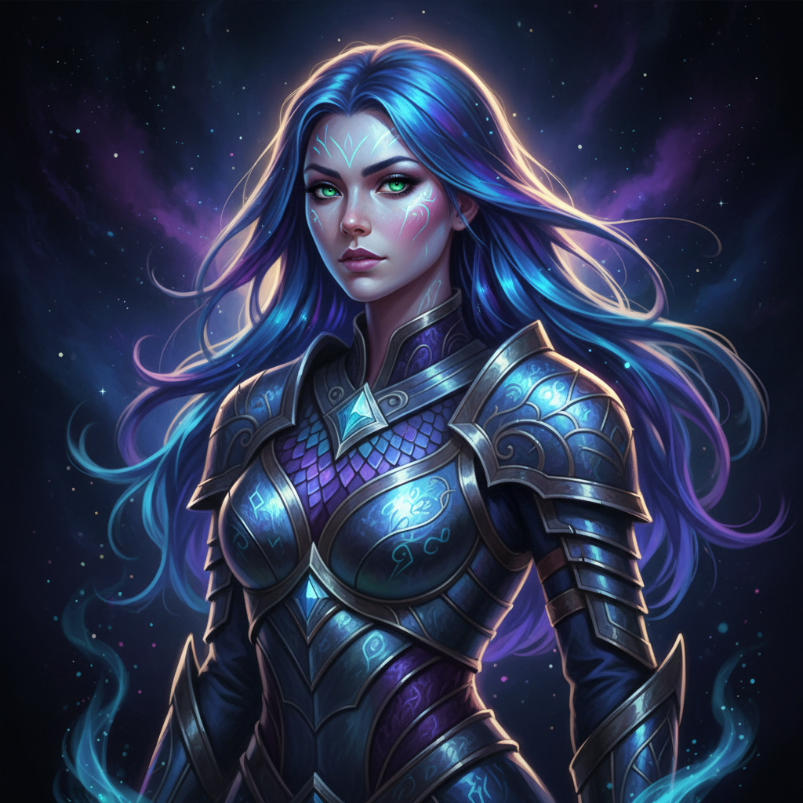

# Digital Art 数字艺术



> **"像素是新的颜料、屏幕是新的画布——无限撤销、无限可能。"**

## 概述

| 维度 | 描述 |
|------|------|
| 时期 | 1960s–至今 |
| 别名 | Digital Art, Computer Art, CG Art, 数字绘画 |
| 核心色彩 | 无限制——RGB全色域 |
| 关键元素 | 数字工具创作、图层/笔刷/滤镜、屏幕展示、无限复制 |
| 代表人物 | Beeple, Android Jones, Loish, Craig Mullins, WLOP |
| 关联风格 | Concept Art, AI Art, Generative Art, Pixel Art, 3D Art |

---

## 历史脉络

| 年份 | 事件 |
|------|------|
| 1963 | Ivan Sutherland "Sketchpad"——第一个图形界面 |
| 1984 | MacPaint——个人电脑绘画 |
| 1990 | Photoshop 1.0 发布 |
| 1995 | Wacom数位板普及——数字绘画专业化 |
| 2000s | DeviantArt——数字艺术社区爆发 |
| 2010s | iPad Pro + Procreate——移动数字绘画 |
| 2021 | Beeple NFT 6900万美元——数字艺术价值认证 |

### 核心哲学

数字艺术的精神是**"工具不定义艺术——创意定义艺术"**：
- 无限 = 自由（"无限撤销、无限图层、无限尝试"）
- 工具 = 民主（"一台电脑 = 一个完整的工作室"）
- 分享 = 社区（"画完立刻全世界可见"）
- 融合 = 未来（"2D+3D+动画+交互——边界消失"）
- "数字不是'假的'——数字是另一种'真的'"

---

## 视觉语法

### 色彩系统

```
无固定规则——RGB全色域可用

数字特有优势：
  精确色彩 — 十六进制精确控制
  无限渐变 — 平滑过渡
  发光效果 — 屏幕自发光
  透明度 — Alpha通道

常见数字美学：
  超饱和 — 屏幕色域
  发光 — 光效、粒子
  精细 — 无限放大
  层叠 — 多图层合成

质感：
  笔刷 — 模拟传统/数字原生
  光效 — 发光、粒子、光线
  材质 — 3D渲染质感
  平滑 — 数字特有的精确
```

### 标志性元素

| 类别 | 元素 |
|------|------|
| 工具 | Photoshop, Procreate, Clip Studio, Blender |
| 技法 | 图层、笔刷、蒙版、滤镜、3D辅助 |
| 类型 | 插画、概念艺术、角色设计、环境设计 |
| 展示 | 屏幕、投影、VR、AR、NFT |
| 社区 | ArtStation, DeviantArt, Behance, Instagram |
| 态度 | 专业、精细、无限可能、持续学习 |

---

## 与千禧怀旧的关系

### 从"不是真正的艺术"到主流
- 2000s: "数字画不算真正的画"
- 2020s: 数字艺术 = 商业艺术的主流
- DeviantArt 一代 = 千禧一代的艺术启蒙
- "我们这一代人是在屏幕上学会画画的"

### NFT与数字艺术的价值
- Beeple 6900万 = 数字艺术"值钱"的证明
- "数字艺术终于有了'原作'的概念——虽然这个概念本身很荒谬"
- 数字艺术的价值争论 = 当代艺术最热门的话题

---

## 中国语境

- 中国数字艺术教育和产业
- 中国CG艺术家在全球的影响力
- 中国游戏/影视产业对数字艺术的需求
- 中国数字艺术平台和社区

---

## 设计应用

| 场景 | 应用方式 |
|------|----------|
| 游戏 | 概念艺术+角色+环境+UI |
| 影视 | 概念设计+数字绘景+特效 |
| 品牌 | 插画+视觉+社交媒体+营销 |
| 出版 | 封面+插图+漫画+绘本 |

---

## 相关风格

← [Concept Art 概念艺术](concept-art.md) | [AI Art 人工智能艺术](ai-art.md) →

↑ [返回千禧怀旧目录](README.md) | [返回总目录](../README.md)
