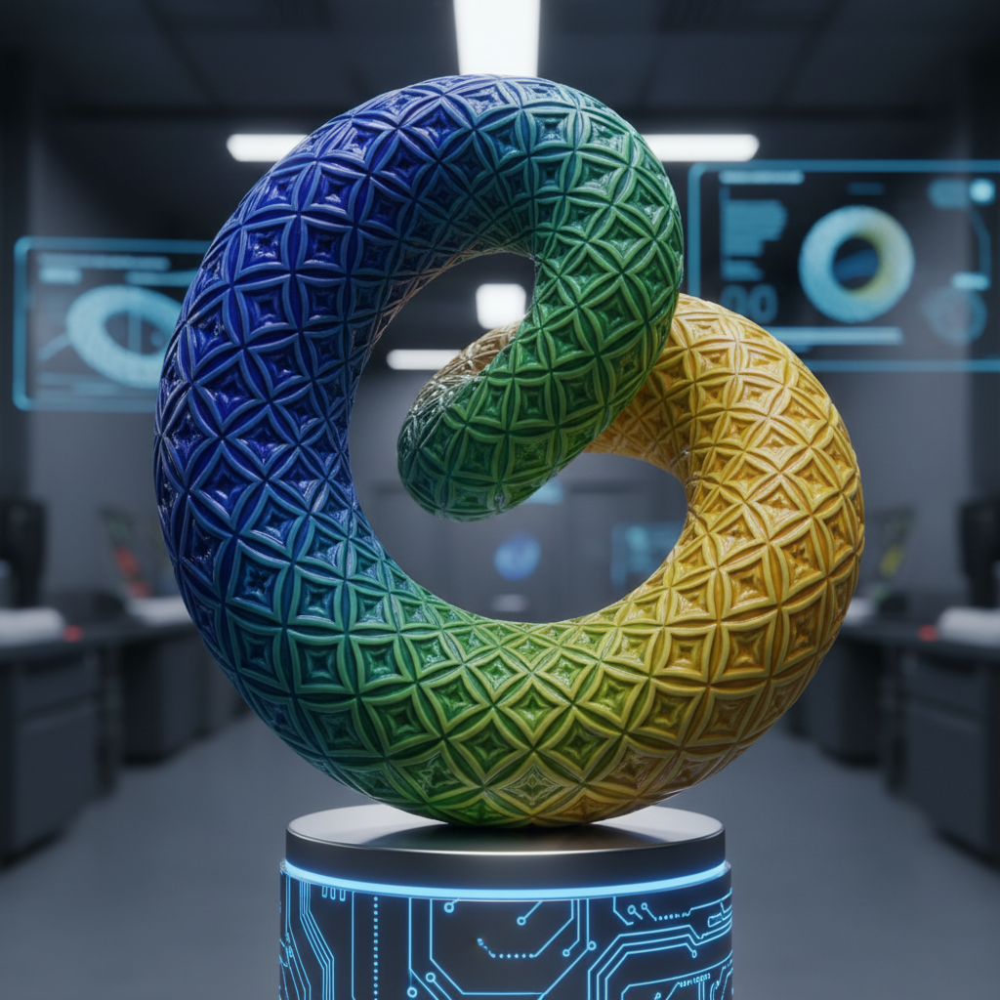

# Digital Ceramic Art 数字陶瓷艺术

> "The screen becomes the wheel, the algorithm becomes the glaze — but the fire remains eternal." — Digital ceramics movement

## 概述

数字陶瓷艺术（Digital Ceramic Art）是将数字技术全面融入陶瓷创作过程的当代艺术实践。数字陶瓷不仅包括3D打印——它涵盖了从数字设计、CNC雕刻、激光切割、数字釉料配方、数字窑炉控制到虚拟现实陶艺体验的整个数字化陶瓷生态系统。

数字陶瓷艺术的兴起反映了21世纪陶瓷领域的根本性变革——数字工具不再仅仅是辅助手段，而是成为了创作思维和美学表达的核心。参数化设计允许陶艺家探索无限的形态变化；数字釉料模拟可以在烧制前预测釉面效果；CNC技术可以在陶瓷表面雕刻出极其精细的图案；数字窑炉控制系统可以精确管理烧成曲线。这些技术的综合应用正在重新定义"陶瓷"的边界。

数字陶瓷艺术的核心要素包括：1）参数化设计——算法驱动的形态探索；2）数字制造——CNC、激光、3D打印等制造技术；3）数字釉料——计算机辅助的釉料配方和模拟；4）智能窑炉——数字控制的烧成系统；5）虚拟陶艺——VR/AR中的陶艺体验；6）数据驱动——传感器和数据分析的应用；7）跨学科融合——艺术、科学、工程的交叉。

## 核心特征

| 特征 | 描述 |
|------|------|
| 参数化设计 | 算法驱动形态探索 |
| 数字制造 | CNC激光3D打印制造 |
| 数字釉料 | 计算机辅助釉料配方 |
| 智能窑炉 | 数字控制烧成系统 |
| 虚拟陶艺 | VR/AR陶艺体验 |
| 跨学科融合 | 艺术科学工程交叉 |

## 视觉特征

- **精确几何**：数学精确的几何形态
- **复杂表面**：CNC雕刻的精细表面
- **渐变釉色**：数字控制的精确渐变
- **重复图案**：算法生成的重复图案
- **混合媒介**：陶瓷与电子元件的结合
- **交互表面**：响应触摸或环境的陶瓷

## 代表作品

| 作品 | 年代 | 意义 |
|------|------|------|
| *Michael Eden数字花瓶* | 2010年代 | 传统与数字融合 |
| *Nervous System陶瓷* | 2012至今 | 算法设计 |
| *Del Harrow CNC陶瓷* | 2010年代 | CNC雕刻 |
| *Glithero釉料实验* | 2010年代 | 数字釉料 |
| *景德镇数字陶瓷中心* | 2015至今 | 中国数字陶瓷 |
| *MIT Mediated Matter* | 2010年代 | 跨学科研究 |

## 历史时间线

| 时期 | 事件 |
|------|------|
| 1990年代 | 早期CAD在陶瓷设计中的应用 |
| 2000年代 | CNC技术进入陶瓷工作室 |
| 2010年代 | 3D打印和参数化设计普及 |
| 2015年 | VR陶艺应用出现 |
| 2018年 | AI辅助陶瓷设计 |
| 当代 | 全面数字化陶瓷生态 |

## 中国语境

中国在数字陶瓷领域正在快速发展。景德镇陶瓷大学等机构已经建立了数字陶瓷实验室——探索将中国传统制瓷工艺与数字技术相结合。中国在5G、AI、物联网等数字技术方面的优势为数字陶瓷的发展提供了独特的技术基础。数字釉料配方系统可以帮助保存和传承中国传统釉料的配方知识——将老师傅的经验转化为可量化、可重复的数字配方。智能窑炉控制系统可以精确复制传统柴烧的温度曲线——在保持传统美学效果的同时提高可控性和成功率。数字陶瓷为中国陶瓷产业的升级转型提供了重要的技术路径。

## 概念图

## 与其他风格的关系

- **Ceramic 3D Printing** → 陶瓷3D打印（子领域）
- **Parametric Design** → 参数化设计
- **New Media Art** → 新媒体艺术
- **Computational Art** → 计算艺术
- **Studio Pottery** → 工作室陶艺（传统对照）
- **Industrial Ceramics** → 工业陶瓷

---

*浮光艺志 | Chronicle of Artistry*
