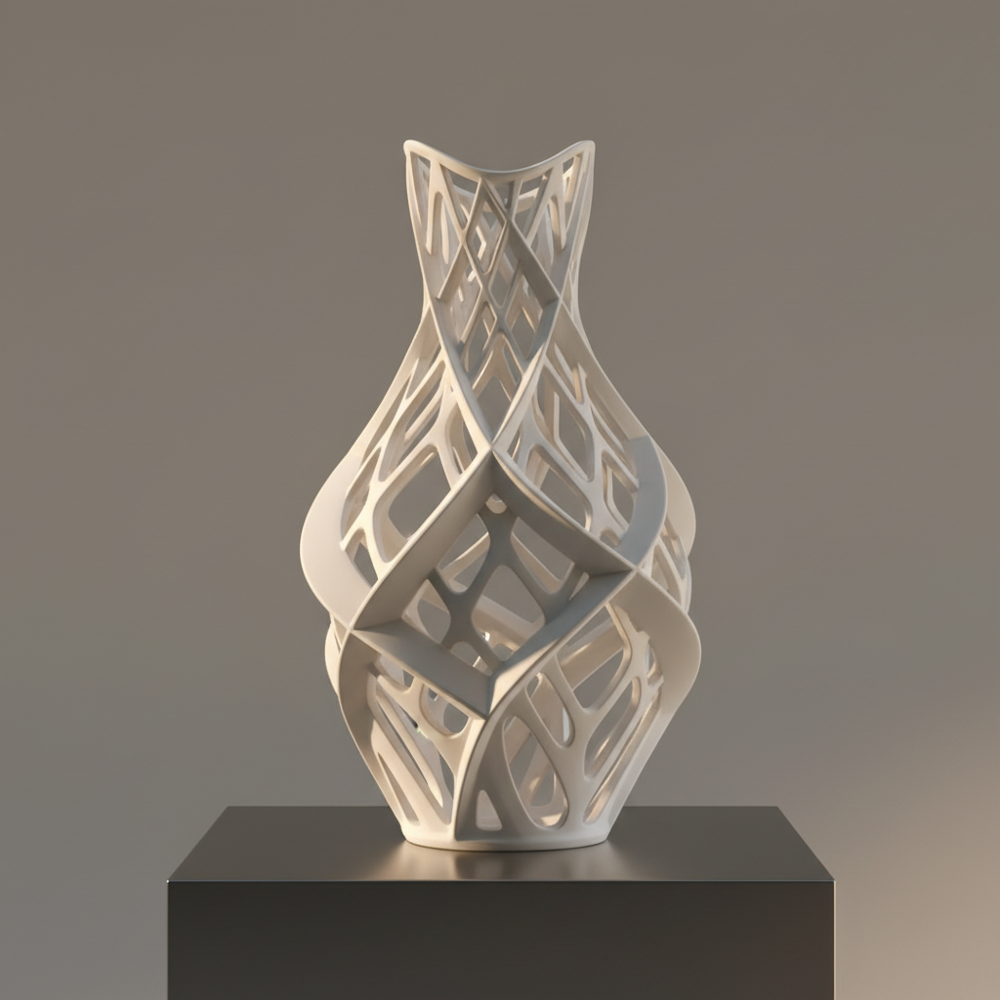

# Digital Ceramics Art 数字陶瓷艺术

> "Digital ceramics is the screen made solid — virtual forms designed in software, tested in simulation, refined through algorithms, then materialized through CNC milling, robotic extrusion, or laser sintering into objects that carry the precision of computation and the warmth of fired earth, the digital and the analog meeting at the boundary where data becomes dust and dust becomes art." — Unknown

## 概述

数字陶瓷艺术（Digital Ceramics Art）是一种将数字技术——计算机辅助设计（CAD）、参数化建模、算法生成、虚拟现实、数字制造等——与陶瓷创作结合的当代艺术形式。数字陶瓷不仅包括3D打印，还包括CNC雕刻、激光切割、数字釉料配方、虚拟陶瓷体验等多种形式。数字陶瓷艺术探索的是数字世界与物质世界之间的转化关系。

数字陶瓷艺术的核心要素包括：1）数字设计——计算机辅助的设计过程；2）算法生成——通过算法生成形态；3）数字制造——CNC、3D打印等数字制造；4）虚实转化——数字模型到物质器物的转化；5）参数化——可调参数的设计系统；6）数据可视化——将数据转化为陶瓷形态；7）人机协作——人类创意与机器精度的结合。

## 核心特征

| 特征 | 描述 |
|------|------|
| 数字设计 | 计算机辅助设计 |
| 算法生成 | 算法驱动的形态生成 |
| 数字制造 | 多种数字制造方式 |
| 虚实转化 | 数字到物质的转化 |
| 参数化 | 可调参数的设计系统 |
| 人机协作 | 人与机器的创意协作 |

## 视觉特征

- **数学曲面**：精确的数学曲面
- **参数化形态**：参数驱动的有机形态
- **精密细节**：机器精度的细节
- **重复变异**：系统性的重复与变异
- **数据映射**：数据转化的视觉形态
- **未来感**：科技感的视觉效果

## 代表作品

| 作品 | 艺术家/文化 | 年代 | 意义 |
|------|-------------|------|------|
| *Michael Eden作品* | Michael Eden | 当代 | 数字陶瓷先驱 |
| *Jonathan Keep作品* | Jonathan Keep | 当代 | 算法陶瓷 |
| *Del Harrow作品* | Del Harrow | 当代 | CNC陶瓷雕刻 |
| *中国数字陶瓷* | 中国陶艺家 | 当代 | 中国数字陶瓷探索 |
| *当代数字陶瓷* | 各地艺术家 | 当代 | 数字陶瓷的多元实践 |

## 历史时间线

| 时期 | 事件 |
|------|------|
| 1990年代 | CAD开始应用于陶瓷设计 |
| 2000年代 | CNC雕刻在陶瓷中的应用 |
| 2010年代 | 3D打印陶瓷的普及 |
| 2015年后 | 参数化和算法陶瓷的发展 |
| 当代 | AI辅助陶瓷设计的探索 |

## 中国语境

中国在数字陶瓷领域正在快速发展——景德镇陶瓷大学、清华大学美术学院等机构都在积极探索数字技术与陶瓷的结合。中国的陶瓷产业——特别是建筑陶瓷和日用陶瓷——已经大量采用数字化设计和制造技术。中国年轻陶艺家对数字陶瓷表现出极大的热情——他们将中国传统陶瓷的美学基因（如青花图案、器形比例）输入算法，让计算机生成具有中国文化DNA的新形态。中国的数字陶瓷探索体现了一个古老陶瓷文明如何在数字时代找到新的表达方式。

## AI生成概念图

## 与其他风格的关系

- **3D Printed Ceramics** → 3D打印陶瓷
- **Parametric Design** → 参数化设计
- **Generative Art** → 生成艺术
- **CNC Art** → 数控艺术
- **Virtual Reality** → 虚拟现实
- **AI Art** → 人工智能艺术

---

*浮光艺志 | Chronicle of Artistry*
