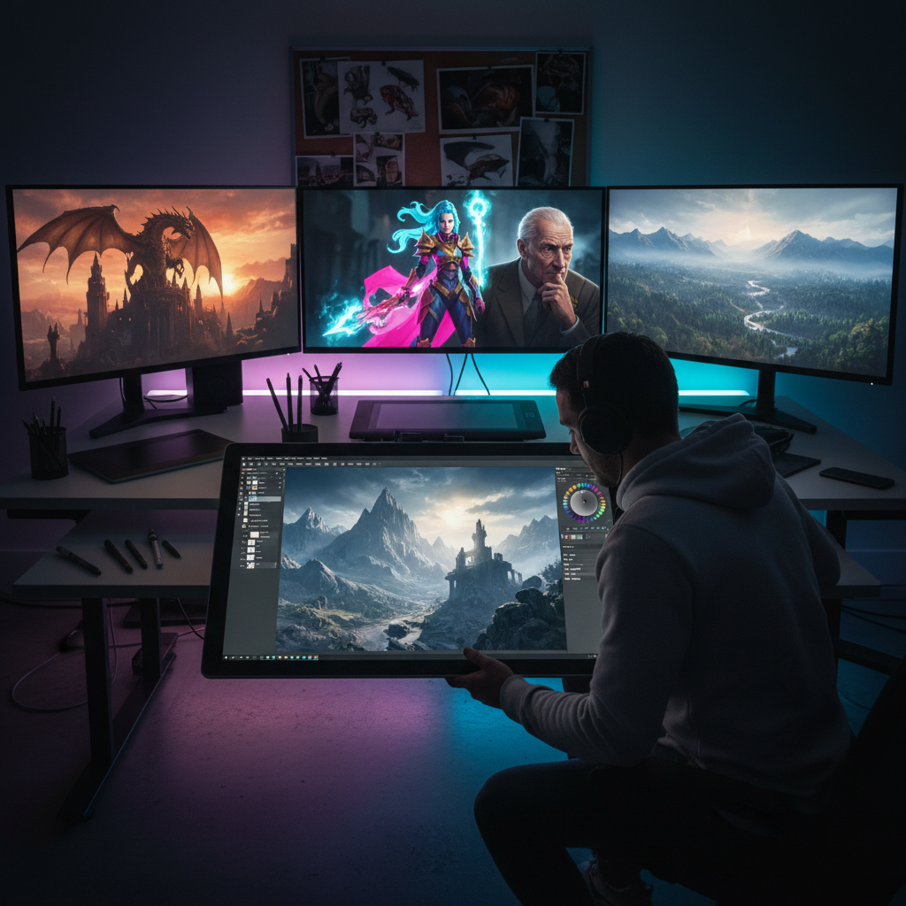

# Digital Painting 数字绘画

> "Digital painting is the liberation of the brush — infinite colors, infinite undo, infinite canvas, yet the artist's eye and hand remain the irreplaceable engine of every stroke." — Unknown

## 概述

数字绘画（Digital Painting）是使用数字工具（图形平板、触控笔、绘画软件）在电子屏幕上进行的绘画创作。数字绘画模拟了传统绘画的笔触、质感和色彩混合，同时提供了传统媒介无法实现的功能：无限撤销、图层系统、无限画布、即时色彩调整、以及各种数字特效。

数字绘画的核心工具包括：压感数位板（Wacom等）、绘画软件（Photoshop、Procreate、Clip Studio Paint、Krita等）、以及越来越多的iPad等平板设备。数字绘画已成为当代视觉产业的主力——从电影概念设计、游戏美术、动画到插画和漫画，数字绘画无处不在。

## 核心特征

| 特征 | 描述 |
|------|------|
| 数字 | 使用数字工具创作 |
| 图层 | 图层系统 |
| 撤销 | 无限撤销 |
| 灵活 | 极其灵活的修改 |
| 模拟 | 可模拟各种传统媒介 |
| 产业 | 视觉产业的主力 |

## 视觉特征

- **多样**：可模拟任何传统风格
- **精细**：可实现极精细的细节
- **色彩**：无限的色彩可能
- **光效**：强大的光效表现
- **混合**：多种风格的混合
- **清晰**：高分辨率的清晰度

## 代表作品

| 作品 | 艺术家 | 年代 | 意义 |
|------|--------|------|------|
| *Concept art for films* | Various | 2000s+ | 电影概念设计 |
| *Digital illustrations* | Craig Mullins | 1990s+ | 数字绘画先驱 |
| *Game art* | Various | 2000s+ | 游戏美术 |
| *Digital portraits* | Various | 当代 | 数字肖像 |
| *iPad paintings* | David Hockney | 2010s | 大师的数字探索 |

## 历史时间线

| 时期 | 事件 |
|------|------|
| 1960s | 最早的计算机图形实验 |
| 1980s | 绘画软件的出现 |
| 1990s | Photoshop和数位板的普及 |
| 2000s | 数字绘画成为产业标准 |
| 2010s | iPad和移动绘画的兴起 |
| 当代 | AI辅助绘画的出现 |

## 中国语境

数字绘画在中国有着巨大的产业规模——中国是世界最大的游戏市场之一，游戏美术对数字绘画人才的需求极大。中国的动画、漫画（国漫）产业也大量依赖数字绘画。中国的数字绘画教育非常发达——从专业院校到在线培训平台（如触站、站酷等）。中国的数字绘画社区活跃——Lofter、微博、B站等平台上有大量数字绘画创作者。一些中国的数字艺术家如黄光剑、阮佳等在国际上获得认可。

## AI生成概念图

## 与其他风格的关系

- **Traditional Painting** → 传统绘画
- **Concept Art** → 概念设计
- **Illustration** → 插画
- **3D Art** → 三维艺术
- **AI Art** → AI艺术
- **Animation** → 动画

---

*浮光艺志 | Chronicle of Artistry*
