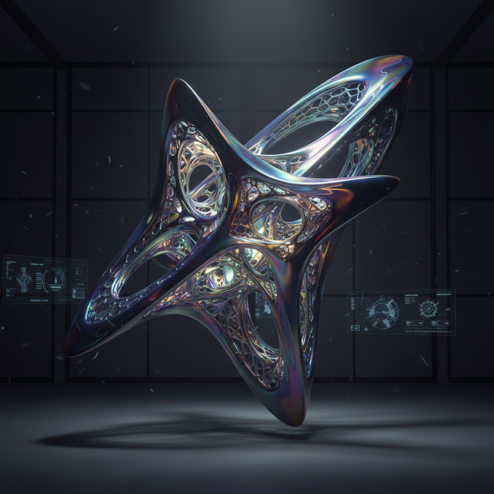

# Digital Sculpture 数字雕塑

> "Digital sculpture is the art of shaping virtual matter with infinite possibility." — Zbrush Community

## 概述

数字雕塑（Digital Sculpture）是使用计算机软件在三维虚拟空间中创作雕塑作品的艺术形式。艺术家使用ZBrush、Blender、Maya等工具，像传统雕塑家揉捏黏土一样在数字空间中塑造形体。数字雕塑可以存在于虚拟空间中，也可以通过3D打印转化为实体。

数字雕塑解放了雕塑家——不再受材料、重力、尺度和成本的限制，可以创造物理世界中不可能存在的形态。

## 核心特征

| 特征 | 描述 |
|------|------|
| 虚拟媒介 | 在数字空间中创作 |
| 无限可塑 | 可以无限修改和迭代 |
| 超越物理 | 不受重力和材料限制 |
| 可输出 | 可3D打印为实体 |
| 高精度 | 可达到极高的细节精度 |
| 可复制 | 数字文件可无限复制 |

## 视觉特征

- **细节**：极高的表面细节——毛孔、纹理、微结构
- **形态**：超越物理可能的有机形态
- **光影**：精确的数字渲染光影
- **材质**：模拟任何材质——金属、石头、皮肤
- **尺度**：从微观到宏观的自由切换
- **对称**：精确的对称和重复

## 代表作品

| 作品/艺术家 | 领域 | 特征 |
|-------------|------|------|
| Nick Ervinck | 纯艺术 | 有机抽象的3D打印雕塑 |
| Joshua Harker | 3D打印艺术 | 复杂的镂空结构 |
| Neri Oxman | 建筑/设计 | 自然启发的数字形态 |
| Morehshin Allahyari | 政治艺术 | 数字重建被毁文物 |
| Refik Anadol | 数据雕塑 | AI驱动的动态数字雕塑 |
| Bathsheba Grossman | 数学雕塑 | 数学结构的3D打印 |

## 历史时间线

| 时期 | 事件 |
|------|------|
| 1960s | 早期计算机图形学——线框模型 |
| 1980s | 3D建模软件的商业化 |
| 1999 | ZBrush发布——数字雕刻革命 |
| 2000s | 电影和游戏推动数字雕塑发展 |
| 2009 | MakerBot——桌面3D打印普及 |
| 2010s | 数字雕塑进入美术馆体系 |
| 2020s | AI辅助生成3D模型、VR雕塑 |

## 中国语境

中国的数字雕塑在游戏、影视和当代艺术领域都有重要发展。中国的3D打印产业为数字雕塑的实体化提供了基础设施。中国当代艺术家如曹斐等在虚拟空间中创作数字雕塑。中国传统雕塑（如敦煌造像）的数字化保护和重建也是数字雕塑的重要应用。

## AI生成概念图

## 与其他风格的关系

- **Sculpture** → 传统雕塑是数字雕塑的根基
- **Digital Art** → 数字艺术的三维分支
- **Bio Art** → 生物艺术借鉴数字雕塑的有机形态
- **Parametric Design** → 参数化设计与数字雕塑共享工具
- **Robotic Art** → 机器人艺术可使用数字雕塑作为模型
- **Crypto Art** → NFT为数字雕塑提供了所有权证明

---

*浮光艺志 | Chronicle of Artistry*
