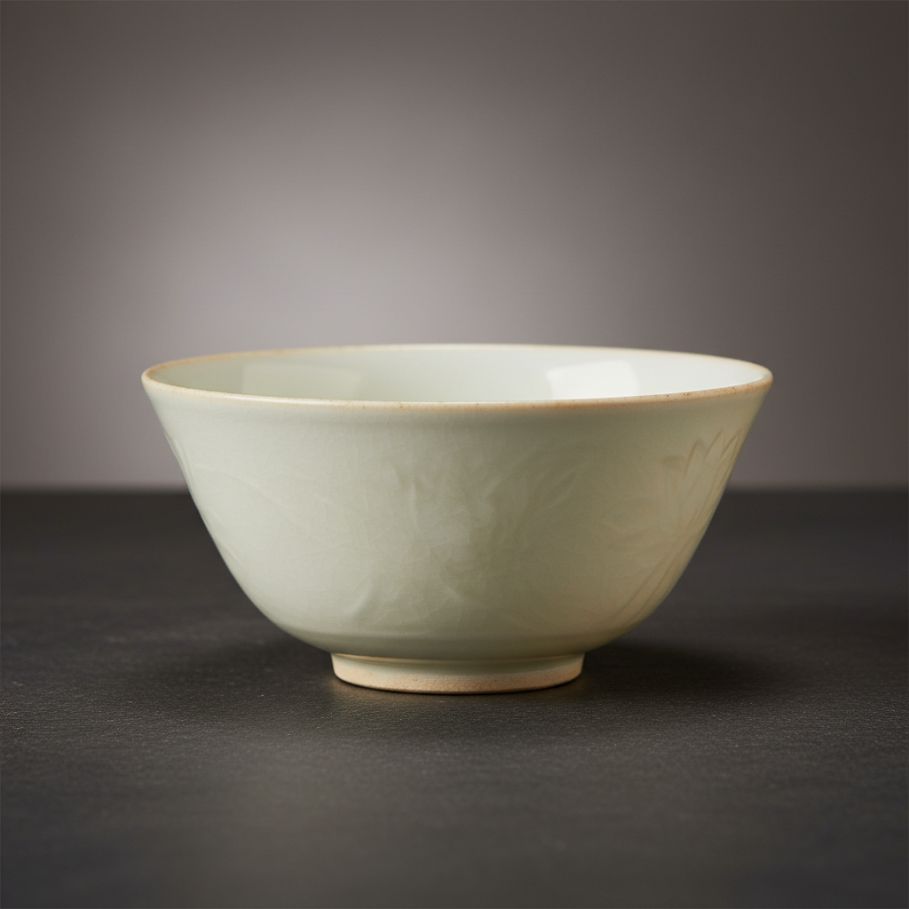

# Ding Ware Art 定窑艺术

> "Ding ware is whiteness refined to its essence — a porcelain so pure and thin it seems carved from ivory rather than shaped from clay, its warm cream-white surface decorated with the most delicate incised and molded patterns that catch light like whispered secrets, the first Chinese white ware to achieve true elegance, proving that absence of color can be the most eloquent statement of all." — Unknown

## 概述

定窑艺术（Ding Ware Art）是中国宋代五大名窑之一，以其精美的白瓷著称于世。定窑位于今河北省曲阳县，是中国北方白瓷的最高成就。定窑白瓷以其温润的牙白色釉、精细的刻花和印花装饰、以及独特的"芒口"覆烧工艺而闻名。定窑代表了中国白瓷从实用器向艺术品的升华——其精致程度使其成为宋代宫廷用瓷。

定窑艺术的核心要素包括：1）牙白釉色——温润的象牙白色；2）刻花装饰——精细的刻花纹样；3）印花工艺——模印的精美图案；4）覆烧芒口——独特的覆烧工艺；5）薄胎精致——薄而精致的胎体；6）宫廷用瓷——宋代宫廷的选择；7）北方白瓷——北方白瓷的巅峰。

## 核心特征

| 特征 | 描述 |
|------|------|
| 牙白釉色 | 温润的象牙白色 |
| 刻花装饰 | 精细的刻花纹样 |
| 印花工艺 | 模印精美图案 |
| 覆烧芒口 | 独特覆烧工艺 |
| 薄胎精致 | 薄而精致的胎体 |
| 宫廷用瓷 | 宋代宫廷选择 |

## 视觉特征

- **象牙白**：温润的象牙白色釉面
- **刻花纹**：精细流畅的刻花线条
- **印花图案**：清晰精美的印花图案
- **泪痕**：釉面流淌的"泪痕"
- **芒口**：口沿无釉的特征
- **薄透感**：薄胎的透光感

## 代表作品

| 作品 | 艺术家/文化 | 年代 | 意义 |
|------|-------------|------|------|
| *定窑刻花梅瓶* | 宋代定窑 | 北宋 | 刻花的经典 |
| *定窑印花盘* | 宋代定窑 | 北宋 | 印花的代表 |
| *定窑孩儿枕* | 宋代定窑 | 北宋 | 定窑雕塑精品 |
| *定窑白釉碗* | 宋代定窑 | 北宋 | 白瓷的典范 |
| *定窑黑釉* | 宋代定窑 | 北宋 | 定窑的黑釉品种 |

## 历史时间线

| 时期 | 事件 |
|------|------|
| 唐代 | 定窑的创烧 |
| 北宋 | 定窑的鼎盛 |
| 金代 | 定窑的延续 |
| 元代 | 定窑的衰落 |
| 当代 | 定窑的复烧和研究 |

## 中国语境

定窑是中国白瓷艺术的巅峰代表。中国白瓷的发展从北朝开始，经过隋唐的邢窑，到宋代的定窑达到最高成就。定窑白瓷曾是宋代宫廷的御用瓷器——直到后来被汝窑取代。定窑的刻花和印花装饰达到了极高的艺术水平——莲花、牡丹、游鱼、飞凤等图案精美绝伦。定窑的"覆烧"工艺是一项重要的技术创新——将碗盘倒扣烧制，提高了窑炉的装烧量，但也留下了口沿无釉的"芒口"特征。定窑对后世影响深远——景德镇的白瓷传统在很大程度上继承了定窑的美学理想。定窑证明了白色本身就是最美的色彩——不需要任何彩绘装饰，仅凭釉色和刻花就能达到极致的美。

## AI生成概念图

## 与其他风格的关系

- **Song Dynasty Kilns** → 宋代名窑
- **White Porcelain** → 白瓷
- **Incised Decoration** → 刻花装饰
- **Molded Decoration** → 印花装饰
- **Northern Kilns** → 北方窑系
- **Court Ceramics** → 宫廷用瓷

---

*浮光艺志 | Chronicle of Artistry*
