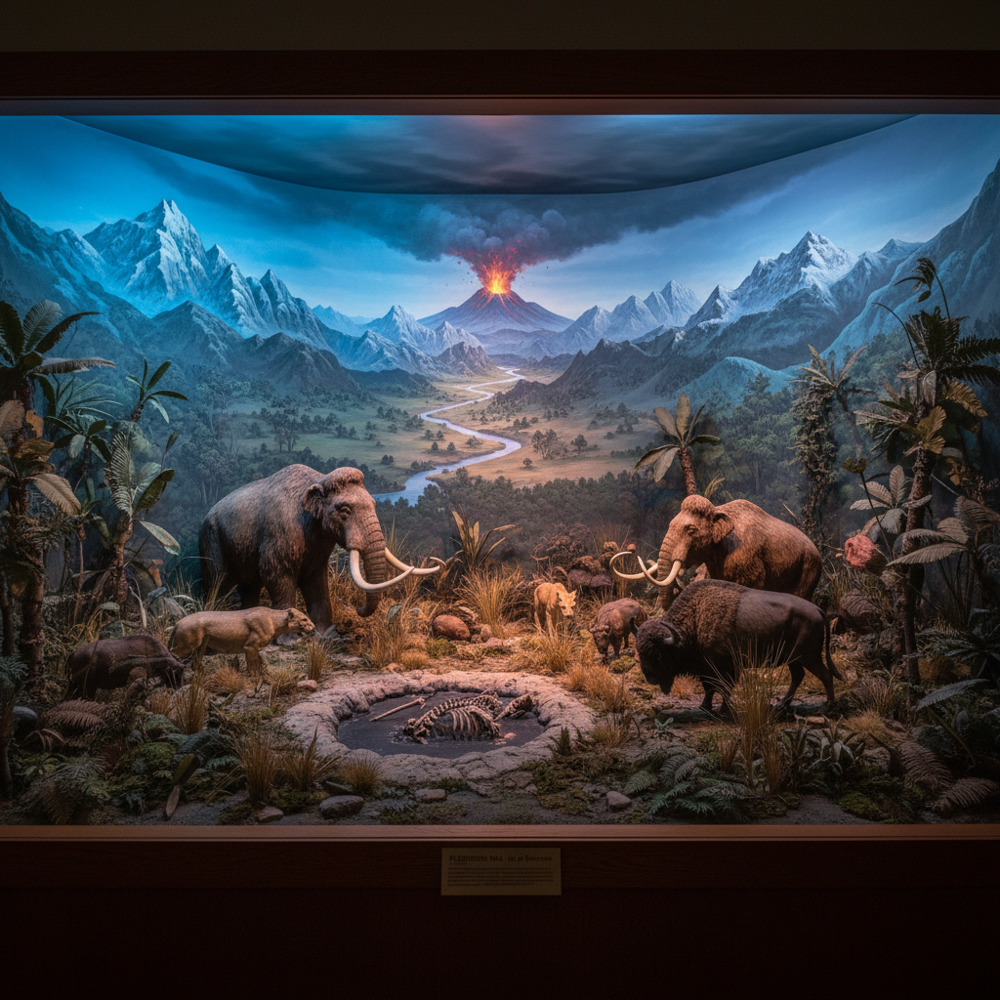

# Diorama Art 透视画/立体模型

> **时期：** 1822年–至今  
> **关键词：** 三维场景、微缩模型、光影戏剧、博物馆展示、叙事空间

## 概述

Diorama（透视画/立体模型）最初由达盖尔于1822年发明，是一种利用半透明画布和变化光线创造三维幻觉的剧场装置。后来演变为博物馆中的微缩立体场景——将绘画背景、雕塑前景和真实物品组合在玻璃箱中，创造一个凝固的叙事瞬间。

## 风格特征

- **三维空间**：绘画与实物的无缝结合
- **光线叙事**：通过照明变化讲述时间故事
- **微缩精确**：按比例缩小的精密模型
- **场景叙事**：凝固一个戏剧性瞬间
- **沉浸窗口**：观众透过框架窥视另一个世界

## 代表人物与作品

- 路易·达盖尔（透视画发明者）
- 美国自然历史博物馆 生态透视画
- 当代：Thomas Doyle 微缩灾难场景
- 当代：Lori Nix 末日微缩摄影

## 概念图

