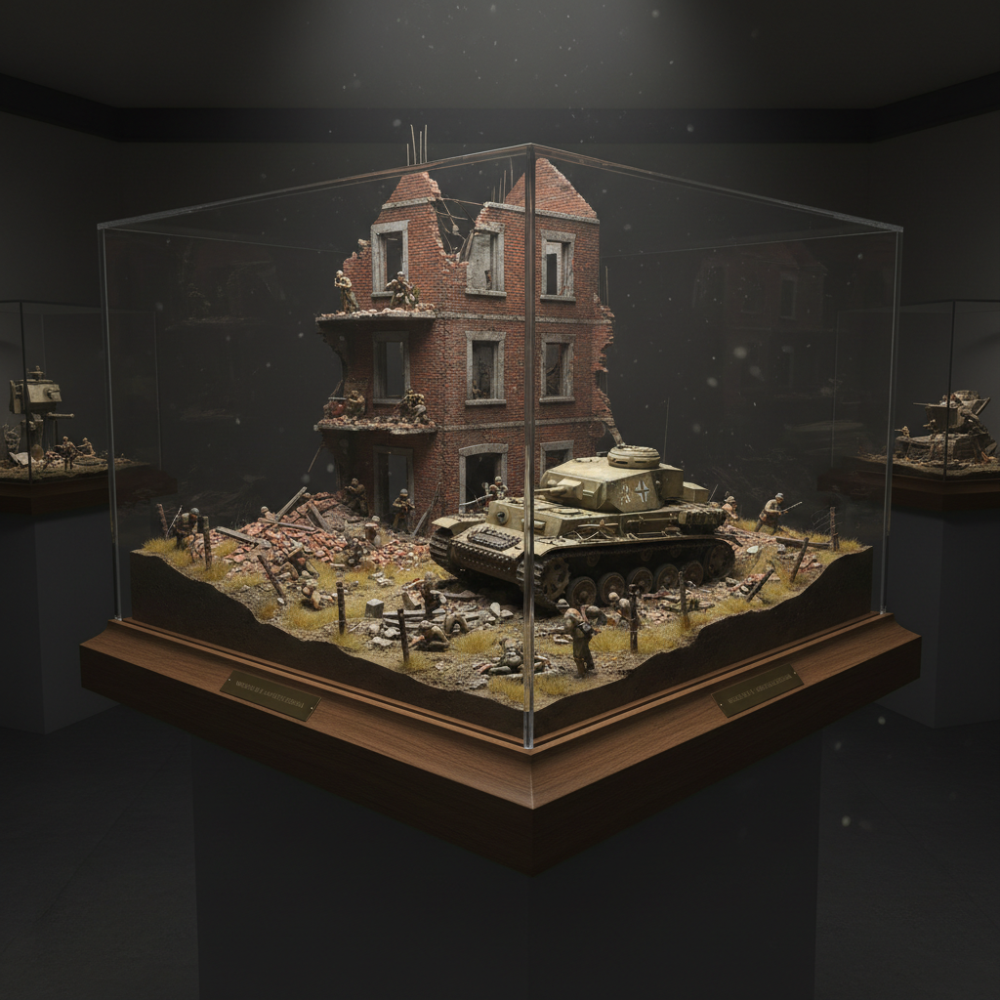

# Diorama 透视模型

> "A diorama is a frozen moment — a three-dimensional story told in miniature." — Unknown

## 概述

透视模型（Diorama）是在封闭或半封闭的空间中创造三维微缩场景的艺术形式——通过精确的比例缩小、细致的材料模拟和巧妙的光线设计，在有限的空间中重现历史事件、自然场景或想象世界。从19世纪达盖尔的剧场透视画到自然历史博物馆的生态场景，从军事模型到当代的微缩摄影，透视模型以其"冻结时间"的魔力持续吸引着观众。

透视模型的魅力在于：它是一个可以走进去的故事——一个三维的、有深度的、可以从不同角度观看的叙事空间。

## 核心特征

| 特征 | 描述 |
|------|------|
| 三维 | 三维的微缩场景 |
| 比例 | 精确的比例缩小 |
| 叙事 | 讲述一个故事或场景 |
| 细节 | 极其精细的细节 |
| 光线 | 巧妙的光线设计 |
| 封闭 | 通常在封闭空间中 |

## 视觉特征

- **微缩**：精确的微缩比例
- **细节**：令人惊叹的细节
- **深度**：三维的空间深度
- **光线**：戏剧性的光线效果
- **材料**：多种材料的模拟
- **叙事**：场景的叙事性

## 代表作品

| 作品 | 艺术家 | 年代 | 意义 |
|------|--------|------|------|
| *Daguerre's Diorama* | Louis Daguerre | 1822 | 透视模型的命名 |
| *AMNH habitat dioramas* | 匿名 | 1900s-60s | 自然历史博物馆场景 |
| *Military dioramas* | Various | 20世纪 | 军事模型场景 |
| *Miniature photography* | Various | 2010s+ | 微缩摄影 |
| *Contemporary dioramas* | Various | 2000s+ | 当代透视模型艺术 |

## 历史时间线

| 时期 | 事件 |
|------|------|
| 18世纪 | 早期的微缩场景 |
| 1822 | Daguerre的透视剧场 |
| 19世纪 | 博物馆透视模型的发展 |
| 20世纪 | 自然历史和军事透视模型 |
| 2000s+ | 当代艺术中的透视模型 |
| 当代 | 微缩摄影和数字透视模型 |

## 中国语境

透视模型在中国主要以博物馆场景和军事模型的形式存在。中国的自然博物馆和历史博物馆中有大量的透视模型展示。中国的模型爱好者社区非常活跃，特别是军事模型和铁路模型。当代中国的微缩摄影艺术家也在国际上获得了认可。中国传统的"盆景"在某种意义上也是一种活的透视模型。

## AI生成概念图

## 与其他风格的关系

- **Miniature Art** → 微型艺术与透视模型有尺度相似
- **Installation Art** → 装置艺术的微缩形式
- **Photography** → 微缩摄影利用透视模型
- **Theater** → 舞台设计与透视模型有空间相似
- **Model Making** → 模型制作是透视模型的基础
- **Bonsai** → 盆景是活的微缩景观

---

*浮光艺志 | Chronicle of Artistry*
