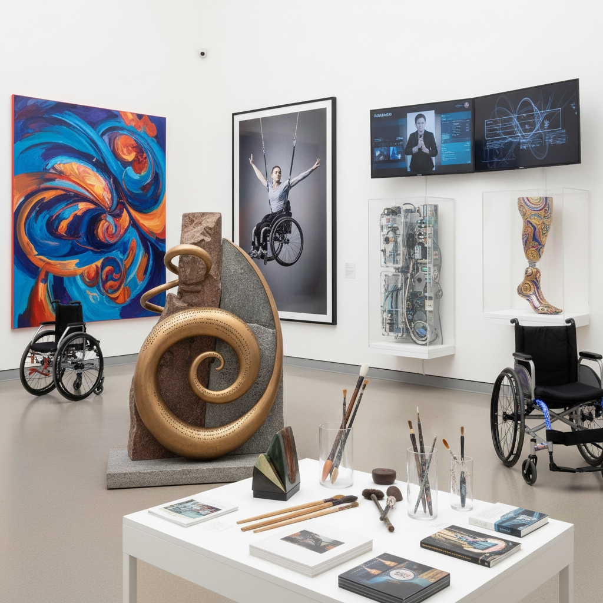

# Disability Art 残障艺术

> "Disability art is not art about disability made by non-disabled people looking in from outside — it is art made from the lived experience of disability as a creative position, a political identity, and an aesthetic resource, art that refuses pity and inspiration porn alike, that insists disabled bodies and minds are not broken versions of a norm but valid ways of being in the world with their own beauty, knowledge, and creative potential, that crips the gallery, hacks the stage, and reimagines what a body can do, what a mind can think, and what art can be when it is freed from the tyranny of the normative body." — Unknown

## 概述

残障艺术（Disability Art / Disability Arts）是从残障权利运动（Disability Rights Movement）中发展出来的一种艺术实践和文化运动，主张残障不是需要被"治愈"或"克服"的缺陷，而是一种有效的创作立场、政治身份和美学资源。残障艺术拒绝"灵感色情"（inspiration porn）和怜悯叙事，坚持从残障者自身的经验和视角出发进行创作。

残障艺术的理论基础是残障的"社会模型"（social model）——认为残障不是个人的身体缺陷，而是社会环境的障碍造成的。在这个框架下，残障艺术不是"尽管有残障仍然创作"，而是"因为有残障而创作出不同的东西"——残障经验提供了独特的感知方式、身体知识和创造性策略。代表艺术家包括Yinka Shonibare、Park McArthur、Sins Invalid集体等。

## 核心特征

| 特征 | 描述 |
|------|------|
| 经验 | 残障的生活经验 |
| 政治 | 残障作为政治身份 |
| 美学 | 残障作为美学资源 |
| 拒绝 | 拒绝怜悯和灵感叙事 |
| 无障碍 | 无障碍作为创作原则 |
| 酷儿化 | "crip"化的美学 |

## 视觉特征

- **身体**：多样的身体形态
- **辅具**：轮椅、假肢等作为美学元素
- **触觉**：触觉和多感官体验
- **无障碍**：无障碍设计的美学化
- **文本**：手语和替代性沟通
- **集体**：集体创作和互助

## 代表作品

| 作品 | 艺术家 | 年代 | 意义 |
|------|--------|------|------|
| *Disability Arts Movement* | Various UK artists | 1980年代起 | 英国残障艺术运动 |
| *Sins Invalid* | Sins Invalid | 2006起 | 残障正义表演集体 |
| *Crip Theory* | Robert McRuer | 2006 | 酷儿残障理论 |
| *Access installations* | Park McArthur | 2010年代 | 无障碍作为艺术 |
| *Disability Visibility* | Alice Wong (ed.) | 2020 | 残障可见性 |

## 历史时间线

| 时期 | 事件 |
|------|------|
| 1970年代 | 残障权利运动的兴起 |
| 1980年代 | 英国残障艺术运动 |
| 1990 | 美国残障人法案（ADA） |
| 2000年代 | 残障艺术的学术化 |
| 当代 | 残障艺术的主流化 |

## 中国语境

残障艺术在中国正在发展中。中国有超过8500万残障人士，但残障艺术作为一个自觉的文化运动仍处于早期阶段。中国的一些残障艺术家在各自的领域取得了成就——如盲人音乐家、聋人舞蹈团、以及使用口或脚作画的画家——但这些实践往往被纳入"励志"叙事而非残障政治的框架。中国的无障碍环境建设仍有很大的改善空间，这也影响了残障艺术家的创作和展示条件。近年来，中国的一些年轻残障艺术家和活动家开始探索更具政治性和批判性的残障艺术实践，挑战社会对残障的刻板印象。

## AI生成概念图

## 与其他风格的关系

- **Feminist Art** → 女性主义艺术
- **Queer Art** → 酷儿艺术
- **Social Practice** → 社会实践艺术
- **Community Art** → 社区艺术
- **Performance Art** → 行为艺术
- **Outsider Art** → 局外人艺术

---

*浮光艺志 | Chronicle of Artistry*
