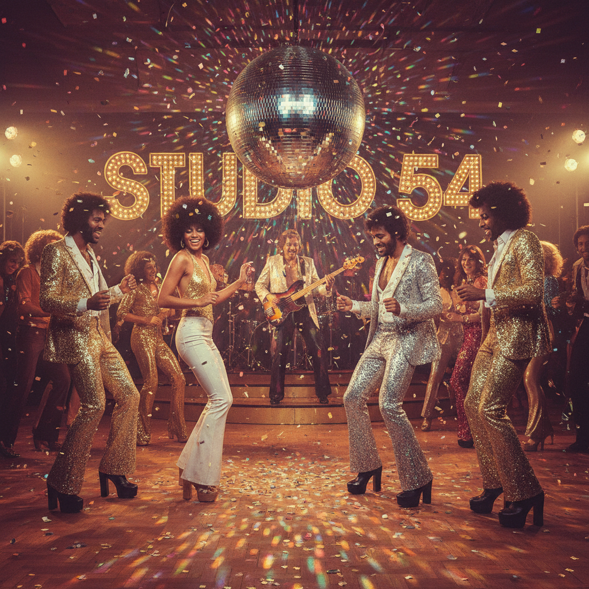

# Disco Funk 迪斯科放克



> **"镜面球、喇叭裤、贝斯线——70年代舞池里的解放运动。"**

## 概述

| 维度 | 描述 |
|------|------|
| 时期 | 1970–1983/影响至今 |
| 别名 | Disco, Funk, Disco Funk, Boogie |
| 核心色彩 | 金色、银色、紫色、白色、橙色 |
| 关键元素 | 镜面球、喇叭裤、平台鞋、闪亮面料 |
| 代表人物 | Donna Summer, Bee Gees, Earth Wind & Fire, Parliament |
| 关联风格 | Soul, R&B, House, Nu-Disco, Boogie |

---

## 历史脉络

| 年份 | 事件 |
|------|------|
| 1970 | Funk 从 Soul 中分化——James Brown, Sly Stone |
| 1974 | Disco 在纽约地下俱乐部兴起 |
| 1977 | Saturday Night Fever——Disco 全球爆发 |
| 1978 | Studio 54——Disco 的"圣殿" |
| 1979 | "Disco Demolition Night"——反 Disco 运动 |
| 1983 | Disco 衰落——但精神延续为 House Music |

### 核心哲学

Disco 的精神是**"舞池是唯一平等的地方——在这里，每个人都是明星"**：
- 跳舞 = 解放（"在舞池里忘记一切"）
- 包容 = 核心（黑人、同性恋、拉丁裔的文化）
- 闪亮 = 态度（"如果你要跳舞，就要闪耀"）
- 贝斯线 = 灵魂（"Funk 的贝斯让你的身体动起来"）
- "Disco 不只是音乐——它是一场解放运动"

---

## 视觉语法

### 色彩系统

```
主色：
  金色 (#FFD700) — 镜面球、闪亮
  银色 (#C0C0C0) — 镜面、金属
  紫色 (#800080) — 夜晚、华丽
  白色 (#FFFFFF) — John Travolta 的西装

辅色：
  橙色 (#FF8C00) — 70s 温暖
  粉色 (#FF69B4) — 霓虹
  蓝色 (#0000FF) — 灯光

规则：
  - 闪亮 = 必须
  - 镜面球 = 核心符号
  - 70s 色调（温暖、饱和）
  - 灯光效果（频闪、彩色）

质感：
  亮片 — 服装
  丝绸 — 衬衫
  聚酯 — 喇叭裤
  镜面 — 球、配饰
  平台 — 鞋底
```

### 标志性元素

| 类别 | 元素 |
|------|------|
| 服装 | 喇叭裤、平台鞋、亮片上衣、深V衬衫 |
| 场所 | Studio 54、镜面球、彩色灯光 |
| 音乐 | 四拍底鼓、贝斯线、弦乐、女声 |
| 舞蹈 | Hustle、指天动作、旋转 |
| 符号 | 镜面球、彩虹、闪电 |
| 态度 | 解放、包容、闪耀、跳舞、快乐 |

---

## 与千禧怀旧的关系

### House Music 的直接祖先
- Disco (1977) → House (1984) → 所有现代电子舞曲
- "House Music 就是 Disco 的孩子"
- 四拍底鼓 = 从 Disco 到今天的 EDM 的DNA
- "Disco never died——it just went underground and became House"

### Nu-Disco 复兴 (2000s-至今)
- Daft Punk "Random Access Memories" (2013)
- 2020s Disco 复兴（Dua Lipa, The Weeknd）
- "每隔10年，Disco 就会回来一次"

---

## 中国语境

- 80年代中国"迪斯科热"
- 中国"蹦迪"文化的起源
- 与中国"复古舞厅"的关系
- 张蔷等中国 Disco 歌手的文化地位

---

## 设计应用

| 场景 | 应用方式 |
|------|----------|
| 音乐 | 镜面球+闪亮+70s海报+唱片 |
| 活动 | 复古舞会+镜面球+彩色灯光+70s |
| 时尚 | 喇叭裤+平台鞋+亮片+闪亮+70s |
| 品牌 | 快乐+包容+闪耀+复古+舞蹈 |

---

## 相关风格

← [Northern Soul 北方灵魂](northern-soul.md) | [Acid House 酸浩室](acid-house.md) →

↑ [返回千禧怀旧目录](README.md) | [返回总目录](../README.md)
