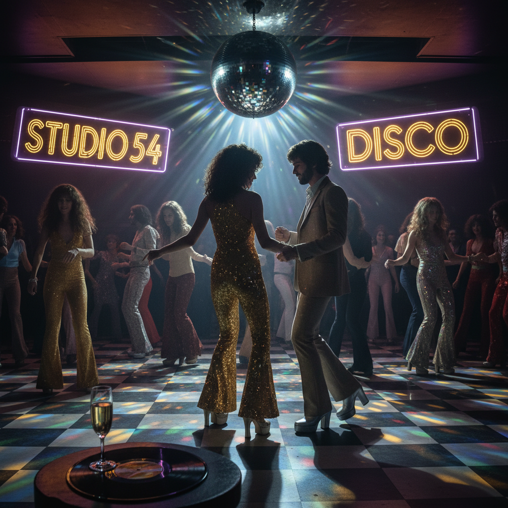

# Disco 迪斯科



> **"镜面球、喇叭裤、Studio 54——当夜晚属于舞池。"**

## 概述

| 维度 | 描述 |
|------|------|
| 时期 | 1974–1981 原版 / 2020s 复兴 |
| 别名 | Disco, Disco Era, Studio 54 Style |
| 核心色彩 | 金色、银色、紫色、粉色、黑色 |
| 关键元素 | 镜面球、闪光面料、喇叭裤、平台鞋 |
| 代表人物 | Donna Summer、Bee Gees、Studio 54、Grace Jones |
| 关联风格 | Funk, Synthwave, City Pop, Electropop 08 |

---

## 历史脉络

### 从地下俱乐部到全球狂热

| 年份 | 事件 |
|------|------|
| 1970 | 纽约地下同志/黑人俱乐部——Disco 萌芽 |
| 1974 | "Rock the Boat" 成为第一首 Disco 热单 |
| 1977 | 《Saturday Night Fever》——Disco 全球爆发 |
| 1977 | Studio 54 开业——Disco 的圣殿 |
| 1979 | "Disco Demolition Night"——反 Disco 运动 |
| 1981 | Disco 退潮——但精神延续到 House/Techno |
| 2020s | Dua Lipa、Doja Cat——Disco 复兴 |

### 核心哲学

Disco 的精神是**"今晚忘记一切——舞池里人人平等"**：
- 舞池 = 乌托邦（不分种族、性别、阶级）
- 快乐 = 政治（在压迫中跳舞就是反抗）
- 夜晚 > 白天
- "穿上最闪的衣服，成为最亮的星"
- 身体的自由 = 精神的自由

---

## 视觉语法

### 色彩系统

```
主色：
  金色 (#FFD700) — 奢华、闪耀
  银色 (#C0C0C0) — 镜面球、金属
  紫色 (#800080) — 夜晚、神秘
  粉色 (#FF69B4) — 活力、性感
  黑色 (#000000) — 夜晚

辅色：
  电蓝 (#0000FF) — 霓虹
  橙色 (#FF8C00) — 日落
  白色 (#FFFFFF) — 闪光

规则：
  - 闪闪发光是必须的
  - 金属质感
  - 彩虹光谱
  - 高饱和度
  - 反射、折射、闪烁

质感：
  亮片 — 服装、装饰
  镜面 — 球、墙面
  丝绒 — 沙发、绳索
  霓虹 — 灯光
```

### 标志性元素

| 类别 | 元素 |
|------|------|
| 物件 | 镜面球、霓虹灯、唱片机、喇叭 |
| 服装 | 喇叭裤、亮片连衣裙、平台鞋、紧身衣 |
| 空间 | 舞池、VIP区、霓虹走廊 |
| 图案 | 星爆、彩虹、几何闪光 |
| 字体 | 圆润、粗体、带阴影的70年代字体 |
| 态度 | 狂欢、自由、性感、包容 |

---

## 与千禧怀旧的关系

### 2020s Disco 复兴
- Dua Lipa《Future Nostalgia》= 当代 Disco
- "复古迪斯科"成为流行音乐趋势
- Studio 54 美学在派对/品牌中复兴
- "70年代比现在更自由"的怀旧

### 从 Disco 到 House
- Disco → House → Techno → EDM
- 电子舞曲的所有分支都源自 Disco
- "四拍子地板鼓"= Disco 的遗产
- 舞池文化从未真正消失

---

## 中国语境

- "迪斯科"在中国80年代的流行
- 中国迪厅文化（80s–90s）
- 当代中国夜店文化与 Disco 的关系
- "复古迪斯科"在中国社交媒体的流行

---

## 设计应用

| 场景 | 应用方式 |
|------|----------|
| 活动 | 镜面球+金色+紫色+闪光+舞池 |
| 品牌 | 70年代字体+金属色+复古+派对 |
| 空间 | 霓虹+镜面+丝绒+暗光 |
| 数字 | 闪光动效+金属渐变+复古字体 |

---

## 相关风格

← [City Pop シティ・ポップ](city-pop.md) | [Synthwave 合成波](synthwave.md) →

↑ [返回千禧怀旧目录](README.md) | [返回总目录](../README.md)
