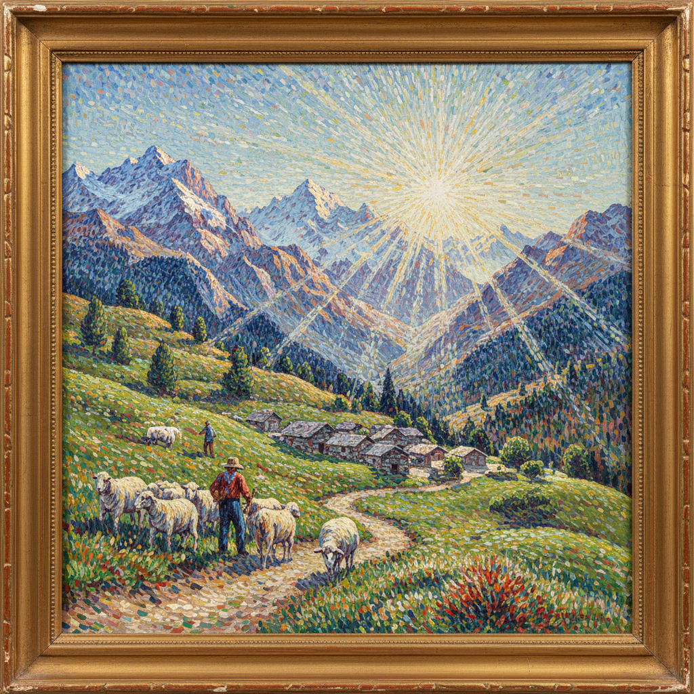

# Divisionism Painting 分色主义绘画

> **时期：** 1880年代–1910年代  
> **关键词：** 色彩分离、光学混合、意大利、科学色彩、未来主义前奏

## 概述

Divisionism（分色主义）是19世纪末在意大利发展的绘画技法——画家们将色彩分解为独立的笔触或线条，让颜色在观者的视网膜上而非调色板上混合。乔瓦尼·塞冈提尼的阿尔卑斯山光线、朱塞佩·佩利扎的社会主题——分色主义比法国点彩派更自由，笔触更长更有表现力，后来直接影响了意大利未来主义。

## 风格特征

- **色彩分离**：独立的色线和色点
- **光学混合**：在视网膜上完成调色
- **长笔触**：比点彩派更自由的线条
- **光线效果**：阿尔卑斯山的强烈日光
- **社会主题**：劳动者和自然的结合

## 代表人物与作品

- 乔瓦尼·塞冈提尼 阿尔卑斯山
- 朱塞佩·佩利扎《第四阶级》
- 安杰洛·莫尔贝利 社会场景
- 加埃塔诺·普雷维亚蒂 象征主义

## 概念图

