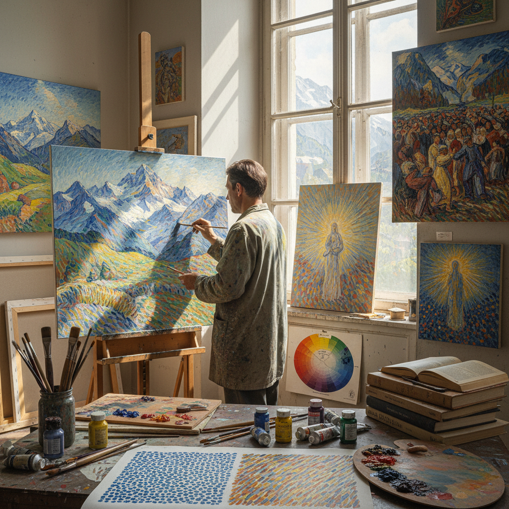

# Divisionism Technique 分色主义技法

> "Divisionism is pointillism's more flexible sibling — separating color into distinct strokes or patches rather than rigid dots, allowing the brush to follow form and direction while still keeping colors optically pure, creating surfaces that shimmer with the energy of unmixed pigment applied in parallel dashes and crosshatches that weave light from individual threads of color into a luminous whole." — Unknown

## 概述

分色主义（Divisionism），也称为"色彩分割"，是一种将颜色分解为独立的笔触或色块，通过光学混合而非物理混合来产生色彩效果的绘画技法。Divisionism与Pointillism密切相关但有所不同——Pointillism严格使用圆点，而Divisionism使用更自由的笔触形式（短线、破折号、交叉线等），允许笔触跟随形体的方向和结构。

Divisionism这个术语主要与意大利的新印象派画家相关——Giovanni Segantini、Gaetano Previati和Giuseppe Pellizza da Volpedo等意大利画家发展了自己的分色技法，与法国的点彩派有所不同。意大利的Divisionism更加注重笔触的方向性和表现力，而不是修拉那种严格的科学点阵。Divisionism对后来的未来主义（Futurism）产生了重要影响——未来主义画家如巴拉（Balla）和波丘尼（Boccioni）都从Divisionism出发。

## 核心特征

| 特征 | 描述 |
|------|------|
| 色彩分割 | 将颜色分解为独立笔触 |
| 光学混合 | 依赖光学混合效果 |
| 自由笔触 | 比点彩更自由的笔触 |
| 方向性 | 笔触跟随形体方向 |
| 意大利 | 主要与意大利画家相关 |
| 表现力 | 比点彩更具表现力 |

## 视觉特征

- **笔触**：可见的分离笔触
- **方向**：有方向性的色彩线条
- **光感**：强烈的光感效果
- **振动**：色彩的光学振动
- **结构**：笔触跟随结构
- **明亮**：明亮的色彩效果

## 代表作品

| 作品 | 艺术家 | 年代 | 意义 |
|------|--------|------|------|
| *The Two Mothers* | Giovanni Segantini | 1889 | 塞甘蒂尼的分色主义 |
| *The Fourth Estate* | Giuseppe Pellizza | 1901 | 佩利扎的分色主义 |
| *Maternity* | Gaetano Previati | 1890-1891 | 普雷维亚蒂的分色主义 |
| *Street Light* | Giacomo Balla | 1909 | 巴拉的分色→未来主义 |
| *Contemporary divisionism* | Various | 当代 | 当代分色主义实践 |

## 历史时间线

| 时期 | 事件 |
|------|------|
| 1886 | 新印象派的诞生 |
| 1890年代 | 意大利分色主义的发展 |
| 1900年代 | 分色主义的鼎盛 |
| 1909-1910 | 分色主义影响未来主义 |
| 当代 | 分色主义的学术研究 |

## 中国语境

分色主义在中国的美术教育中作为色彩理论和美术史的重要内容被教授。中国的美术院校在讲解新印象派和色彩科学时会详细介绍Divisionism。中国的一些油画家在创作中借鉴分色主义的色彩分割原理——特别是在表现光感和色彩振动时。中国传统绘画中的"皴法"（用不同方向的笔触表现山石纹理）与Divisionism的方向性笔触有形式上的相似性。当代中国的一些色彩教学实验中也使用分色原理。

## AI生成概念图

## 与其他风格的关系

- **Pointillism** → 点彩
- **Neo-Impressionism** → 新印象派
- **Futurism** → 未来主义
- **Color Theory** → 色彩理论
- **Italian Art** → 意大利艺术
- **Impressionism** → 印象派

---

*浮光艺志 | Chronicle of Artistry*
