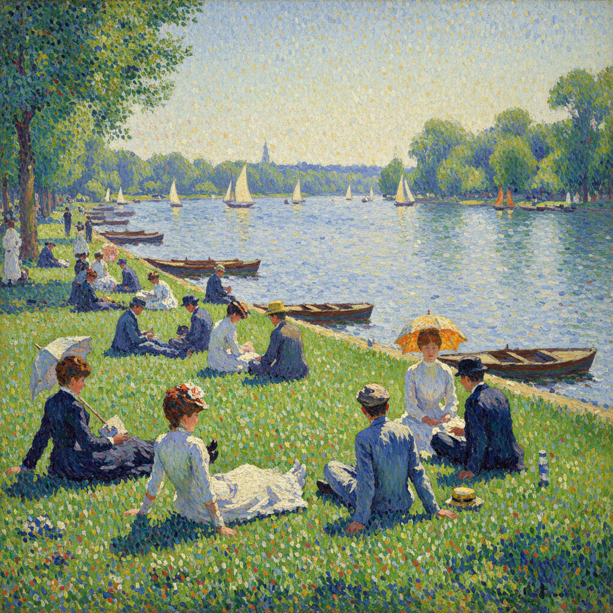

# Divisionism 分割主义

> "Art is harmony." — Georges Seurat

## 概述

分割主义（Divisionism），又称分色主义，是新印象派（Neo-Impressionism）的核心技法理论，由乔治·修拉和保罗·西涅克在1880年代发展而成。其原理是将颜色分解为独立的色点或色条并置于画布上，利用观者视网膜的光学混合（而非调色板上的物理混合）来产生更纯净、更明亮的色彩效果。

分割主义与点彩派（Pointillism）密切相关但不完全等同——点彩派特指用圆点的技法，而分割主义是更广泛的色彩分离理论。

## 核心特征

| 特征 | 描述 |
|------|------|
| 色彩分离 | 不在调色板上混色，而是将纯色并置 |
| 光学混合 | 依赖观者眼睛在一定距离外的视觉融合 |
| 科学基础 | 基于谢弗勒尔的色彩对比理论和亥姆霍兹的光学研究 |
| 互补色 | 大量使用互补色并置以增强色彩振动 |
| 系统性 | 高度理性和系统化的创作方法 |
| 光线表现 | 追求比印象派更纯净的光线效果 |

## 视觉特征

- **笔触**：规则的色点、短线或小色块
- **色彩**：高纯度的原色和互补色并置
- **表面**：均匀的、织物般的肌理
- **光线**：明亮、闪烁、充满活力
- **轮廓**：物体边缘由色彩过渡自然形成
- **整体**：远看和谐统一，近看色点分明

## 代表人物

| 画家 | 代表作 | 特点 |
|------|--------|------|
| Georges Seurat | *A Sunday on La Grande Jatte* (1886) | 分割主义创始人 |
| Paul Signac | *The Port of Saint-Tropez* | 理论家和实践者 |
| Henri-Edmond Cross | 地中海风景 | 色彩最大胆的成员 |
| Maximilien Luce | 巴黎城市风景 | 社会题材 |
| Giovanni Segantini | 阿尔卑斯山景 | 意大利分割主义 |
| Gaetano Previati | 象征主义题材 | 意大利分割主义 |

## 科学基础

- **Michel Eugène Chevreul**：《色彩同时对比法则》(1839)
- **Ogden Rood**：《现代色彩学》(1879)
- **Hermann von Helmholtz**：光学与视觉理论
- **色轮理论**：互补色并置产生最大视觉振动

## 历史背景

1. **1884年**：修拉开始实验色彩分离技法
2. **1886年**：《大碗岛的星期天下午》在最后一次印象派展览展出
3. **1890年代**：西涅克出版《从德拉克洛瓦到新印象派》理论著作
4. **1891年**：修拉去世，西涅克继续推广
5. **1900-10年代**：影响野兽派和未来主义

## 与其他风格的关系

- **Impressionism** → 继承其对光线的关注，但更系统化
- **Pointillism** → 分割主义的具体技法表现
- **Fauvism** → 受其色彩解放的启发
- **Futurism** → 意大利未来主义继承了意大利分割主义
- **Op Art** → 光学混合原理的现代延续

## 概念图

---

*浮光艺志 | Chronicle of Artistry*
