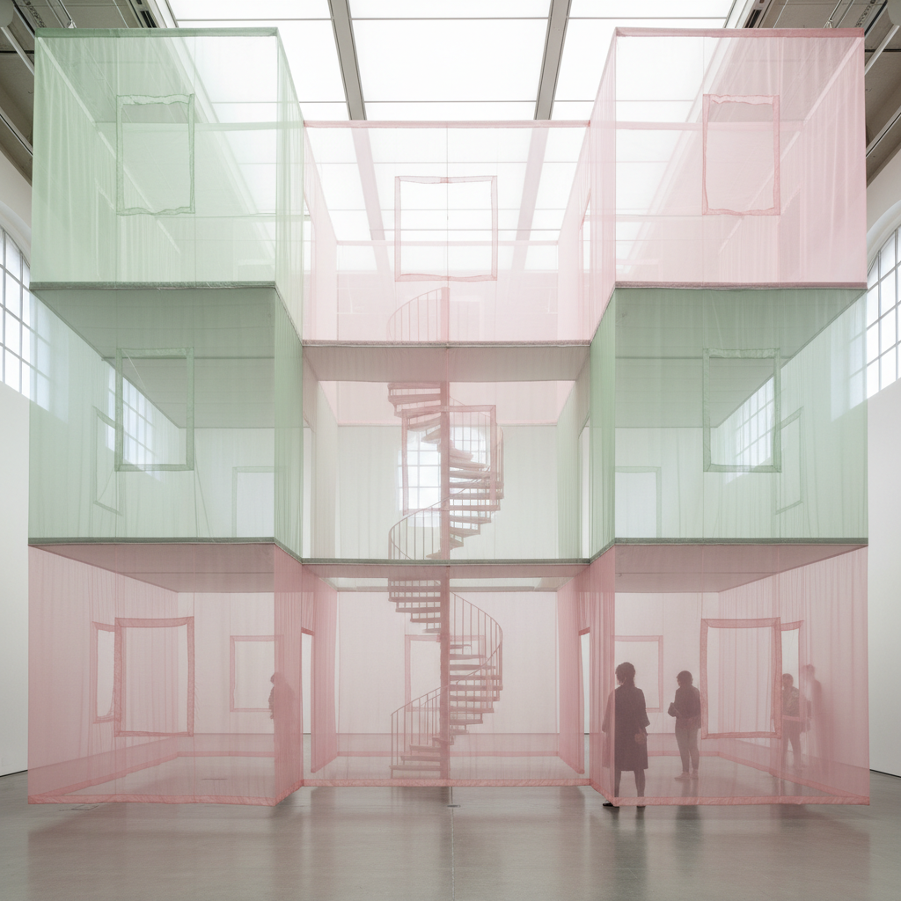

# Do Ho Suh 徐道获

> **时期：** 1962–至今  
> **关键词：** 织物建筑、半透明空间、家的记忆、位移与身份

## 概述

Do Ho Suh 是韩国艺术家，以用半透明织物1:1重建他曾居住过的公寓和房屋而闻名。这些幽灵般的建筑复制品——门框、楼梯、浴室——悬浮在展厅中，如同记忆的物质化身，探索移民经验中"家"的概念。

## 风格特征

- **织物建筑**：用半透明丝绸或聚酯纤维重建真实建筑空间
- **1:1比例**：精确复制每个细节——门把手、开关、管道
- **半透明**：材料的透明性暗示记忆的脆弱和不确定
- **悬浮**：作品常悬挂在空中，脱离地面
- **叠加**：多个住所的空间相互嵌套或连接

## 代表作品

- *Seoul Home/L.A. Home*（1999）
- *Staircase-III*（2010）
- *Hub*系列（2012–至今）
- *Passage/s*（2017）

## 概念图

