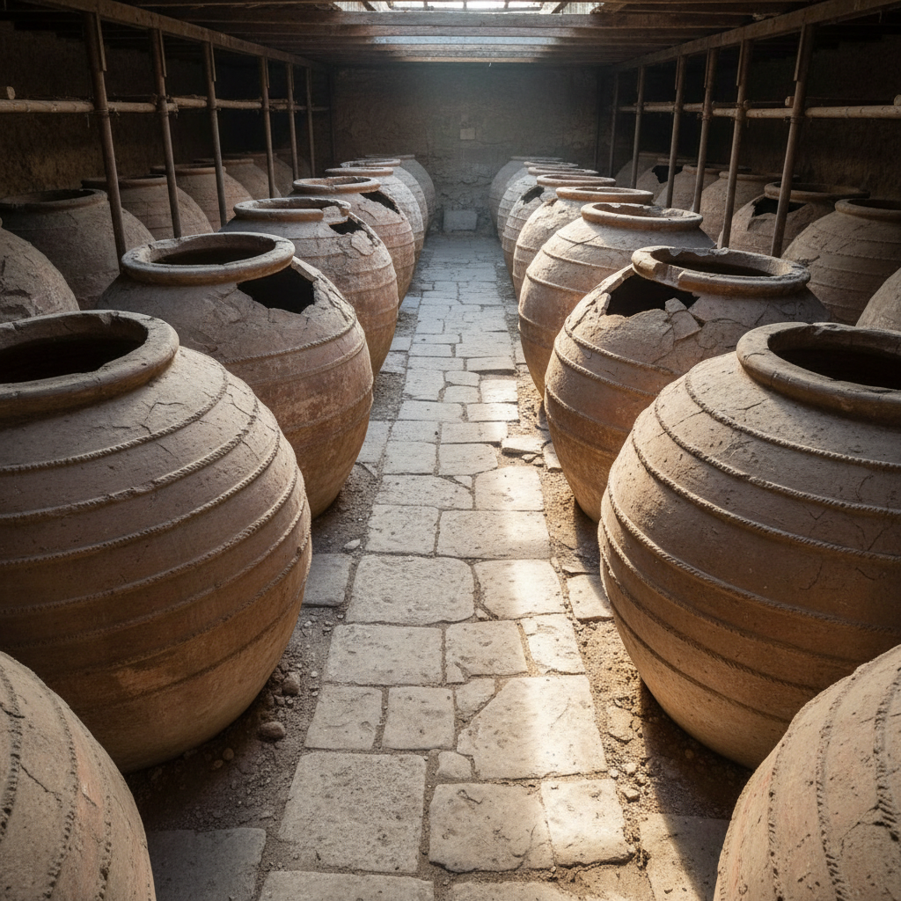

# Dolium Art 罗马大瓮艺术

> "The dolium is Rome's industrial ceramic — a massive earthenware vessel built into the floor of a villa or warehouse, too large to move and too useful to abandon, each one a permanent fixture of Roman commerce holding hundreds of liters of wine, oil, or garum, the empire's appetite made tangible in clay, a reminder that ceramics built not just art but economies." — Unknown

## 概述

罗马大瓮艺术（Dolium Art）是以古罗马时期的大型固定式储存陶瓮为代表的陶瓷器形艺术。Dolium（多利乌姆）是罗马帝国时期用于大规模储存葡萄酒、橄榄油和鱼酱（garum）的巨型陶瓮——通常半埋于地下，容量可达数千升，是罗马商业和农业经济的重要基础设施。Dolium代表了古代陶瓷工业化生产的最高水平。

罗马大瓮艺术的核心要素包括：1）工业规模——大规模工业化生产；2）固定安装——半埋地下不可移动；3）巨大容量——数千升的储存容量；4）商业用途——罗马商业的基础设施；5）标准化——相对标准化的生产；6）耐久性——极高的耐久性；7）帝国经济——罗马帝国经济的支柱。

## 核心特征

| 特征 | 描述 |
|------|------|
| 工业规模 | 大规模工业化生产 |
| 固定安装 | 半埋地下不可移动 |
| 巨大容量 | 数千升储存容量 |
| 商业用途 | 商业基础设施 |
| 标准化 | 相对标准化生产 |
| 极耐久 | 极高的耐久性 |

## 视觉特征

- **巨大圆腹**：巨大的球形腹部
- **宽口设计**：便于取用的宽口
- **厚实器壁**：极厚的陶壁
- **粗犷质感**：粗犷的表面质感
- **半埋状态**：半埋于地面的状态
- **排列整齐**：仓库中整齐排列

## 代表作品

| 作品 | 艺术家/文化 | 年代 | 意义 |
|------|-------------|------|------|
| *庞贝大瓮* | 罗马 | 1世纪 | 庞贝遗址的大瓮 |
| *奥斯提亚大瓮* | 罗马 | 各时期 | 港口仓库大瓮 |
| *罗马别墅大瓮* | 罗马 | 各时期 | 农庄储存大瓮 |
| *高卢大瓮* | 罗马高卢 | 各时期 | 行省的大瓮生产 |
| *西班牙大瓮* | 罗马西班牙 | 各时期 | 橄榄油储存 |

## 历史时间线

| 时期 | 事件 |
|------|------|
| 前3世纪 | 罗马大瓮的早期发展 |
| 前1世纪 | 大瓮生产的工业化 |
| 1-2世纪 | 罗马帝国大瓮的鼎盛 |
| 3-4世纪 | 大瓮使用的延续 |
| 当代 | 考古发掘和研究 |

## 中国语境

中国虽然没有与罗马Dolium完全对应的器物，但中国的大型储存陶器同样是农业经济的重要基础设施。中国传统的酒窖中使用大型陶缸储存白酒——四川、贵州等地的酒厂至今仍使用传统陶缸进行白酒的储存和陈化。中国的酱油、醋、豆瓣酱等发酵食品也依赖大型陶缸——郫县豆瓣的露天晒缸是中国食品工业中陶瓷容器的典型应用。中国和罗马帝国在同一时期都发展出了大规模的陶瓷储存系统——这反映了农业文明对大型储存容器的共同需求。中国当代的一些酒厂和食品企业仍在使用传统陶缸，证明了这种古老技术的持久价值。

## AI生成概念图

## 与其他风格的关系

- **Pithos** → 大陶缸
- **Roman Ceramics** → 罗马陶瓷
- **Industrial Ceramics** → 工业陶瓷
- **Storage Vessel** → 储存器
- **Amphora** → 双耳瓶
- **Ancient Commerce** → 古代商业

---

*浮光艺志 | Chronicle of Artistry*
