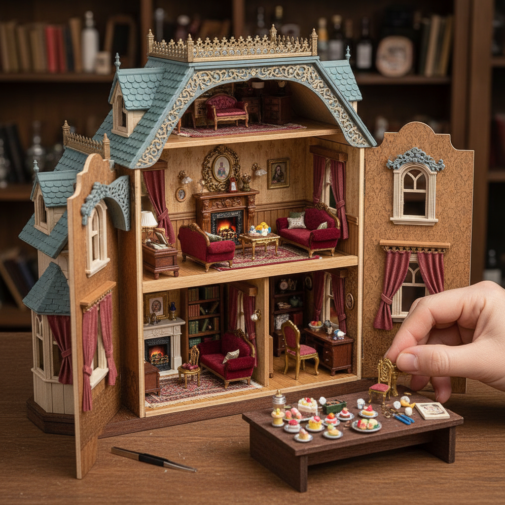

# Dollhouse Art 微缩屋艺术

> "A dollhouse is a universe compressed — every detail of human habitation reduced to one-twelfth scale, yet somehow more vivid for its smallness. The miniaturist must be architect, carpenter, upholsterer, painter, and decorator all at once, working with tweezers and magnifying glasses to create rooms so perfect that the eye forgets their size and sees only home." — Unknown

## 概述

微缩屋艺术（Dollhouse Art）是以微缩比例（通常1:12）制作完整室内场景和建筑模型的艺术形式——包括微缩建筑结构、家具、装饰品、食物、植物和人物的精细制作。微缩屋艺术是木工、绘画、纺织、陶艺等多种工艺的微缩综合。

微缩屋艺术的实践包括：1）传统娃娃屋——完整的微缩房屋和室内陈设；2）微缩场景（Room Box）——单个房间的微缩场景；3）微缩家具——精细的微缩家具制作；4）微缩食物——用粘土制作的微缩食物；5）微缩花园——微缩的花园和景观；6）历史微缩——再现历史时期的室内场景；7）当代微缩——将微缩技法用于当代艺术表达。

## 核心特征

| 特征 | 描述 |
|------|------|
| 微缩 | 精确的比例缩小 |
| 完整 | 完整的生活场景 |
| 精细 | 极其精细的细节 |
| 综合 | 多种工艺的综合 |
| 叙事 | 讲述生活故事 |
| 沉浸 | 令人沉浸的微型世界 |

## 视觉特征

- **比例**：精确的1:12比例
- **细节**：极其精细的细节
- **完整**：完整的生活场景
- **光影**：微缩空间中的光影
- **材质**：多种材质的微缩再现
- **温馨**：温馨的家居氛围

## 代表作品

| 作品 | 艺术家 | 年代 | 意义 |
|------|--------|------|------|
| *Queen Mary's Dolls' House* | Edwin Lutyens | 1924 | 英国王室微缩屋 |
| *Thorne Miniature Rooms* | Narcissa Thorne | 1930年代 | 芝加哥艺术学院收藏 |
| *Colleen Moore's Fairy Castle* | Colleen Moore | 1935 | 好莱坞微缩城堡 |
| *Contemporary miniatures* | Various | 当代 | 当代微缩艺术 |
| *Japanese miniature rooms* | Various | 当代 | 日本微缩场景 |

## 历史时间线

| 时期 | 事件 |
|------|------|
| 16世纪 | 欧洲最早的娃娃屋 |
| 17-18世纪 | 荷兰和德国的精美娃娃屋 |
| 19世纪 | 娃娃屋的商业化生产 |
| 20世纪 | 微缩艺术的专业化 |
| 当代 | 微缩艺术的社交媒体复兴 |

## 中国语境

微缩屋艺术在中国近年来发展迅速。中国的微缩艺术与中国传统的"盆景"和"假山"有文化上的联系——都追求在有限空间中创造完整的世界。中国的一些微缩艺术家在社交媒体上获得了大量关注——他们制作的中国传统建筑微缩模型（如四合院、苏州园林、徽派建筑）展示了中国建筑的精美细节。中国的DIY微缩屋套件市场非常活跃——各种主题的微缩屋套件（如中国风书房、日式庭院、现代咖啡馆）深受年轻消费者喜爱。中国的一些博物馆也收藏和展示微缩艺术品——如故宫的微缩模型。中国的微缩食物（粘土微缩）创作者在网络上也非常活跃。

## AI生成概念图

## 与其他风格的关系

- **Miniature Art** → 微缩艺术
- **Architecture** → 建筑
- **Woodworking** → 木工艺术
- **Diorama Art** → 透视模型艺术
- **Model Making** → 模型制作
- **Interior Design** → 室内设计

---

*浮光艺志 | Chronicle of Artistry*
