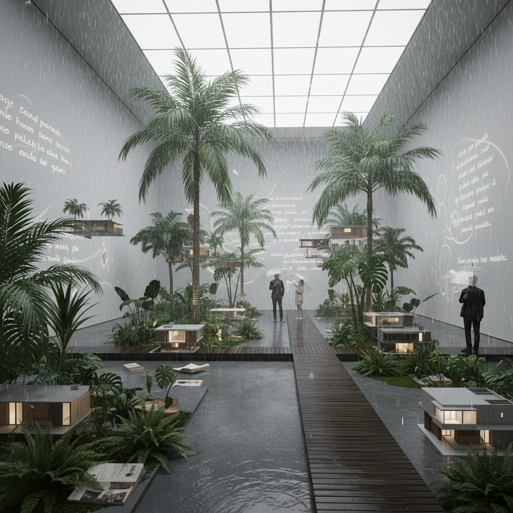

# Dominique Gonzalez-Foerster 多米尼克·冈萨雷斯-福尔斯特

> **时期：** 1965–至今  
> **关键词：** 环境装置、文学空间、热带现代主义、记忆房间

## 概述

Dominique Gonzalez-Foerster 是法国艺术家，以创造沉浸式环境装置而闻名。她的作品常常重建或暗示特定的文学、电影或建筑空间——一个热带城市的雨季、一间作家的卧室、一个末日后的景观——观众进入的不是展览，而是一个平行世界的片段。

## 风格特征

- **环境而非物品**：创造氛围和空间体验
- **文学引用**：作品常引用小说、诗歌和电影
- **热带现代主义**：巴西利亚、里约等热带城市的建筑记忆
- **缩放与变形**：将物品放大或缩小改变感知
- **雨与湿度**：水、雾、潮湿作为反复出现的元素

## 代表作品

- *TH.2058*（2008，泰特涡轮大厅）
- *Chronotopes & Dioramas*（2009）
- *Cosmodrome*（2019）
- *Alienarium 5*（2022）

## 概念图

