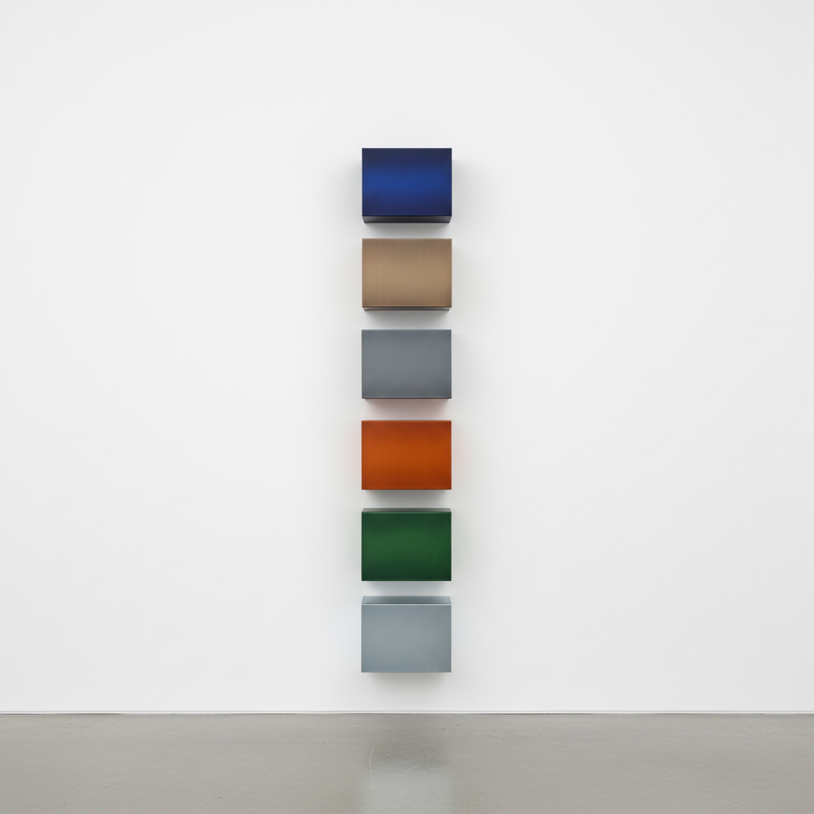

# Donald Judd 唐纳德·贾德

> **流派**: 极简主义 · 特定物体  
> **时期**: 1928–1994 美国  
> **关键词**: 工业材料、重复单元、特定物体、马尔法

## 概述

唐纳德·贾德是极简主义雕塑的核心人物。他拒绝"雕塑"这个词，称自己的作品为"特定物体"——既非绘画也非雕塑，而是占据真实空间的工业制品。他用铝、有机玻璃和钢板制作精确的几何形体，追求一种不指涉任何外部事物的纯粹存在。

## 视觉特征

- **重复单元**: 相同的盒状形体等距排列在墙面或地面
- **工业材料**: 铝、不锈钢、有机玻璃、阳极氧化铝
- **精确制造**: 工厂加工，消除一切手工痕迹
- **色彩即材料**: 颜色来自材料本身或阳极氧化处理
- **开放结构**: 盒子常为开口或透明，内外空间互通

## 代表作品

- 《无题》(堆叠) 系列 (1960s–90s)
- 马尔法 Chinati 基金会永久装置 (1980s)
- 100件铝制作品 (1982–86)
- 《无题》(伯恩斯坦) (1970)

## 历史影响

贾德将艺术从表达和再现中解放出来，让物体以其自身的物理存在说话。他在德克萨斯州马尔法建立的永久装置空间开创了"场域特定艺术"的新模式。

## 相关风格

- [Minimalism 极简主义](minimalism.md)
- [Sol LeWitt 索尔·勒维特](sol-lewitt.md)
- [Dan Flavin 丹·弗莱文](dan-flavin.md)
