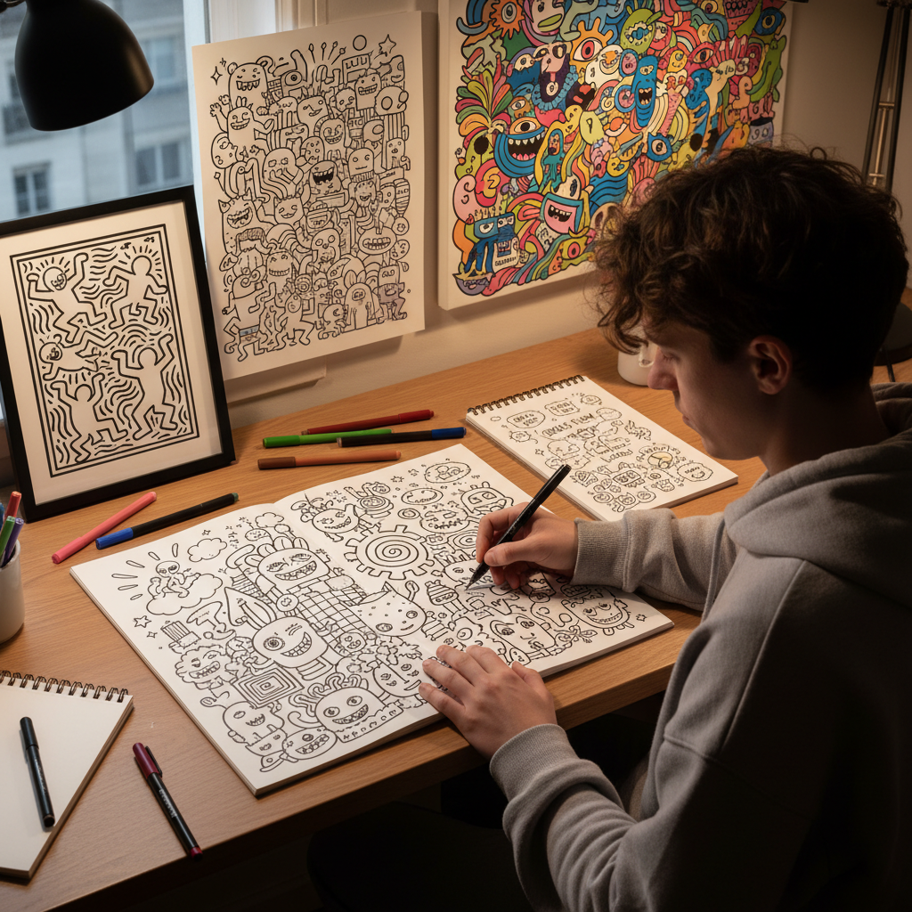

# Doodling 涂鸦

> "Doodling is the mind's way of thinking out loud — the hand moves freely while consciousness wanders, and what emerges is a map of the unconscious at play." — Unknown

## 概述

涂鸦（Doodling）是一种无意识或半意识状态下的自由绘画——通常在注意力集中于其他事物（如听讲座、打电话）时，手自发地在纸上画出的图案、线条和形状。Doodling的特点是：无预设目的、自由流动、重复性图案、即兴创作。虽然长期被视为"走神"的表现，但现代研究表明Doodling实际上有助于集中注意力、增强记忆和促进创造性思维。

当代的Doodling已从无意识的边缘活动发展为一种有意识的艺术形式——Doodle Art（涂鸦艺术）将自由的涂鸦风格提升为精心构建的复杂作品。艺术家如Keith Haring、Jon Burgerman等将涂鸦美学带入了当代艺术的主流。

## 核心特征

| 特征 | 描述 |
|------|------|
| 自由 | 自由流动的线条 |
| 即兴 | 即兴创作 |
| 重复 | 重复性图案 |
| 无意识 | 半意识状态 |
| 简单 | 简单的形状和线条 |
| 填充 | 空间的自由填充 |

## 视觉特征

- **自由**：自由流动的线条
- **重复**：重复的图案元素
- **密集**：密集的填充
- **有机**：有机的形状
- **黑白**：通常为黑白
- **即兴**：即兴的构图

## 代表作品

| 作品 | 艺术家 | 年代 | 意义 |
|------|--------|------|------|
| *Subway drawings* | Keith Haring | 1980s | 涂鸦艺术的先驱 |
| *Doodle characters* | Jon Burgerman | 当代 | 当代涂鸦艺术 |
| *Google Doodles* | Various | 1998+ | 涂鸦的商业应用 |
| *Doodle journals* | Various | 当代 | 涂鸦日记 |
| *Collaborative doodles* | Various | 当代 | 协作涂鸦 |

## 历史时间线

| 时期 | 事件 |
|------|------|
| 史前 | 洞穴中的早期涂鸦 |
| 中世纪 | 手稿边缘的涂鸦 |
| 20世纪初 | 超现实主义的自动绘画 |
| 1980s | Keith Haring的涂鸦艺术 |
| 2000s+ | 涂鸦笔记（Sketchnoting）的兴起 |
| 当代 | 涂鸦作为正式艺术形式 |

## 中国语境

涂鸦在中国有着悠久的传统——从古代文人在书信、手稿边缘的随手画，到当代的涂鸦文化。中国当代的涂鸦艺术受到了街头文化和网络文化的双重影响。"涂鸦笔记"（Sketchnoting）在中国的设计和教育领域越来越流行。一些中国当代艺术家如MOMO等将涂鸦带入了当代艺术语境。中国的社交媒体上，涂鸦风格的表情包和插画非常流行。手账文化中的涂鸦装饰也是中国年轻人的热门爱好。

## AI生成概念图

## 与其他风格的关系

- **Zentangle** → 禅绕画
- **Street Art** → 街头艺术
- **Graffiti** → 涂鸦（街头）
- **Automatic Drawing** → 自动绘画
- **Illustration** → 插画
- **Sketchnoting** → 涂鸦笔记

---

*浮光艺志 | Chronicle of Artistry*
