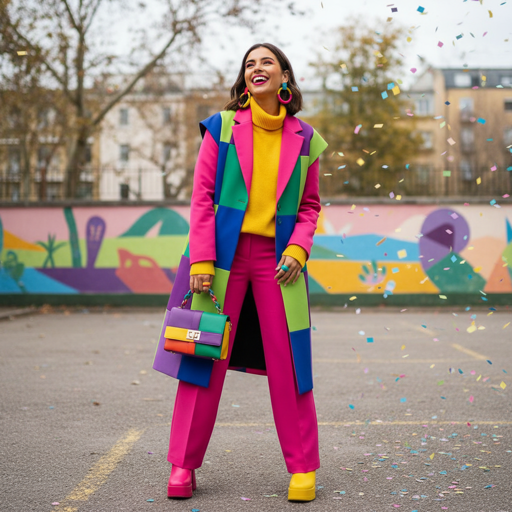

# Dopamine Dressing 多巴胺穿搭



> **"穿上所有你喜欢的颜色——快乐不需要理由，色彩就是药方。"**

## 概述

| 维度 | 描述 |
|------|------|
| 时期 | 2021–至今 |
| 别名 | Dopamine Dressing, Color Blocking, Joy Dressing |
| 核心色彩 | 全光谱高饱和——粉、黄、绿、蓝、紫、橙 |
| 关键元素 | 大面积纯色、色块碰撞、不协调配色、快乐至上 |
| 代表人物 | Valentino、Bottega Veneta、Zara 2022 |
| 关联风格 | Kidcore, Memphis Design, Maximalism, Barbiecore |

---

## 历史脉络

### 疫情后的色彩爆发

| 年份 | 事件 |
|------|------|
| 2020 | 疫情封锁——人们穿灰色睡衣 |
| 2021 | 解封——"我要穿最亮的颜色出门" |
| 2022 | Valentino 全粉色系列引爆 |
| 2022 | 《芭比》电影预告推动 Barbiecore |
| 2023 | 多巴胺穿搭成为全球趋势 |

### 为什么是现在？

| 背景 | 反应 |
|------|------|
| 疫情的灰暗 | → 渴望色彩和快乐 |
| 极简主义疲劳 | → 反叛"性冷淡风" |
| 心理健康意识 | → "穿衣服可以改善心情" |
| 社交媒体 | → 鲜艳色彩更吸引眼球 |
| 可持续时尚 | → "买少但买亮"——一件亮色=多件基础款 |

### 核心哲学

Dopamine Dressing 的精神是**"快乐是一种选择，颜色是工具"**：
- 穿衣不是为了"好看"——是为了"开心"
- 没有"不搭配"的颜色——只有不够大胆
- 时尚规则是用来打破的
- 你的衣柜应该让你微笑

---

## 视觉语法

### 色彩系统

```
主色：
  全光谱！没有禁区！
  粉色 (#FF69B4) — Barbiecore
  黄色 (#FFD700) — 阳光
  绿色 (#00FF00) — 能量
  蓝色 (#0000FF) — Klein Blue
  紫色 (#800080) — 戏剧
  橙色 (#FF8C00) — 温暖

规则：
  - 高饱和度
  - 大面积纯色
  - 色块碰撞（不是渐变）
  - 越"不搭"越好
  - 单色全身也可以

搭配方式：
  单色 — 全身一个颜色（Valentino粉）
  撞色 — 互补色碰撞（粉+绿）
  彩虹 — 每件不同颜色
  渐变 — 同色系深浅
```

### 标志性元素

| 类别 | 元素 |
|------|------|
| 色彩 | 高饱和纯色、大面积色块 |
| 搭配 | 撞色、单色、彩虹 |
| 配饰 | 彩色包、彩色鞋、彩色珠宝 |
| 面料 | 缎面、针织、皮革——任何面料都行 |
| 态度 | 自信、快乐、不在乎规则 |
| 场景 | 日常、办公、派对——任何场合 |

---

## 与千禧怀旧的关系

### 对"性冷淡风"的反叛
- 2015–2020 = 极简、中性色、"高级感"
- 千禧一代被告知"少即是多"
- 但疫情后："我受够了灰色和米色"
- Dopamine Dressing = 千禧一代的"中年叛逆"

### 与 Kidcore 的交叉
- 两者都热爱鲜艳色彩
- Kidcore = 回到童年的色彩
- Dopamine Dressing = 成人版的"我想穿什么就穿什么"
- 共同精神：快乐 > 规则

---

## 中国语境

- "多巴胺穿搭"2023年在中国爆火
- 小红书/抖音上的"多巴胺女孩"
- 与"美拉德穿搭"(2023秋冬)的对比
- 中国消费者对色彩的接受度提升
- 从"高级感=黑白灰"到"快乐=彩色"的转变

---

## 设计应用

| 场景 | 应用方式 |
|------|----------|
| 时尚 | 大面积纯色+撞色搭配+彩色配饰 |
| 品牌 | 高饱和品牌色+色块设计+快乐调性 |
| 空间 | 彩色家具+纯色墙面+色块地毯 |
| 数字 | 大色块UI+鲜艳CTA+快乐插画 |

---

## 相关风格

← [Kidcore 童核](kidcore.md) | [Maximalism 极繁主义](maximalism.md) →

↑ [返回千禧怀旧目录](README.md) | [返回总目录](../README.md)
