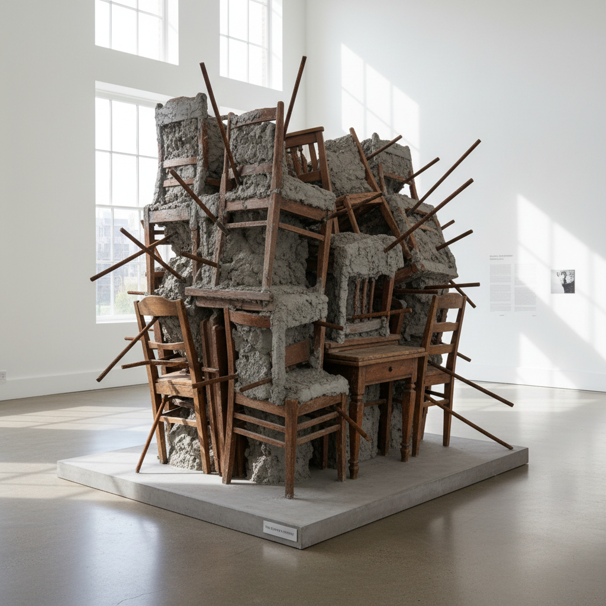

# Doris Salcedo 多丽丝·萨尔塞多

> **流派**: 当代雕塑 · 装置艺术  
> **时期**: 1958–至今 哥伦比亚  
> **关键词**: 政治暴力、缺席与哀悼、家具雕塑、集体创伤

## 概述

多丽丝·萨尔塞多是当代最重要的政治雕塑家之一。她的作品回应哥伦比亚内战和全球政治暴力中的失踪、谋杀和流离失所。她将日常家具——桌子、椅子、衣柜——用水泥填充、用钢筋穿透、用人类头发缝合，将私密的家庭物品转化为沉默的纪念碑。

## 视觉特征

- **家具变形**: 桌椅衣柜被水泥、钢筋、玻璃侵入
- **沉默的白**: 大量使用白色、灰色和木色
- **缝合痕迹**: 用丝线或头发将断裂的物品缝合
- **巨大规模**: 装置常占据整栋建筑或广场
- **缺席感**: 作品暗示不在场的人——失踪者

## 代表作品

- 《Shibboleth》(2007) — 泰特现代美术馆地板裂缝
- 《无题》(Untitled, 2003) — 1550把椅子堆叠
- 《Plegaria Muda》(2008–10) — 泥土桌子长出草
- 《Noviembre 6 y 7》(2002) — 椅子从建筑外墙缓慢坠落

## 历史影响

萨尔塞多证明了雕塑可以承载政治创伤而不沦为宣传。她的作品以极度克制的方式让观众感受到暴力的后果——不是暴力本身，而是暴力留下的空洞。

## 相关风格

- [Installation Art 装置艺术](installation-art.md)
- [Arte Povera 贫穷艺术](arte-povera.md)
- [Social Practice Art 社会实践艺术](social-practice-art.md)
