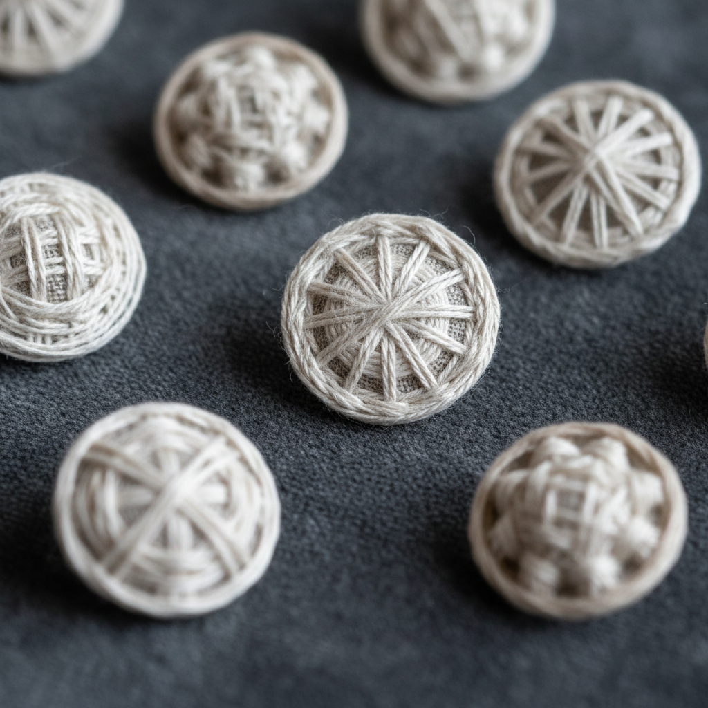

# Dorset Button Art 多塞特纽扣艺术

> "A Dorset button is a universe in miniature — thread wound over a ring, spoked like a wheel, then woven into patterns that radiate from the center like tiny mandalas. Each button is a complete textile construction: foundation, spokes, and filling, worked entirely by hand with nothing but thread and a metal or bone ring, creating buttons that are both functional fasteners and jewel-like ornaments." — Unknown

## 概述

多塞特纽扣艺术（Dorset Button Art）是一种起源于英国多塞特郡的手工纽扣制作技法——通过在金属或骨质环上缠绕线、拉辐条、然后编织填充图案来制作装饰性纽扣。多塞特纽扣曾是一个重要的家庭手工业，在18-19世纪为当地提供了大量就业，直到机器纽扣的出现使其衰落。

多塞特纽扣艺术的实践包括：1）缠环——用线紧密缠绕金属环；2）拉辐条——从中心向外拉出辐射状的线；3）编织填充——在辐条上编织各种图案；4）Dorset Knob——球形纽扣；5）Cartwheel——车轮形纽扣；6）Crosswheel——十字车轮纽扣；7）当代多塞特纽扣——将传统技法与现代设计结合的创作。

## 核心特征

| 特征 | 描述 |
|------|------|
| 环形 | 在环上制作 |
| 辐射 | 辐射状的结构 |
| 编织 | 编织填充图案 |
| 微型 | 微型的纺织品 |
| 功能 | 功能性的纽扣 |
| 手工 | 完全手工制作 |

## 视觉特征

- **辐射**：从中心辐射的图案
- **对称**：严格的放射对称
- **精致**：精致微小的尺寸
- **几何**：几何化的编织图案
- **圆形**：圆形的基本形态
- **多样**：多种图案变化

## 代表作品

| 作品 | 艺术家/文化 | 年代 | 意义 |
|------|-------------|------|------|
| *Dorset Knob buttons* | 英国多塞特 | 18世纪 | 球形多塞特纽扣 |
| *Cartwheel buttons* | 英国多塞特 | 18-19世纪 | 车轮形纽扣 |
| *High Top buttons* | 英国多塞特 | 18-19世纪 | 高顶纽扣 |
| *Singleton buttons* | 英国多塞特 | 18-19世纪 | 单线纽扣 |
| *Contemporary Dorset buttons* | 国际 | 当代 | 当代多塞特纽扣 |

## 历史时间线

| 时期 | 事件 |
|------|------|
| 17世纪 | 多塞特纽扣产业的起源 |
| 18世纪 | 产业的繁荣时期 |
| 1851年 | 机器纽扣导致产业崩溃 |
| 20世纪 | 作为传统工艺的复兴 |
| 当代 | 手工纽扣的艺术化发展 |

## 中国语境

多塞特纽扣与中国的传统纽扣制作有一定的可比性。中国的盘扣（Chinese knot buttons）是中国传统服饰的重要组成部分——同样是完全手工制作的装饰性纽扣。中国的盘扣以编结技法为主——与多塞特纽扣的编织技法有相似的手工精神。中国当代的手工爱好者群体中，多塞特纽扣作为一种西方传统手工——正在获得关注。中国的纤维艺术教育中，多塞特纽扣作为微型纺织品的代表——在相关课程中有所介绍。中国的手工市场中，多塞特纽扣被用于首饰、胸针和装饰品——超越了其原始的功能性用途。

## AI生成概念图

## 与其他风格的关系

- **Passementerie** → 花边装饰
- **Textile Art** → 纺织艺术
- **Folk Art** → 民间艺术
- **Miniature Art** → 微型艺术
- **Chinese Knot** → 中国结
- **Weaving** → 编织

---

*浮光艺志 | Chronicle of Artistry*
