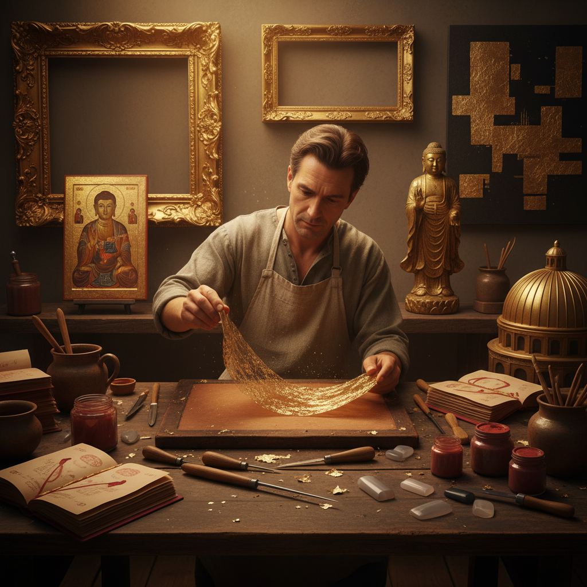

# Dorure Art 鎏金艺术

> "Dorure — gilding — is the art of clothing surfaces in gold. Whether applied as gossamer-thin gold leaf beaten to a few atoms' thickness, or as liquid gold ground with mercury and fired onto metal, gilding transforms the ordinary into the transcendent. A gilded surface catches light like nothing else in the material world, glowing with a warmth that paint can only imitate." — Unknown

## 概述

鎏金艺术（Dorure Art）是在物体表面施加金层的装饰技法的总称——包括贴金箔、水鎏金（汞齐法）、火鎏金、油鎏金等多种方法。鎏金是人类最古老的表面装饰技术之一，从古埃及法老的面具到拜占庭教堂的穹顶，从中国佛像到法国宫殿，金色一直是神圣、权力和美的象征。

鎏金艺术的实践包括：1）水鎏金——使用水性胶粘剂贴金箔；2）油鎏金——使用油性胶粘剂贴金箔；3）汞鎏金——使用金汞齐的古代技法；4）电镀鎏金——现代电化学镀金；5）粉金——使用金粉的装饰；6）描金——用金液绘制图案；7）当代鎏金——将传统技法与现代艺术结合的创作。

## 核心特征

| 特征 | 描述 |
|------|------|
| 金色 | 纯金的永恒光泽 |
| 薄层 | 极薄的金层覆盖 |
| 永恒 | 金不氧化不褪色 |
| 神圣 | 宗教和权力的象征 |
| 多法 | 多种施金方法 |
| 通用 | 适用于各种基材 |

## 视觉特征

- **光泽**：纯金的温暖光泽
- **反射**：金面的柔和反射
- **温暖**：金色的温暖感
- **对比**：金与其他材料的对比
- **质感**：不同鎏金法的质感差异
- **神圣**：神圣庄严的视觉效果

## 代表作品

| 作品 | 艺术家/文化 | 年代 | 意义 |
|------|-------------|------|------|
| *图坦卡蒙面具* | 古埃及 | 公元前14世纪 | 古代鎏金巅峰 |
| *拜占庭马赛克* | 拜占庭 | 6-15世纪 | 金底马赛克 |
| *凡尔赛镜厅* | 法国 | 17世纪 | 法国宫廷鎏金 |
| *日本金阁寺* | 日本 | 1397 | 日本贴金建筑 |
| *中国鎏金铜佛* | 中国 | 汉代至今 | 中国鎏金传统 |

## 历史时间线

| 时期 | 事件 |
|------|------|
| 古代 | 埃及和美索不达米亚的早期鎏金 |
| 古典时期 | 希腊罗马的鎏金技术 |
| 中世纪 | 教堂和手抄本的鎏金 |
| 文艺复兴 | 鎏金画框和建筑装饰 |
| 当代 | 鎏金的现代传承和艺术应用 |

## 中国语境

鎏金艺术在中国有极其悠久和辉煌的传统。中国的"鎏金"技术（汞齐法）至少可追溯到战国时期——是世界上最早的金属镀金技术之一。中国的鎏金铜器（如马踏飞燕、长信宫灯）是国宝级文物——展示了中国古代鎏金技术的精湛水平。中国佛教造像中大量使用鎏金——从北魏到清代的铜佛像多采用鎏金装饰。中国传统建筑中的"贴金"技法用于宫殿和寺庙装饰——故宫的金色琉璃瓦和金漆彩画是其代表。中国的漆器装饰中有"描金"和"洒金"技法——在漆面上用金粉或金液创造装饰效果。中国的鎏金技艺被列入国家级非物质文化遗产——多位传承人在继续这一古老技艺。

## AI生成概念图

## 与其他风格的关系

- **Gold Leaf** → 金箔艺术
- **Electroplating** → 电镀艺术
- **Lacquerware** → 漆器艺术
- **Religious Art** → 宗教艺术
- **Frame Making** → 画框制作
- **Decorative Art** → 装饰艺术

---

*浮光艺志 | Chronicle of Artistry*
