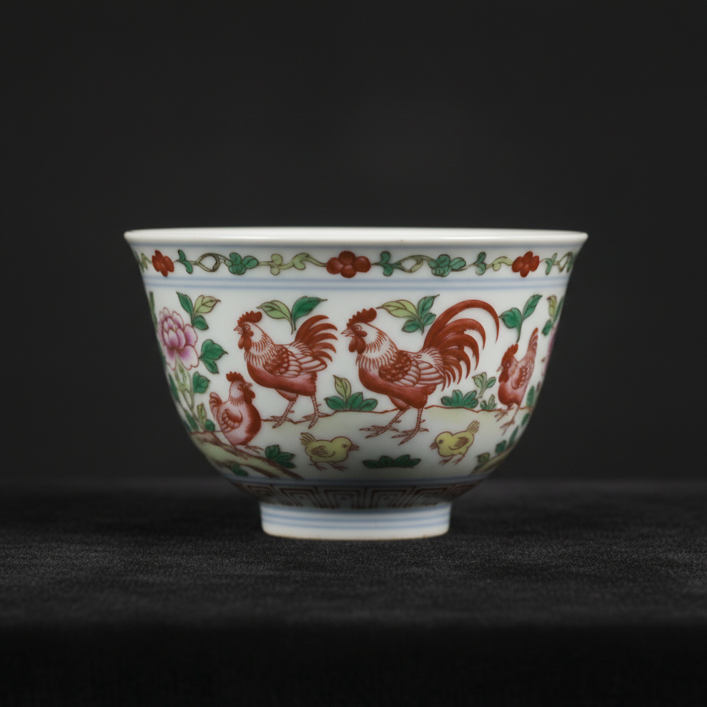

# Doucai Art 斗彩艺术

> "Doucai is color in conversation — underglaze blue outlines filled with overglaze enamels in a technique whose name means 'contending colors' or 'fitted colors,' where cobalt blue drawn before firing meets red, green, yellow, and purple applied after, each color knowing its place within the blue boundary, a dialogue between two firings that produces decoration of extraordinary precision and jewel-like clarity." — Unknown

## 概述

斗彩艺术（Doucai Art）是中国明代成化时期（1465-1487年）创造的一种独特的陶瓷彩绘技法。斗彩（意为"斗争的色彩"或"拼合的色彩"）将釉下青花与釉上彩料巧妙结合——先用钴蓝料在素胎上勾勒图案轮廓，施釉后高温烧成，再在青花轮廓内填入各色釉上彩料，低温二次烧成。斗彩是中国陶瓷工艺中最精致的技法之一——其色彩清丽、构图精巧、工艺复杂。

斗彩艺术的核心要素包括：1）双次烧成——釉下与釉上两次烧成；2）青花勾线——釉下青花勾勒轮廓；3）填彩——釉上彩料填充色彩；4）色彩清丽——色彩淡雅清丽；5）成化巅峰——成化时期的最高成就；6）小巧精致——以小件器物为主；7）工艺复杂——需要极高的工艺水平。

## 核心特征

| 特征 | 描述 |
|------|------|
| 双次烧成 | 釉下与釉上两次烧成 |
| 青花勾线 | 釉下青花勾勒轮廓 |
| 填彩 | 釉上彩料填充色彩 |
| 色彩清丽 | 色彩淡雅清丽 |
| 成化巅峰 | 成化时期最高成就 |
| 小巧精致 | 以小件器物为主 |

## 视觉特征

- **青花轮廓**：清晰的青花勾线
- **填彩精确**：彩料精确填入轮廓
- **色彩淡雅**：淡雅清丽的色调
- **小巧玲珑**：多为小件精品
- **构图精巧**：精巧的装饰构图
- **釉面温润**：温润如玉的釉面

## 代表作品

| 作品 | 艺术家/文化 | 年代 | 意义 |
|------|-------------|------|------|
| *成化斗彩鸡缸杯* | 景德镇御窑 | 成化 | 中国最贵瓷器之一 |
| *成化斗彩葡萄杯* | 景德镇御窑 | 成化 | 经典斗彩 |
| *成化斗彩天字罐* | 景德镇御窑 | 成化 | 天字款精品 |
| *雍正斗彩* | 景德镇御窑 | 雍正 | 清代仿成化 |
| *成化斗彩三秋杯* | 景德镇御窑 | 成化 | 秋虫题材 |

## 历史时间线

| 时期 | 事件 |
|------|------|
| 宣德 | 斗彩技法的萌芽 |
| 成化 | 斗彩艺术的巅峰 |
| 嘉靖万历 | 斗彩的继续发展 |
| 康熙雍正 | 清代仿成化斗彩 |
| 当代 | 斗彩的传承与收藏 |

## 中国语境

斗彩是中国陶瓷史上最精致的彩绘技法之一。成化斗彩被公认为中国彩瓷的巅峰之作——其中最著名的"鸡缸杯"在2014年香港苏富比拍卖会上以2.81亿港元成交，创下中国瓷器的世界纪录。成化斗彩的成功与明宪宗的个人审美密切相关——宪宗偏爱小巧精致的器物，这种审美偏好催生了斗彩这种精工细作的技法。斗彩的"斗"字有多种解释——有人认为是"斗争"（釉下与釉上色彩的对比），也有人认为是"凑合"（两种技法的结合）。无论如何解释，斗彩都代表了中国陶瓷工匠将两种不同烧成温度的彩绘技法完美结合的智慧。清代雍正时期大量仿制成化斗彩——其品质之高甚至可以与原作媲美。

## AI生成概念图

## 与其他风格的关系

- **Wucai** → 五彩
- **Famille Verte** → 素三彩
- **Blue and White** → 青花
- **Chenghua Porcelain** → 成化瓷器
- **Overglaze Enamel** → 釉上彩
- **Imperial Porcelain** → 御窑瓷器

---

*浮光艺志 | Chronicle of Artistry*
