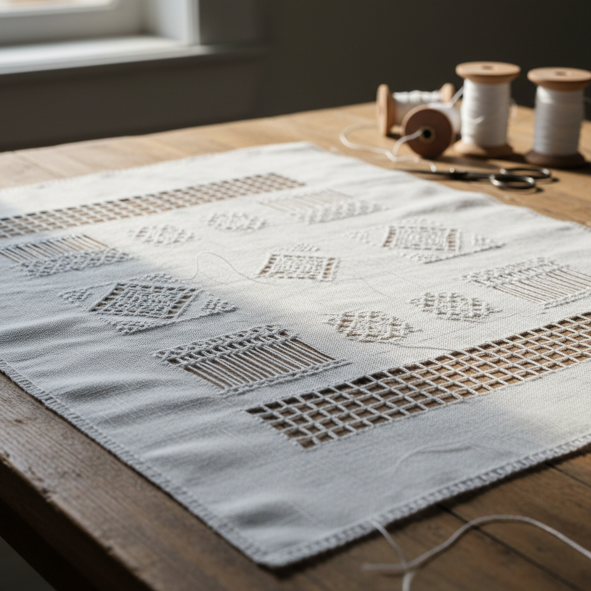

# Drawn Thread Art 抽线绣艺术

> "Drawn thread work is the art of absence — by carefully withdrawing warp or weft threads from woven fabric and then decorating the remaining threads with wrapping, weaving, and knotting, the embroiderer creates patterns of light and air within the cloth itself. It is embroidery that subtracts rather than adds, revealing beauty through what is taken away." — Unknown

## 概述

抽线绣艺术（Drawn Thread Art）是一种通过从织物中抽去部分经线或纬线，然后对剩余的线进行包缠、编织和打结装饰的刺绣技法——创造出精美的镂空效果和几何图案。抽线绣是最古老的针线装饰技法之一，广泛存在于世界各地的纺织传统中。

抽线绣艺术的实践包括：1）简单抽线——抽去一个方向的线并包缠剩余线；2）复杂抽线——同时抽去经纬线创造网格；3）hem stitch——最基本的抽线边缘装饰；4）束线——将剩余线束成组并装饰；5）编织填充——在抽线区域编织装饰图案；6）角落处理——抽线交叉处的特殊处理；7）当代抽线绣——将传统技法与现代设计结合的创作。

## 核心特征

| 特征 | 描述 |
|------|------|
| 减法 | 通过减去线来创造图案 |
| 镂空 | 形成透光的镂空效果 |
| 几何 | 受织物结构限制的几何 |
| 精密 | 需要精确计数的技法 |
| 古老 | 最古老的装饰技法之一 |
| 普遍 | 世界各地都有传统 |

## 视觉特征

- **透光**：镂空处的透光效果
- **几何**：受织物结构决定的几何
- **精细**：极其精细的线条
- **规律**：规律重复的图案
- **层次**：不同密度的层次感
- **素雅**：通常为单色的素雅美

## 代表作品

| 作品 | 艺术家/文化 | 年代 | 意义 |
|------|-------------|------|------|
| *Italian reticella* | 意大利 | 15-16世纪 | 意大利网格绣 |
| *Danish hedebo* | 丹麦 | 18-19世纪 | 丹麦赫德博绣 |
| *Russian drawn work* | 俄罗斯 | 传统 | 俄罗斯抽线绣 |
| *Chinese drawn work* | 中国 | 传统 | 中国抽纱 |
| *Contemporary drawn thread* | 当代 | 当代 | 当代抽线绣 |

## 历史时间线

| 时期 | 事件 |
|------|------|
| 古代 | 抽线绣的起源（埃及、中东） |
| 中世纪 | 在欧洲的发展和传播 |
| 15-16世纪 | 意大利reticella的黄金时代 |
| 19世纪 | 中国抽纱产业的兴起 |
| 当代 | 抽线绣的艺术化和创新 |

## 中国语境

抽线绣艺术在中国有深厚的传统——中国的"抽纱"是重要的出口工艺品。山东烟台是中国抽纱的主要产地——19世纪末由欧洲传教士引入后迅速发展为重要产业。中国的抽纱工艺融合了欧洲技法和中国审美——创造出具有中国特色的抽线绣作品。中国的抽纱产品曾大量出口欧美——以精细的工艺和相对低廉的价格著称。中国传统的"挑花"和"十字挑花"中也有类似抽线的技法——在少数民族服饰中广泛应用。中国当代的一些纺织艺术家重新探索抽线绣——将其作为当代纤维艺术的表达方式。中国的非物质文化遗产保护中，抽纱工艺被列为保护项目——传承这一重要的手工艺传统。

## AI生成概念图

## 与其他风格的关系

- **Hardanger** → 哈当厄尔刺绣
- **Whitework** → 白色刺绣
- **Cutwork** → 镂空绣
- **Lacework** → 蕾丝艺术
- **Hedebo** → 赫德博绣
- **Textile Art** → 纺织艺术

---

*浮光艺志 | Chronicle of Artistry*
