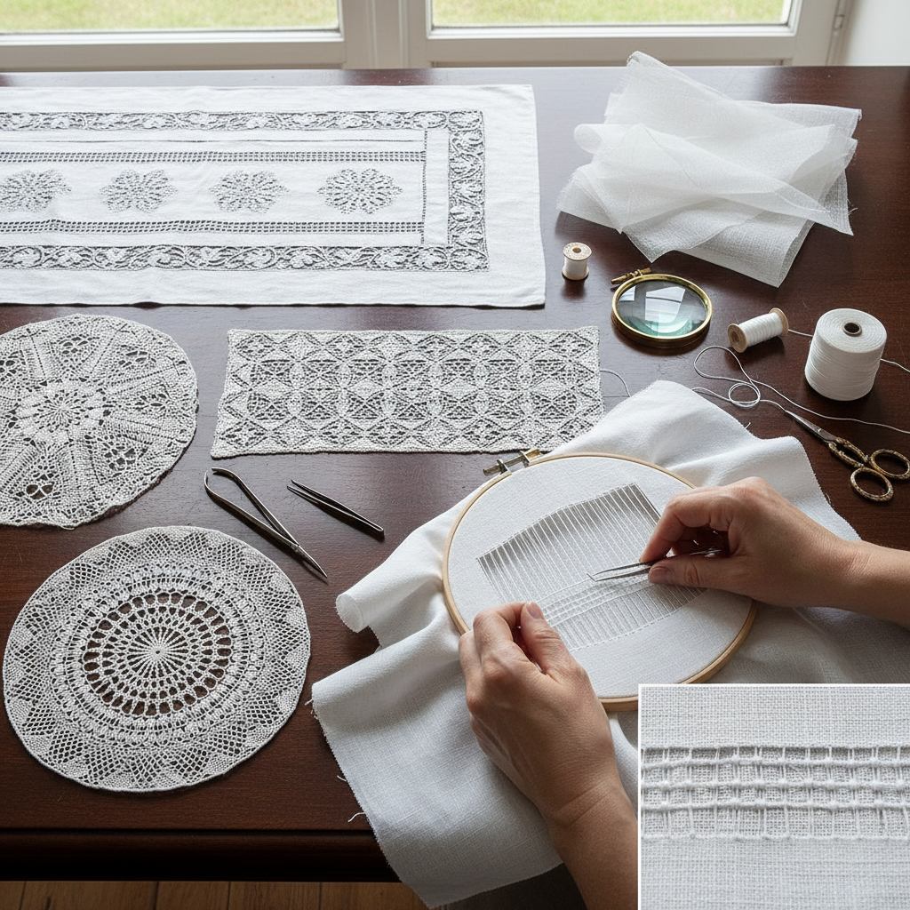

# Drawn Thread Work 抽丝绣

> "Drawn thread work is subtraction as art — threads carefully withdrawn from the fabric's weave, the remaining threads grouped, wrapped, and woven into patterns that transform solid cloth into lace, creating transparency where there was opacity, openness where there was density, beauty from absence." — Unknown

## 概述

抽丝绣（Drawn Thread Work）是一种通过从织物中抽出部分经线或纬线，然后对剩余的线进行装饰性处理（包裹、编织、打结等）来创造透空效果的刺绣技法。抽丝绣是"减法"纺织——通过去除织物的部分结构来创造图案，而非在织物上添加材料。

抽丝绣的历史极其悠久——可以追溯到古埃及的亚麻织物。抽丝绣在欧洲各国发展出不同的地方风格：意大利的Punto Tirato、挪威的Hardanger（也包含抽丝元素）、德国的Schwalm、丹麦的Hedebo等。抽丝绣的基本操作包括：抽出线（withdrawing threads）、束线（hemstitching/grouping threads）、包裹线（wrapping bars）、编织线（weaving bars）和填充（filling with needlewoven patterns）。

## 核心特征

| 特征 | 描述 |
|------|------|
| 抽丝 | 抽出织物线 |
| 透空 | 创造透空效果 |
| 包裹 | 包裹剩余线 |
| 编织 | 编织装饰图案 |
| 减法 | 减法纺织技法 |
| 精细 | 极其精细的工艺 |

## 视觉特征

- **透明**：透空的蕾丝效果
- **几何**：几何的网格结构
- **精细**：极其精细的编织
- **对比**：实体与透空的对比
- **光影**：光线穿透的效果
- **优雅**：精致的优雅感

## 代表作品

| 作品 | 艺术家 | 年代 | 意义 |
|------|--------|------|------|
| *Egyptian drawn thread linen* | 埃及工匠 | 古代 | 古埃及抽丝 |
| *Italian Punto Tirato* | 意大利工匠 | 文艺复兴 | 意大利抽丝 |
| *Danish Hedebo* | 丹麦工匠 | 18-19世纪 | 丹麦抽丝 |
| *German Schwalm* | 德国工匠 | 传统 | 德国施瓦尔姆 |
| *Contemporary drawn thread* | Various | 当代 | 当代抽丝绣 |

## 历史时间线

| 时期 | 事件 |
|------|------|
| 古代 | 古埃及的抽丝亚麻 |
| 文艺复兴 | 意大利抽丝的精细化 |
| 17-18世纪 | 各国地方风格的形成 |
| 19世纪 | 抽丝绣的工业化影响 |
| 当代 | 抽丝绣的艺术化复兴 |

## 中国语境

抽丝绣在中国有重要的传统——中国的"抽纱"是国家级非物质文化遗产。汕头抽纱（潮汕抽纱）是中国最著名的抽丝绣传统——使用精细的抽丝和编织技法在亚麻或棉布上创造透空图案。汕头抽纱曾是重要的出口工艺品，在国际市场上享有盛誉。中国的抽纱技法与欧洲的drawn thread work有相似的原理但发展出独特的风格。当代中国的抽纱面临传承挑战，但仍有工匠在坚持。

## AI生成概念图

## 与其他风格的关系

- **Hardanger** → 哈当厄尔刺绣
- **Whitework** → 白色刺绣
- **Needle Lace** → 针绣蕾丝
- **Cutwork** → 雕绣
- **Hemstitching** → 抽纱镶边
- **Textile Art** → 纺织艺术

---

*浮光艺志 | Chronicle of Artistry*
