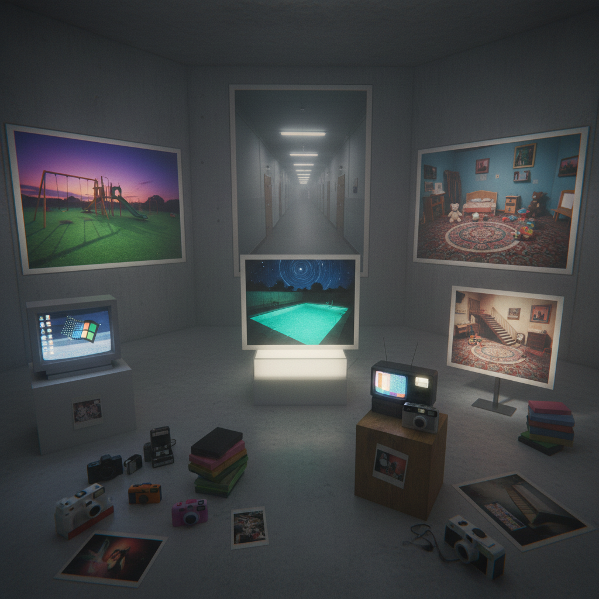

# Dreamcore Art 梦核艺术

> "Dreamcore captures the texture of dreams themselves — not nightmares but the strange familiar unreality of sleeping consciousness, where childhood bedrooms stretch into infinite corridors, where the sky is always the wrong color, where you recognize everything but nothing makes sense, an aesthetic that lives in the uncanny valley between memory and imagination, nostalgia and unease, comfort and cosmic wrongness." — Unknown

## 概述

梦核（Dreamcore）是2020年代兴起的一种互联网美学风格，通过图像营造一种类似梦境的超现实感——熟悉但又不对劲、怀旧但又不安、平静但又诡异。Dreamcore的图像通常看起来像是被遗忘的记忆或半醒半睡时的幻觉——模糊的、过度饱和或欠饱和的、带有VHS质感或早期数码相机质感的照片。

Dreamcore与Weirdcore（怪核）和Liminal Space（阈限空间）美学密切相关，但有其独特的侧重点：Dreamcore更强调"梦"的感觉——那种似曾相识（déjà vu）的体验、童年记忆的变形、以及意识边缘的模糊状态。Dreamcore的图像常常包含：空旷的游乐场、无人的走廊、奇怪颜色的天空、漂浮的物体、以及带有文字叠加的超现实场景。

## 核心特征

| 特征 | 描述 |
|------|------|
| 梦境 | 梦境般的超现实感 |
| 熟悉 | 熟悉但不对劲 |
| 怀旧 | 扭曲的怀旧感 |
| 模糊 | 模糊的边界和质感 |
| 不安 | 平静中的不安 |
| 记忆 | 变形的记忆 |

## 视觉特征

- **模糊**：模糊和柔焦的质感
- **色彩**：不自然的色彩
- **空旷**：空旷的熟悉空间
- **天空**：奇怪颜色的天空
- **文字**：叠加的神秘文字
- **VHS**：VHS和早期数码质感

## 代表作品

| 作品 | 艺术家 | 年代 | 意义 |
|------|--------|------|------|
| *Dreamcore edits* | Various creators | 2020起 | 互联网梦核创作 |
| *Everywhere at the End of Time* | The Caretaker | 2016-19 | 记忆衰退的音乐 |
| *Yume Nikki* | Kikiyama | 2004 | 梦日记游戏 |
| *David Lynch films* | David Lynch | 1980年代起 | 林奇的梦境美学 |
| *Backrooms* | Anonymous | 2019 | 后室的梦核空间 |

## 历史时间线

| 时期 | 事件 |
|------|------|
| 2004 | 《梦日记》游戏发布 |
| 2019 | Backrooms概念的诞生 |
| 2020 | Dreamcore美学的命名和传播 |
| 2021 | TikTok上的梦核内容爆发 |
| 当代 | Dreamcore的持续发展 |

## 中国语境

梦核在中国年轻人中有广泛的传播。中国的社交媒体上有大量梦核风格的创作——利用中国特有的空间（如90年代的学校走廊、老式居民楼、废弃的游乐场等）创造梦核效果。中国的"千禧怀旧"（对2000年代初期的怀旧）与梦核有天然的亲和性。有趣的是，中国传统文化中的"庄周梦蝶"哲学——质疑现实与梦境的界限——与梦核的核心体验有深层的相通之处。中国的一些实验影像艺术家也在创作具有梦核气质的作品。

## AI生成概念图

## 与其他风格的关系

- **Weirdcore** → 怪核
- **Liminal Space** → 阈限空间
- **Surrealism** → 超现实主义
- **Vaporwave** → 蒸汽波
- **Nostalgia** → 怀旧美学
- **Backrooms** → 后室美学

---

*浮光艺志 | Chronicle of Artistry*
