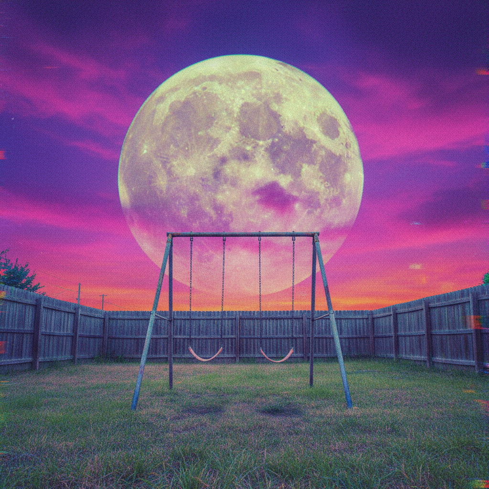

# Dreamcore 梦核

> **时期：** 2019–至今  
> **关键词：** 梦境逻辑、超现实日常、柔和失真、记忆碎片、不安宁静

## 概述

Dreamcore 是一种互联网美学，模拟梦境中那种"熟悉又陌生"的感觉。与Liminal Space的空旷不同，Dreamcore更强调梦的逻辑——颜色过于饱和或过于苍白、物体比例失调、天空是不可能的颜色、熟悉的场景中出现不该存在的元素。它捕捉的是那种"我好像来过这里，但一切都不太对"的感觉。

## 风格特征

- **色彩失真**：过饱和或极度褪色的色调
- **比例失调**：物体大小不符合现实逻辑
- **熟悉的陌生**：日常场景的微妙扭曲
- **无人场景**：空旷但暗示有人存在
- **低分辨率**：模糊、颗粒感、早期数码相机质感

## 代表作品与平台

- Tumblr/TikTok Dreamcore 社区
- AI生成的梦境图像
- 独立游戏《Yume Nikki》视觉风格
- 早期3D渲染的超现实场景

## 概念图

