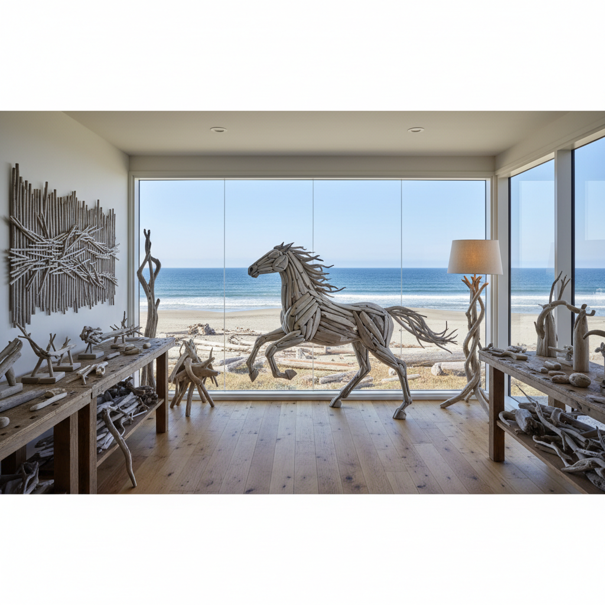

# Driftwood Art 浮木艺术

> "Driftwood art begins where the tree's life ends and the ocean's sculpting begins — every piece of driftwood is a collaboration between growth and erosion, between the patient years of a tree reaching for sunlight and the relentless months of salt water, sand, and sun stripping it back to its essential form. No two pieces are alike; each carries the memory of its journey — the river that carried it, the ocean that tumbled it, the beach where it finally came to rest." — Unknown

## 概述

浮木艺术（Driftwood Art）是以浮木——被水流冲刷、搬运并最终搁浅在海岸或河岸的木材——为主要创作材料的艺术实践。浮木经过长时间的水蚀、日晒和盐渍，形成了独特的形态：光滑的表面、扭曲的形状、银灰色的色调、以及被水流雕刻的有机曲线。

浮木艺术的实践包括：1）浮木雕塑——将浮木组合或雕刻成雕塑作品；2）浮木家具——用浮木制作独特的家具和装饰品；3）浮木装置——用大量浮木创作大型装置艺术；4）浮木拼贴——将浮木片拼贴成图案或画面；5）海滩浮木排列——在海滩上用浮木创作临时性大地艺术；6）浮木与其他材料——将浮木与玻璃、金属、石头等材料结合。

## 核心特征

| 特征 | 描述 |
|------|------|
| 自然 | 自然雕刻的形态 |
| 独特 | 每件都独一无二 |
| 旅程 | 漂流的旅程 |
| 银灰 | 风化的银灰色 |
| 有机 | 有机的曲线 |
| 回收 | 回收利用 |

## 视觉特征

- **银灰**：风化木材的银灰色
- **曲线**：水流雕刻的曲线
- **纹理**：暴露的木纹纹理
- **光滑**：水磨的光滑表面
- **扭曲**：自然的扭曲形态
- **孔洞**：虫蛀和水蚀的孔洞

## 代表作品

| 作品 | 艺术家 | 年代 | 意义 |
|------|--------|------|------|
| *Driftwood sculptures* | Deborah Butterfield | 1980年代 | 浮木马雕塑 |
| *Driftwood installations* | Various | 2000年代 | 浮木装置 |
| *Beach driftwood art* | Various | 当代 | 海滩浮木艺术 |
| *Driftwood horses* | Heather Jansch | 2000年代 | 浮木动物雕塑 |
| *Driftwood furniture* | Various | 当代 | 浮木家具设计 |

## 历史时间线

| 时期 | 事件 |
|------|------|
| 古代 | 浮木在沿海文化中的利用 |
| 19世纪 | 维多利亚时代的浮木装饰 |
| 1980年代 | 当代浮木雕塑的发展 |
| 2000年代 | 浮木艺术的流行 |
| 当代 | 浮木与环保意识的结合 |

## 中国语境

浮木艺术在中国有独特的文化和地理基础。中国拥有漫长的海岸线和众多河流，浮木资源丰富。中国传统文化中对"枯木"有独特的美学欣赏——"枯木逢春"是中国传统的吉祥意象，枯木在中国盆景艺术中有重要地位（"舍利干"技法）。中国传统的根雕艺术——利用树根的自然形态进行雕刻——与浮木艺术有密切的关系。中国沿海地区（如福建、浙江）有利用浮木制作家具和装饰品的传统。中国当代的一些艺术家在探索浮木艺术：将中国传统根雕的美学与当代浮木装置结合、在中国海岸线上创作浮木大地艺术、以及将中国传统的"枯木"意象与当代环保艺术对话。

## AI生成概念图

## 与其他风格的关系

- **Found Object Art** → 现成品艺术
- **Wood Sculpture** → 木雕
- **Land Art** → 大地艺术
- **Eco-Art** → 生态艺术
- **Natural Material Art** → 自然材料艺术
- **Beach Art** → 海滩艺术

---

*浮光艺志 | Chronicle of Artistry*
