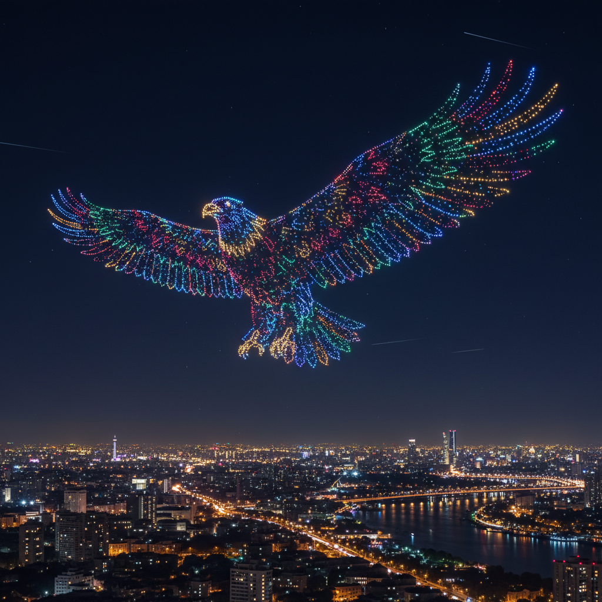

# Drone Art 无人机艺术

> **时期：** 2010年代–至今  
> **关键词：** 空中编队、光绘表演、群体智能、天空画布、科技表演

## 概述

Drone Art（无人机艺术）是利用无人机群进行艺术创作的新兴领域。数百甚至数千架无人机在夜空中编队飞行，用LED灯光组成巨大的三维图案、文字和动画——将天空变为画布。从Intel的奥运表演到Studio Drift的漂浮灯光装置，无人机艺术代表了科技与美学的最新融合。

## 风格特征

- **空中编队**：精密算法控制的群体运动
- **光点矩阵**：LED灯光组成的像素化图像
- **三维空间**：在天空中创造立体形态
- **时间性**：动态变化的空中动画
- **规模感**：数百米尺度的巨型画面

## 代表人物与作品

- Intel Shooting Star无人机表演
- Studio Drift《Franchise Freedom》
- 大疆创新无人机灯光秀
- Ars Electronica Futurelab

## 概念图

