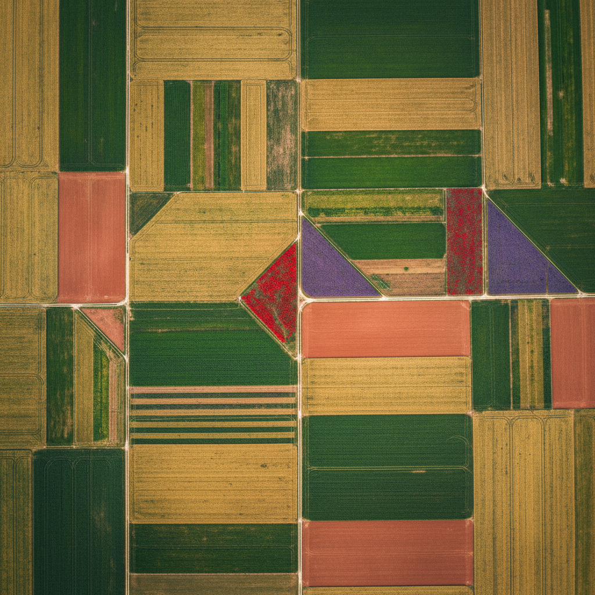

# Drone Photography 无人机摄影

> **时期：** 2010年代–至今  
> **关键词：** 鸟瞰视角、几何图案、地景抽象、新视角、民主化航拍

## 概述

Drone Photography（无人机摄影）是消费级无人机普及后兴起的摄影类型，将曾经只属于直升机和卫星的鸟瞰视角民主化。从正上方俯视时，熟悉的景观变成抽象的几何图案——农田成为色块拼贴、海岸线成为曲线构图、城市成为电路板——这种"上帝视角"彻底改变了人们观看世界的方式。

## 风格特征

- **正俯视角**：垂直向下的平面化视角
- **几何抽象**：地景的图案化和色块化
- **尺度对比**：人与环境的比例关系
- **对称构图**：自然和人工的对称美
- **色彩分区**：不同地貌的色彩区隔

## 代表人物与作品

- 乔治·斯坦梅茨（航拍先驱）
- 伯恩哈德·朗《Aerial Views》
- 汤姆·赫根（环境航拍）
- DJI无人机摄影大赛获奖作品

## 概念图

