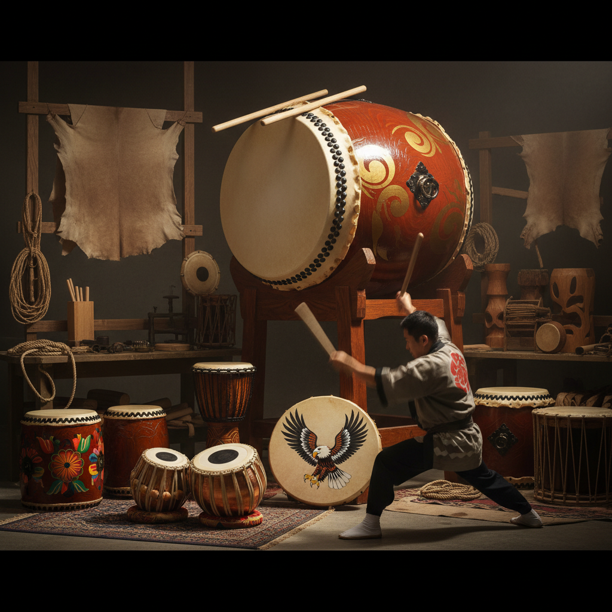

# Drum Art 鼓艺术

> "A drum is the heartbeat made audible — the most primal of instruments, requiring nothing more than a membrane stretched over a frame and a hand to strike it. Every culture on earth has drums because every human body has a pulse. Drum art celebrates this universality: the carved bodies of African djembes, the painted heads of Native American drums, the lacquered shells of Japanese taiko, each one a sculpture that sings when struck." — Unknown

## 概述

鼓艺术（Drum Art）是以鼓为创作媒介、装饰对象或表演核心的艺术形式——包括鼓的制作工艺、鼓身的装饰艺术、鼓乐表演艺术和以鼓为灵感的当代创作。鼓是人类最古老的乐器之一，在世界各文化中都有深厚的艺术传统。

鼓艺术的实践包括：1）鼓的制作——传统手工制鼓工艺；2）鼓身装饰——鼓身的雕刻和彩绘；3）鼓乐表演——鼓乐的表演艺术；4）鼓圈——集体鼓乐的社区艺术；5）鼓舞——鼓与舞蹈的结合；6）鼓装置——以鼓为元素的艺术装置；7）当代鼓艺术——将鼓作为当代艺术媒介的创作。

## 核心特征

| 特征 | 描述 |
|------|------|
| 节奏 | 节奏的核心载体 |
| 共鸣 | 鼓腔的共鸣效果 |
| 手工 | 传统手工制作 |
| 仪式 | 仪式和庆典用途 |
| 社区 | 社区凝聚力 |
| 普遍 | 全球普遍存在 |

## 视觉特征

- **圆形**：鼓面的圆形
- **木纹**：鼓身的木材纹理
- **皮革**：鼓面的皮革质感
- **雕刻**：鼓身的雕刻装饰
- **彩绘**：鼓面或鼓身的彩绘
- **绳索**：调音绳索的图案

## 代表作品

| 作品 | 艺术家/传统 | 年代 | 意义 |
|------|-------------|------|------|
| *Taiko drums* | 日本传统 | 古代至今 | 日本太鼓 |
| *African djembe* | 西非传统 | 古代至今 | 非洲金贝鼓 |
| *Native American drums* | 原住民传统 | 古代至今 | 美洲原住民鼓 |
| *Stomp* | Luke Cresswell | 1991 | 打击乐表演 |
| *Drum installations* | Various | 当代 | 鼓装置艺术 |

## 历史时间线

| 时期 | 事件 |
|------|------|
| 史前 | 最早的鼓（可能是空心树干） |
| 古代 | 各文明的鼓传统形成 |
| 中世纪 | 军鼓和仪式鼓的发展 |
| 20世纪 | 鼓组和现代打击乐 |
| 当代 | 鼓的当代艺术化和全球融合 |

## 中国语境

鼓艺术在中国有极其悠久的传统——中国的鼓文化可追溯到新石器时代。中国的鼓种类繁多——堂鼓、腰鼓、花鼓、战鼓、书鼓等各有特色。中国的安塞腰鼓是国家级非物质文化遗产——以其豪放的表演风格和强烈的视觉冲击力著称。中国的鼓在传统文化中有重要的象征意义——"击鼓鸣冤"、"一鼓作气"等成语反映了鼓在中国社会中的地位。中国的龙舟鼓、威风锣鼓等是重要的民间表演艺术。中国当代的一些艺术家将鼓作为创作元素——探索节奏、身体和集体记忆的主题。中国的鼓制作工艺在一些地区仍然传承——如山西的制鼓传统。

## AI生成概念图

## 与其他风格的关系

- **Sound Art** → 声音艺术
- **Performance Art** → 表演艺术
- **Wood Carving** → 木雕艺术
- **Ritual Art** → 仪式艺术
- **Community Art** → 社区艺术
- **Dance** → 舞蹈艺术

---

*浮光艺志 | Chronicle of Artistry*
