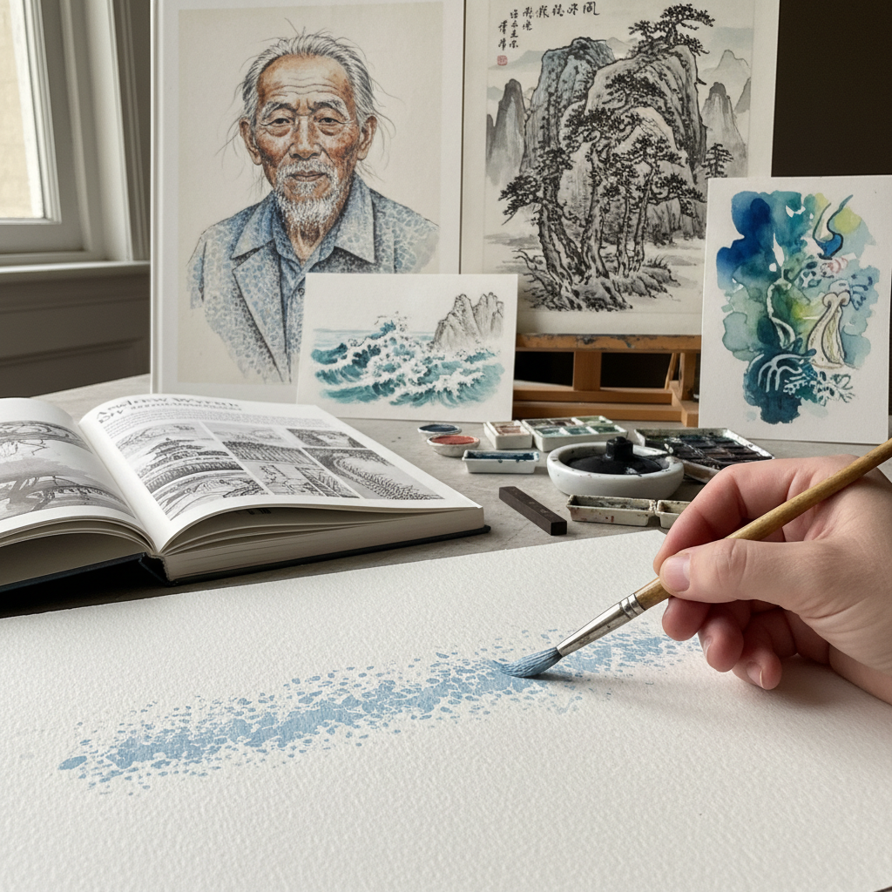

# Dry Brush Technique 干笔技法

> "Dry brush is the art of restraint — a nearly empty brush dragged across textured paper, leaving broken trails of pigment that suggest more than they state, creating atmosphere through what is absent as much as what is present." — Unknown

## 概述

干笔技法（Dry Brush Technique）是一种使用几乎不含水分（或溶剂）的画笔在纸张或画布上绘画的技法——笔上只有少量颜料，快速拖过粗糙的表面时，颜料只附着在纸张纹理的凸起部分，留下断续的、有纹理感的笔触。干笔法产生的效果是粗糙的、有颗粒感的、半透明的——与湿画法的流畅和饱满形成鲜明对比。

干笔法广泛应用于水彩画、水墨画、油画和丙烯画中。在水彩画中，干笔法用于表现粗糙的质感（如树皮、石头、草地）；在中国水墨画中，干笔（枯笔/飞白）是重要的笔法之一，用于表现苍劲、枯涩的效果；在油画中，干笔法用于创造薄透的覆盖效果。安德鲁·怀斯（Andrew Wyeth）是干笔水彩的当代大师。

## 核心特征

| 特征 | 描述 |
|------|------|
| 干燥 | 笔上几乎无水分 |
| 断续 | 断续的笔触效果 |
| 纹理 | 利用纸张纹理 |
| 质感 | 粗糙的质感表现 |
| 含蓄 | 含蓄的表现方式 |
| 多媒介 | 适用于多种媒介 |

## 视觉特征

- **断续**：断续的笔触
- **纹理**：粗糙的纹理感
- **透明**：半透明的效果
- **颗粒**：颗粒感的表面
- **含蓄**：含蓄的表现
- **苍劲**：苍劲的力度

## 代表作品

| 作品 | 艺术家 | 年代 | 意义 |
|------|--------|------|------|
| *Christina's World* | Andrew Wyeth | 1948 | 干笔水彩的经典 |
| *Dry brush watercolors* | Andrew Wyeth | 20世纪 | 干笔技法的大师 |
| *Chinese ink paintings* | Various | 传统 | 中国枯笔传统 |
| *Landscape studies* | Various | 当代 | 风景中的干笔应用 |
| *Contemporary dry brush* | Various | 当代 | 当代干笔创作 |

## 历史时间线

| 时期 | 事件 |
|------|------|
| 古代 | 中国书法中的飞白 |
| 宋代 | 中国水墨画中的枯笔传统 |
| 19世纪 | 水彩画中的干笔技法 |
| 20世纪 | Andrew Wyeth的干笔水彩 |
| 当代 | 干笔法在各媒介中的应用 |
| 当代 | 干笔法在插画中的流行 |

## 中国语境

干笔技法在中国有极其深厚的传统——中国书法中的"飞白"和中国水墨画中的"枯笔"都是干笔技法的经典应用。中国的文人画传统中，枯笔被视为高雅的笔法——表现苍劲、古拙、枯涩的美感。中国的书法教育中，飞白是重要的笔法之一。中国的水墨画教育中，干笔（枯笔）与湿笔的对比运用是基本功。中国的当代水墨画家继续发展干笔技法的表现力。

## AI生成概念图

## 与其他风格的关系

- **Wet-on-Wet** → 湿画法
- **Watercolor** → 水彩画
- **Chinese Ink Painting** → 中国水墨画
- **Calligraphy** → 书法
- **Scumbling** → 薄涂法
- **Texture Painting** → 肌理绘画

---

*浮光艺志 | Chronicle of Artistry*
