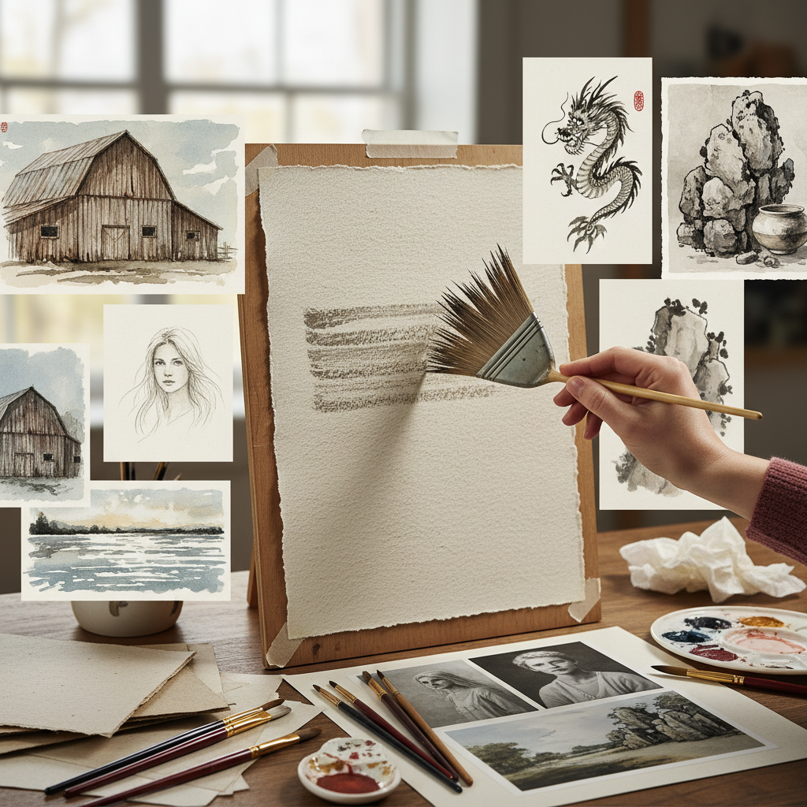

# Dry Brush 干笔法

> "Dry brush is the art of almost nothing — a brush barely loaded with paint dragged across textured paper or canvas, leaving broken marks that catch only the peaks of the surface, creating a shimmering texture that suggests more than it states." — Unknown

## 概述

干笔法（Dry Brush）是一种使用几乎不含水分或溶剂的画笔在纸面或画布上作画的技法。画笔蘸取少量颜料后，在调色板或纸巾上擦去多余的颜料，然后轻轻拖过画面——笔触只接触到纸面或画布的凸起部分，留下断续的、有纹理的痕迹。干笔法可以用于水彩、油画、丙烯和水墨等多种媒介。

干笔法的魅力在于其"暗示性"——断续的笔触让观者的眼睛自动补全信息，产生一种闪烁、透气的视觉效果。干笔法特别适合表现：粗糙的纹理（树皮、石头、老墙）、闪烁的光线（水面反光、阳光穿过树叶）、毛发和草地的质感。Andrew Wyeth是干笔水彩画的大师——他用干笔法创作了极其精细写实的水彩画。

## 核心特征

| 特征 | 描述 |
|------|------|
| 少量 | 极少量的颜料 |
| 断续 | 断续的笔触 |
| 纹理 | 利用纸面纹理 |
| 暗示 | 暗示性的表达 |
| 通用 | 适用于多种媒介 |
| 质感 | 丰富的质感效果 |

## 视觉特征

- **断续**：断续的笔触痕迹
- **纹理**：丰富的纹理效果
- **闪烁**：闪烁的光感
- **透气**：透气的画面
- **粗糙**：粗糙的质感
- **暗示**：暗示性的表达

## 代表作品

| 作品 | 艺术家 | 年代 | 意义 |
|------|--------|------|------|
| *Dry brush watercolors* | Andrew Wyeth | 20世纪 | 干笔水彩大师 |
| *Chinese ink dry brush* | Various | 传统 | 中国水墨干笔 |
| *Dry brush portraits* | Various | 当代 | 干笔肖像画 |
| *Landscape dry brush* | Various | 当代 | 干笔风景画 |
| *Mixed technique works* | Various | 当代 | 混合技法中的干笔 |

## 历史时间线

| 时期 | 事件 |
|------|------|
| 传统 | 中国水墨画中的"飞白"和干笔 |
| 19世纪 | 水彩画中的干笔技法发展 |
| 20世纪 | Andrew Wyeth的干笔水彩画 |
| 当代 | 干笔法在各种媒介中的应用 |
| 当代 | 干笔法在插画中的流行 |
| 当代 | 社交媒体上的干笔技法教程 |

## 中国语境

干笔法在中国有深厚的传统——中国水墨画中的"飞白"（flying white）和"枯笔"就是干笔法的经典应用。中国书法中的"飞白书"也是干笔效果。中国画论中对"干湿浓淡"的讨论包含了对干笔法的深入理解。中国的水彩画教学中，干笔法是基础技法之一。中国的当代水墨画家继续探索干笔法的表现力。干笔法在中国的美术教育中被视为控制力和表现力的重要训练。

## AI生成概念图

## 与其他风格的关系

- **Wet-on-Wet** → 湿画法
- **Watercolor** → 水彩画
- **Ink Wash** → 水墨画
- **Scumbling** → 干擦法
- **Texture** → 纹理表现
- **Chinese Calligraphy** → 中国书法

---

*浮光艺志 | Chronicle of Artistry*
