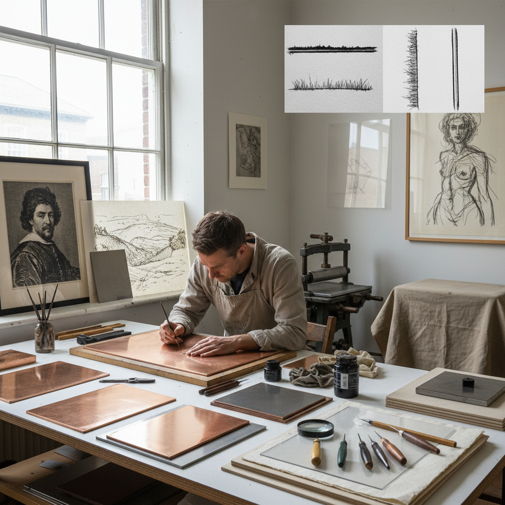

# Drypoint Art 干刻

> "Drypoint is drawing at its most immediate on metal — a sharp needle scratching directly into copper with no acid, no ground, no intermediary between intention and mark, the displaced metal curling up as a burr that holds ink in a soft feathery line unlike any other print technique, each impression slightly different as the fragile burr wears away, making every print a unique moment in the plate's brief life." — Unknown

## 概述

干刻（Drypoint）是一种凹版印刷技法——使用锋利的钢针或金刚石尖直接在金属板（通常是铜板或锌板）表面刻划线条，不使用酸液腐蚀。当针尖划过金属表面时，会在线条两侧翻起金属毛刺（burr）——这些毛刺在印刷时持墨，产生干刻特有的柔和、模糊、天鹅绒般的线条效果。

干刻是最直接的凹版技法——不需要涂防腐蚀层、不需要酸液、不需要等待——艺术家可以像用铅笔画画一样直接在板上作画。伦勃朗（Rembrandt）是干刻的大师——他在蚀刻作品中大量使用干刻来增加丰富的暗部效果。干刻的缺点是毛刺非常脆弱，在印刷压力下会逐渐磨损，因此每块板只能印刷约10-20张高质量的版画。

## 核心特征

| 特征 | 描述 |
|------|------|
| 直接 | 直接在板上刻划 |
| 毛刺 | 翻起的金属毛刺 |
| 柔和 | 柔和模糊的线条 |
| 有限 | 印刷数量有限 |
| 即兴 | 即兴直接的创作 |
| 独特 | 每张印刷略有不同 |

## 视觉特征

- **柔和**：柔和模糊的线条边缘
- **天鹅绒**：天鹅绒般的质感
- **即兴**：即兴的笔触感
- **深邃**：深邃的暗部
- **变化**：每张印刷的微妙变化
- **直接**：直接的表现力

## 代表作品

| 作品 | 艺术家 | 年代 | 意义 |
|------|--------|------|------|
| *Three Crosses* | Rembrandt | 1653 | 伦勃朗干刻杰作 |
| *Christ Healing the Sick* | Rembrandt | 约1648 | 伦勃朗百盾版画 |
| *Drypoint portraits* | Mary Cassatt | 19世纪 | 卡萨特干刻肖像 |
| *Contemporary drypoint* | Various | 当代 | 当代干刻艺术 |
| *Drypoint on plexiglass* | Various | 当代 | 有机玻璃干刻 |

## 历史时间线

| 时期 | 事件 |
|------|------|
| 15世纪 | 干刻的早期实践 |
| 17世纪 | 伦勃朗的干刻大师时期 |
| 19世纪 | 印象派画家的干刻实践 |
| 20世纪 | 毕加索等现代大师的干刻 |
| 当代 | 干刻在当代版画中的应用 |

## 中国语境

干刻在中国的版画教育中是重要的基础技法之一。中国的美术院校版画专业教授干刻作为凹版入门技法——因为它不需要酸液，相对安全简单。中国的一些版画家在创作中使用干刻——特别是在表现即兴和直接的笔触感时。中国的版画展览中经常可以看到干刻作品。当代中国的一些版画家使用有机玻璃（plexiglass）代替铜板进行干刻创作。

## AI生成概念图

## 与其他风格的关系

- **Copperplate Engraving** → 铜版雕刻
- **Etching** → 蚀刻
- **Mezzotint** → 美柔汀
- **Intaglio** → 凹版
- **Drawing** → 素描
- **Printmaking** → 版画

---

*浮光艺志 | Chronicle of Artistry*
