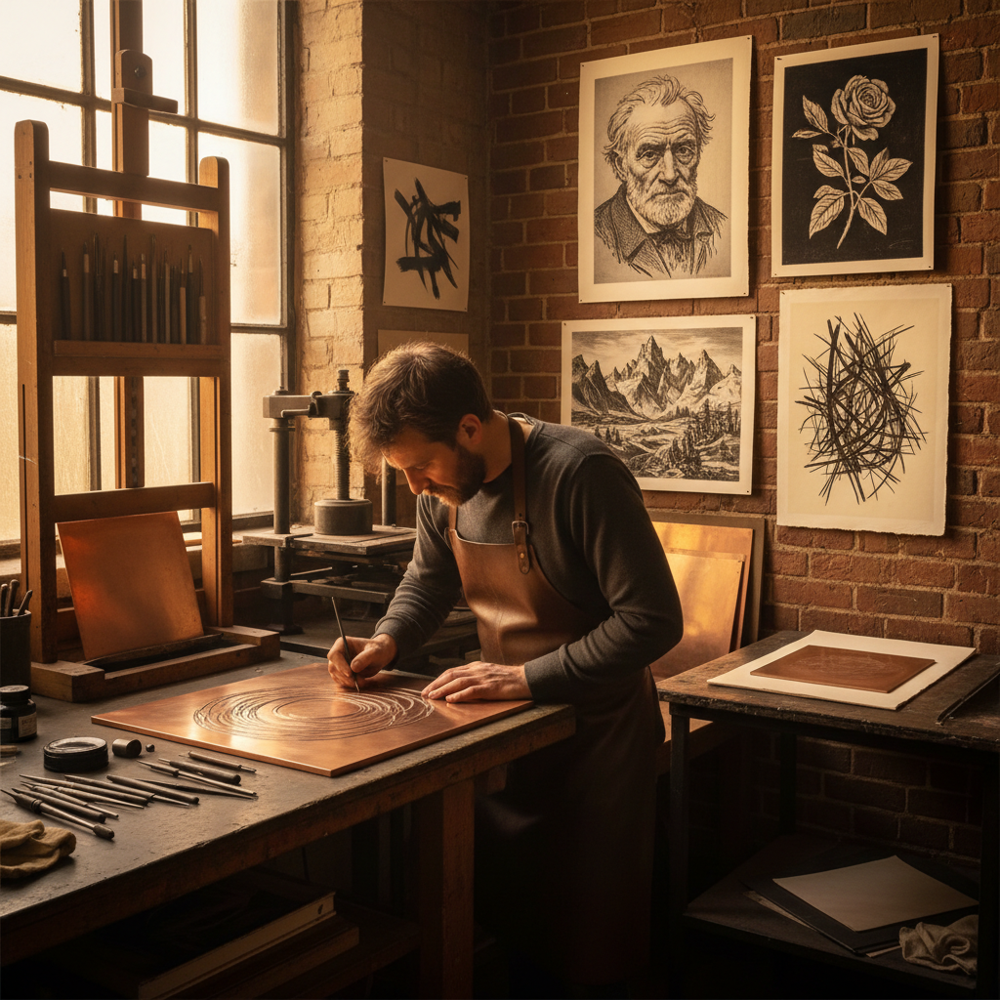

# Drypoint 干刻版画

> "Drypoint is drawing directly into metal — the needle scores the plate with an urgency that etching's acid bath can never match, and the burr it raises prints with a velvety richness all its own." — Unknown

## 概述

干刻版画（Drypoint）是一种凹版印刷技法——艺术家使用尖锐的针或钻石笔直接在金属版（通常是铜版或锌版）上刻画线条，无需使用酸液腐蚀。干刻的独特之处在于"毛刺"（burr）——针刻入金属时，被推起的金属碎屑留在沟槽两侧，这些毛刺在印刷时会吸附油墨，产生柔软、模糊、天鹅绒般的线条效果。这种效果是干刻版画独有的——温暖、柔和、富有表现力。

干刻的局限在于：毛刺在反复印刷中会被压平，因此每块版只能印出有限数量的高质量版画（通常10-25张）。这使得干刻版画具有稀缺性和珍贵性。

## 核心特征

| 特征 | 描述 |
|------|------|
| 直刻 | 直接刻入金属 |
| 毛刺 | 独特的毛刺效果 |
| 柔和 | 柔和的线条质感 |
| 限量 | 印数有限 |
| 即兴 | 直接、即兴的表现 |
| 凹版 | 凹版印刷技法 |

## 视觉特征

- **柔和**：天鹅绒般的线条
- **毛刺**：线条边缘的模糊感
- **温暖**：温暖的调子
- **即兴**：直接的笔触感
- **深浅**：线条深浅的变化
- **质感**：独特的印刷质感

## 代表作品

| 作品 | 艺术家 | 年代 | 意义 |
|------|--------|------|------|
| *The Three Crosses* | Rembrandt | 1653 | 干刻的经典 |
| *Drypoint portraits* | Mary Cassatt | 1890s | 印象派干刻 |
| *Drypoint landscapes* | James McNeill Whistler | 19世纪 | 风景干刻 |
| *Abstract drypoints* | Pablo Picasso | 20世纪 | 现代干刻 |
| *Contemporary drypoint* | Various | 当代 | 当代干刻艺术 |

## 历史时间线

| 时期 | 事件 |
|------|------|
| 15世纪 | 最早的干刻版画（Housebook Master） |
| 17世纪 | 伦勃朗将干刻推向高峰 |
| 19世纪 | 印象派艺术家的干刻实验 |
| 19世纪末 | Whistler和Cassatt的干刻 |
| 20世纪 | 现代艺术家的干刻探索 |
| 当代 | 当代干刻的复兴 |

## 中国语境

干刻版画在中国的版画教育和创作中占有一席之地。中国的版画传统以木刻为主（如鲁迅推动的新兴木刻运动），但铜版画（包括干刻）在20世纪后半叶逐渐发展。中国美术学院、中央美术学院等院校设有铜版画工作室，教授包括干刻在内的凹版技法。一些中国当代版画家如苏新平、王华祥等在铜版画领域有重要贡献。当代中国的版画展览中，干刻作品越来越多地出现。

## AI生成概念图

## 与其他风格的关系

- **Etching** → 蚀刻版画
- **Engraving** → 铜版画
- **Mezzotint** → 美柔汀
- **Aquatint** → 飞尘腐蚀
- **Intaglio** → 凹版印刷
- **Printmaking** → 版画

---

*浮光艺志 | Chronicle of Artistry*
