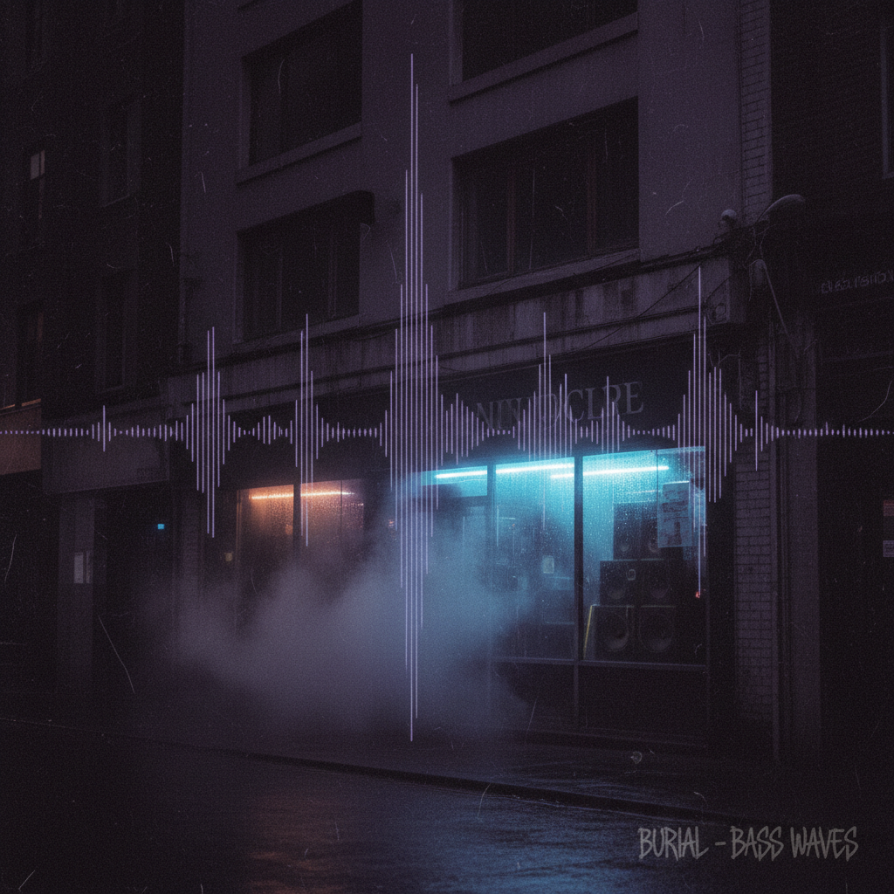

# Dubstep 回响贝斯



> **"Sub贝斯、半拍节奏、南伦敦车库——当贝斯变成了物理力量。"**

## 概述

| 维度 | 描述 |
|------|------|
| 时期 | 2001–至今 |
| 别名 | Dubstep, Bass Music, Brostep (美国变体) |
| 核心色彩 | 深紫、黑色、暗蓝、霓虹紫 |
| 关键元素 | Sub Bass、半拍节奏(Half-time)、Wobble、黑暗空间感 |
| 代表人物 | Skream, Benga, Digital Mystikz, Burial, Skrillex |
| 关联风格 | UK Garage, Jungle/DnB, Grime, Dub, Bass Music |

---

## 历史脉络

| 年份 | 事件 |
|------|------|
| 2001 | 南伦敦 Croydon——Dubstep 萌芽 |
| 2003 | FWD>> 俱乐部之夜——Dubstep 的"教堂" |
| 2005 | Digital Mystikz "Anti War Dub"——定义性作品 |
| 2006 | Burial "Burial"——Dubstep 的艺术巅峰 |
| 2007 | Skream "Midnight Request Line"——突破 |
| 2010 | Skrillex——"Brostep"美国化 |
| 2012 | 全球 EDM 浪潮中的 Dubstep |

### 核心哲学

Dubstep 的精神是**"贝斯是物理的——你不是听到它，你感受到它穿过你的身体"**：
- Sub Bass = 核心（"如果你的音箱不够大——你听不到真正的 Dubstep"）
- 空间 = 重要（"音符之间的沉默和音符一样重要"）
- 黑暗 = 美学（"午夜的南伦敦"）
- Dub = 根源（"牙买加 Dub 的孙子"）
- "真正的 Dubstep 不是 Skrillex——是 Burial 在雨中行走的感觉"

---

## 视觉语法

### 色彩系统

```
主色：
  深紫 (#1A001A) — 黑暗、深邃
  黑色 (#000000) — 夜晚、空间
  暗蓝 (#0D0D2B) — 午夜

辅色：
  霓虹紫 (#9400D3) — 能量
  深红 (#4A0000) — 温暖
  灰色 (#333333) — 城市

规则：
  - 极暗色调
  - 大量负空间
  - 低频的视觉化（波形）
  - 城市夜景

质感：
  烟雾 — 俱乐部
  雨水 — 伦敦
  混凝土 — 城市
  振动 — 贝斯的物理感
```

### 标志性元素

| 类别 | 元素 |
|------|------|
| 音乐 | Sub Bass、Half-time、Wobble、2-step变体 |
| 场所 | FWD>>、DMZ、Fabric、南伦敦 |
| 封面 | 极简、暗色、城市、抽象 |
| 厂牌 | Tempa, Hyperdub, Deep Medi |
| 文化 | Dubplate文化、Sound System |
| 态度 | 黑暗、深邃、物理、空间、伦敦 |

---

## 与千禧怀旧的关系

### 2000s 英国电子音乐的革新
- Dubstep = 2000s 英国最重要的电子音乐创新
- 从 UK Garage 的"优雅"到 Dubstep 的"黑暗"
- Burial "Untrue" (2007) = 2000s 最重要的电子专辑之一
- "Dubstep 让贝斯成为了一种艺术形式"

### 两个 Dubstep
- 英国原版 (2001-2009): 黑暗、空间、深邃
- 美国 Brostep (2010-): 攻击性、Drop、EDM
- "同一个名字，完全不同的音乐"

---

## 中国语境

- Bass Music 在中国的兴起
- 中国 Dubstep/Bass 制作人社区
- 与中国"重型电子"的交叉
- 深圳/成都的 Bass Music 场景

---

## 设计应用

| 场景 | 应用方式 |
|------|----------|
| 音乐 | 暗色+极简+波形+空间+深邃 |
| 品牌 | 黑暗+深度+物理+地下+创新 |
| 活动 | Sound System+暗色+烟雾+贝斯 |
| 数字 | 暗色+波形可视化+极简+空间 |

---

## 相关风格

← [UK Garage 英国车库](uk-garage.md) | [Jungle / DnB](jungle-dnb.md) →

↑ [返回千禧怀旧目录](README.md) | [返回总目录](../README.md)
