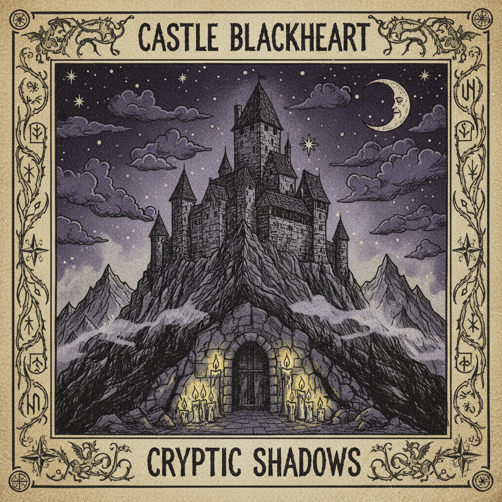

# Dungeon Synth 地牢合成器



> **"廉价合成器演奏的中世纪幻想——地下室里的骑士与巫师。"**

## 概述

| 维度 | 描述 |
|------|------|
| 时期 | 1990s（起源）/ 2010s（复兴） |
| 别名 | Dungeon Synth, DS, 地牢合成器, Medieval Synth |
| 核心色彩 | 深紫、森林绿、烛光金、石灰灰、羊皮纸黄 |
| 关键元素 | 中世纪幻想、Lo-fi合成器、城堡、地牢、手绘封面 |
| 代表人物 | Mortiis, Depressive Silence, Old Tower, Erang |
| 关联风格 | Dark Ambient, Black Metal, Medieval, Dark Fantasy, Lo-fi |

---

## 历史脉络

| 年份 | 事件 |
|------|------|
| 1991 | Mortiis离开Emperor乐队——开始solo合成器项目 |
| 1993 | Mortiis《Født til å Herske》——Dungeon Synth原型 |
| 1990s | 北欧黑金属圈的键盘手们创作"ambient"侧项目 |
| 2010s | Bandcamp复兴——新一代Dungeon Synth艺术家涌现 |
| 2015+ | Dungeon Synth成为独立的亚文化——脱离黑金属 |
| 2020s | 与TTRPG/D&D文化深度融合 |

### 核心哲学

Dungeon Synth的精神是**"用最简陋的工具创造最宏大的幻想世界"**：
- "一台廉价Casio键盘 + 想象力 = 一整个中世纪王国"
- "Lo-fi不是缺陷——是氛围的一部分"
- "这不是音乐——是通往另一个世界的门"
- "DIY精神：自己录、自己画封面、自己发行"
- "逃避主义不是懦弱——是必要的精神庇护"

---

## 视觉语法

### 色彩系统

```
主色：
  深紫 (#301934) — 魔法、神秘
  森林绿 (#228B22) — 荒野、精灵
  烛光金 (#FFD700) — 温暖、古老
  石灰灰 (#808080) — 城堡、地牢

辅色：
  羊皮纸黄 (#F5DEB3) — 地图、卷轴
  血红 (#8B0000) — 战斗、危险
  冰蓝 (#B0E0E6) — 北方、寒冷

视觉特征：
  手绘封面 — 业余但充满热情
  中世纪图案 — 城堡、骑士、龙
  Lo-fi质感 — 模糊、颗粒、褪色
  地图/卷轴 — 幻想世界的制图
  黑金属字体 — 难以辨认的logo

规则：
  - 手绘/手工 > 数字精致
  - 中世纪/幻想 > 现代/科幻
  - Lo-fi质感是美学选择
  - 封面 = 通往音乐世界的门
  - DIY精神贯穿一切
```

### 标志性元素

| 类别 | 元素 |
|------|------|
| 场景 | 城堡、地牢、森林、洞穴、塔楼 |
| 生物 | 龙、精灵、巫师、骑士、亡灵 |
| 物品 | 剑、盾、卷轴、水晶球、蜡烛 |
| 风格 | 手绘、Lo-fi、业余、真诚 |
| 媒介 | 磁带、CDR、Bandcamp |
| 态度 | 逃避主义、DIY、真诚、内向 |

---

## 与千禧怀旧/当代的关系

### D&D/TTRPG文化的音乐伴侣
- Dungeon Synth = D&D的背景音乐
- 2020s TTRPG复兴 → Dungeon Synth复兴
- "边听边玩" = 沉浸式桌游体验

### 与Dark Academia/Cottagecore的交集
- 对"前现代"世界的浪漫化
- 逃避主义 + 手工 + Lo-fi
- 但Dungeon Synth更暗、更地下、更nerd

---

## 设计应用

| 场景 | 应用方式 |
|------|----------|
| 音乐 | 专辑封面+磁带设计 |
| 游戏 | TTRPG+独立游戏+像素RPG |
| 出版 | 幻想小说+zine+手绘地图 |
| 品牌 | 独立+手工+幻想+复古 |

---

## 相关风格

← [Dark Fantasy 暗黑幻想](dark-fantasy.md) | [Dark Ambient 暗黑氛围](dark-ambient.md) →

↑ [返回千禧怀旧目录](README.md) | [返回总目录](../README.md)
