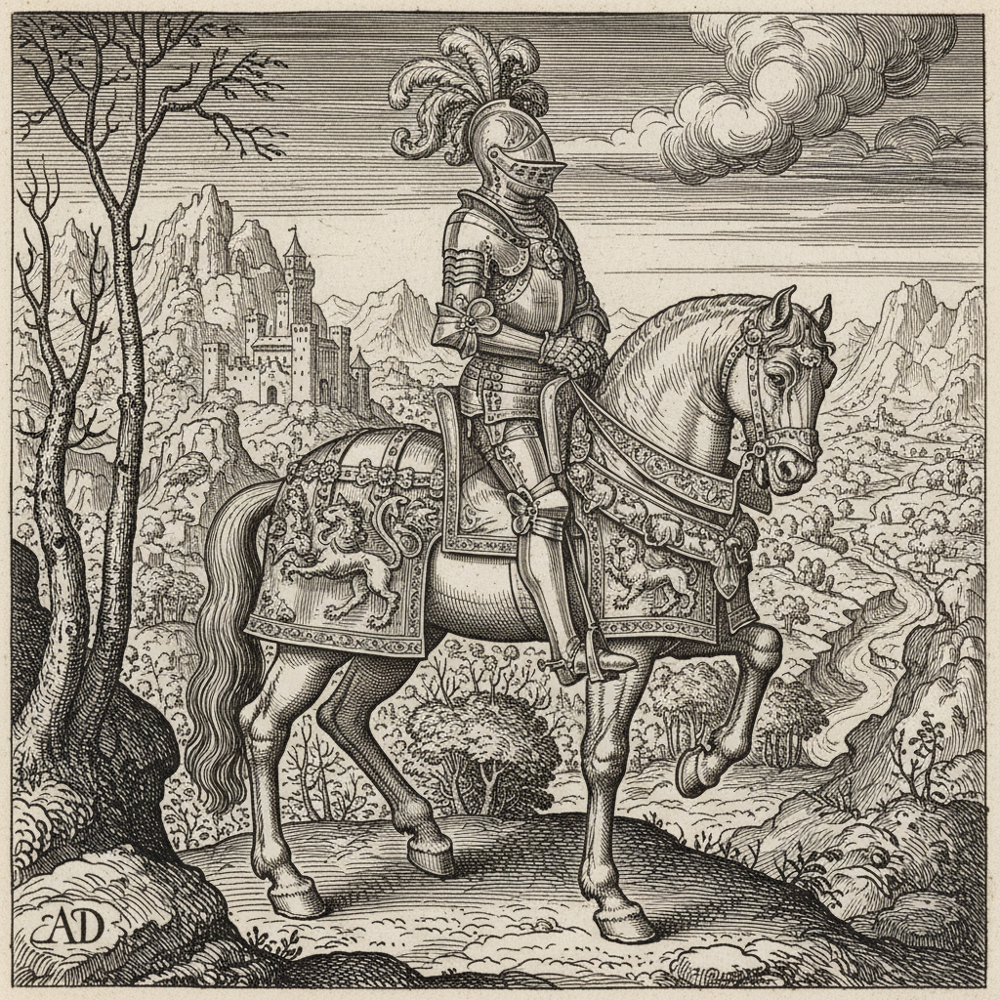

# Albrecht Dürer 丢勒

> "What beauty is, I know not, though it adheres to many things." — Albrecht Dürer

## 概述

阿尔布雷希特·丢勒（Albrecht Dürer，1471–1528）是德国文艺复兴最伟大的艺术家，也是西方版画史上无可争议的巅峰。他将意大利文艺复兴的理性精神与北方哥特传统的精密细节完美融合，在木刻、铜版画和水彩画领域都达到了前无古人的高度。

丢勒不仅是艺术家，更是理论家和科学观察者——他的自然研究和人体比例论著使他成为北方的达·芬奇。

## 核心特征

| 特征 | 描述 |
|------|------|
| 极致精密 | 超人的细节控制力——每根毛发可数 |
| 版画革命 | 将木刻和铜版画提升为独立艺术形式 |
| 自然研究 | 科学般精确的动植物写生 |
| 南北融合 | 意大利理性+北方细密的完美结合 |
| 自画像传统 | 西方最早系统性自画像的创作者 |
| 理论建构 | 人体比例和透视的数学研究 |

## 视觉特征

- **线条**：极其精密的平行排线和交叉排线
- **细节**：显微镜般的毛发、羽毛、草叶描绘
- **明暗**：纯粹通过线条密度实现的明暗层次
- **构图**：严谨的几何构图和对称性
- **质感**：金属、毛皮、织物的极致再现
- **黑白**：版画中黑白对比的戏剧性

## 代表作品

| 作品 | 年代 | 意义 |
|------|------|------|
| *Melencolia I* | 1514 | 西方版画的最高成就 |
| *Knight, Death and the Devil* | 1513 | 基督教骑士的寓言 |
| *Young Hare* | 1502 | 自然研究的典范 |
| *Self-Portrait at 28* | 1500 | 艺术家作为创造者 |
| *Rhinoceros* | 1515 | 想象与科学的交汇 |
| *The Four Horsemen* | 1498 | 启示录木刻系列 |

## 真实作品（公共领域）

| 作品 | 来源 |
|------|------|
| *Melencolia I* | [Met Museum](https://www.metmuseum.org/art/collection/search/336228) |
| *Young Hare* | [Albertina](https://www.albertina.at/en/collection/albrecht-duerer/) |
| *Self-Portrait at 28* | [Alte Pinakothek](https://www.sammlung.pinakothek.de/en/artwork/y7RoaqYYXG) |

> ⚠️ 本条目优先使用真实作品。

## AI生成概念图

## 与其他风格的关系

- **Northern Renaissance** → 北方文艺复兴的最高代表
- **Printmaking** → 版画作为独立艺术的奠基人
- **Scientific Illustration** → 科学插画的先驱
- **German Expressionism** → 德国表现主义追溯的精神源头
