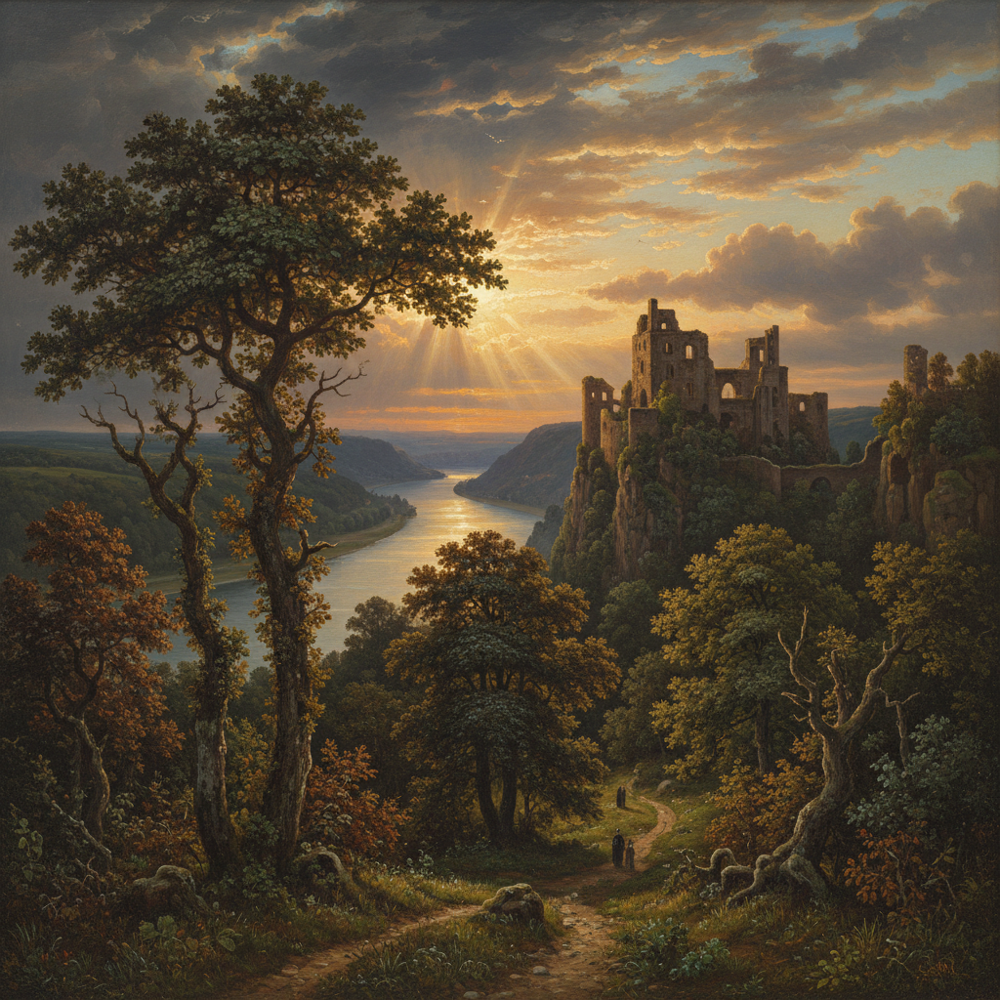

# Düsseldorf School 杜塞尔多夫画派

> "Nature is the artist's best teacher." — Johann Wilhelm Schirmer

## 概述

杜塞尔多夫画派（Düsseldorfer Malerschule）是19世纪（约1830–1870）以德国杜塞尔多夫美术学院为中心的绘画运动。该学院培养了大量风景画家和历史画家，其精确的素描训练和对自然的细致观察影响了整个北欧和美国的风景画传统——哈德逊河画派的多位核心成员都曾在此学习。

## 核心特征

| 特征 | 描述 |
|------|------|
| 学院训练 | 严格的素描基础和构图训练 |
| 精确描绘 | 对自然细节的精确观察和再现 |
| 理想化风景 | 将真实风景提升为理想化构图 |
| 叙事性 | 风景中常包含叙事性人物和故事 |
| 国际影响 | 吸引了挪威、美国、俄罗斯等国学生 |
| 光线处理 | 戏剧性的光线效果，尤其是日落和暴风雨 |

## 视觉特征

- **构图**：精心安排的古典风景构图
- **细节**：精确的植物学和地质学描绘
- **光线**：戏剧性的金色光芒或暴风雨天空
- **色调**：深绿、金褐、天蓝为主
- **人物**：小型叙事性点景人物
- **技法**：光滑的学院派表面处理

## 代表人物

| 画家 | 代表作 | 特点 |
|------|--------|------|
| Johann Wilhelm Schirmer | 意大利和莱茵河风景 | 学院风景画教授 |
| Andreas Achenbach | 海景和暴风雨 | "北方风景之父" |
| Carl Friedrich Lessing | 历史风景画 | 浪漫主义历史画 |
| Albert Bierstadt | 美国西部风景 | 赴美的杜塞尔多夫学生 |
| Emanuel Leutze | *Washington Crossing the Delaware* | 美国历史画 |
| Hans Fredrik Gude | 挪威峡湾风景 | 挪威风景画奠基人 |

## 与其他风格的关系

- **Hudson River School** → Bierstadt 等人将杜塞尔多夫训练带到美国
- **Romanticism** → 浪漫主义风景画的学院化
- **Barbizon School** → 同时代的法国对应物
- **Norwegian Romanticism** → 挪威画家在此接受训练
- **Academic Art** → 学院派训练体系的典范

## 概念图

---

*浮光艺志 | Chronicle of Artistry*
