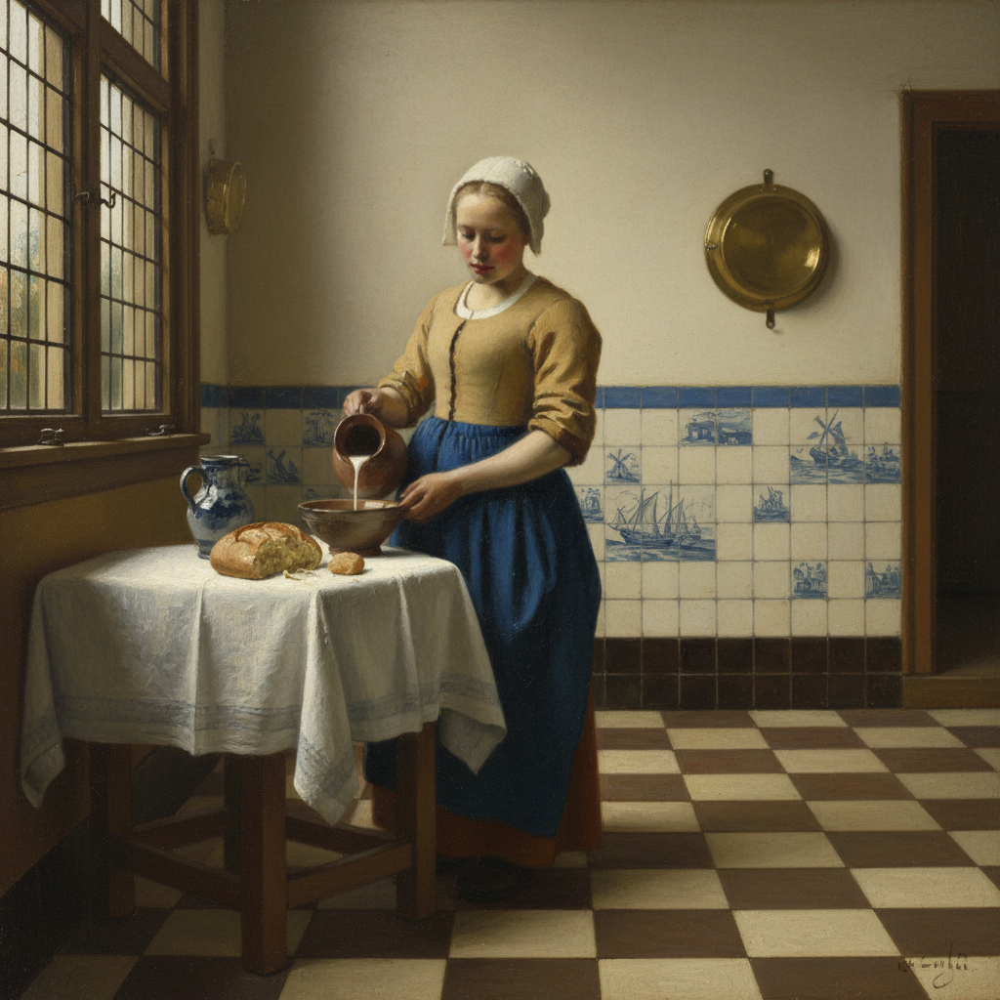

# Dutch Golden Age 荷兰黄金时代绘画

> "I do not paint things. I only paint the difference between things." — Henri Matisse (on Vermeer)

## 概述

荷兰黄金时代绘画（Dutch Golden Age Painting）是17世纪（约1600–1680）荷兰共和国在经济繁荣时期产生的绘画高峰。与同时期其他欧洲国家不同，荷兰绘画的主要赞助者不是教会或贵族，而是富裕的市民阶层，这催生了前所未有的世俗题材多样性——风景、静物、肖像、风俗画、海景、建筑内部等。

这一时期产生了伦勃朗、维米尔、哈尔斯等世界级大师，其对光线、质感和日常生活的精湛描绘至今仍是西方绘画的标杆。

## 核心特征

| 特征 | 描述 |
|------|------|
| 世俗题材 | 日常生活、静物、风景取代宗教画 |
| 光线大师 | 对自然光线的精确观察和表现 |
| 质感表现 | 丝绸、玻璃、金属、面包的极致质感 |
| 小尺幅 | 适合市民家庭悬挂的中小尺寸 |
| 象征寓意 | 静物中隐含的 vanitas（虚空）寓意 |
| 专业分工 | 画家专攻特定题材（花卉、海景等） |

## 题材分类

| 题材 | 代表画家 | 特点 |
|------|---------|------|
| 肖像画 | Rembrandt, Frans Hals | 心理深度，群像 |
| 风俗画 | Vermeer, Jan Steen | 日常生活场景 |
| 风景画 | Jacob van Ruisdael | 低地平线，壮阔天空 |
| 静物画 | Willem Claesz. Heda | 精致的质感，vanitas |
| 海景画 | Willem van de Velde | 荷兰海上霸权 |
| 建筑画 | Pieter Saenredam | 教堂内部的几何美 |
| 花卉画 | Rachel Ruysch | 精确的植物学描绘 |

## 视觉特征

- **光线**：柔和的北方窗光，或伦勃朗式的金色光辉
- **色调**：低调的褐色、金色、灰色为主
- **质感**：极度写实的材质表现
- **构图**：精心安排的日常场景
- **细节**：放大镜级别的精细描绘
- **氛围**：宁静、内省、时间凝固

## 代表人物

| 画家 | 代表作 | 特点 |
|------|--------|------|
| Rembrandt van Rijn | *The Night Watch* (1642) | 光影大师，心理深度 |
| Johannes Vermeer | *Girl with a Pearl Earring* (1665) | 光线诗人，极致静谧 |
| Frans Hals | *The Laughing Cavalier* (1624) | 生动笔触，瞬间捕捉 |
| Jacob van Ruisdael | *Windmill at Wijk* | 荷兰风景画巅峰 |
| Pieter de Hooch | 庭院和室内场景 | 空间与光线的几何 |

## 历史背景

1. **1581年**：荷兰共和国独立，新教改革禁止教堂装饰画
2. **1600-20年代**：市民阶层成为艺术赞助主力
3. **1630-60年代**：黄金时代鼎盛期，画家数量爆发
4. **1672年**：灾难年（法国入侵），经济衰退，画市萎缩

## 与其他风格的关系

- **Baroque** → 同时期但风格更内敛、世俗
- **Chiaroscuro** → 伦勃朗发展出独特的明暗语言
- **Realism** → 19世纪现实主义的重要先驱
- **Impressionism** → 维米尔的光线处理启发了印象派
- **Grimshaw** → 继承了荷兰画派对夜景和光线的关注

## 概念图

---

*浮光艺志 | Chronicle of Artistry*
