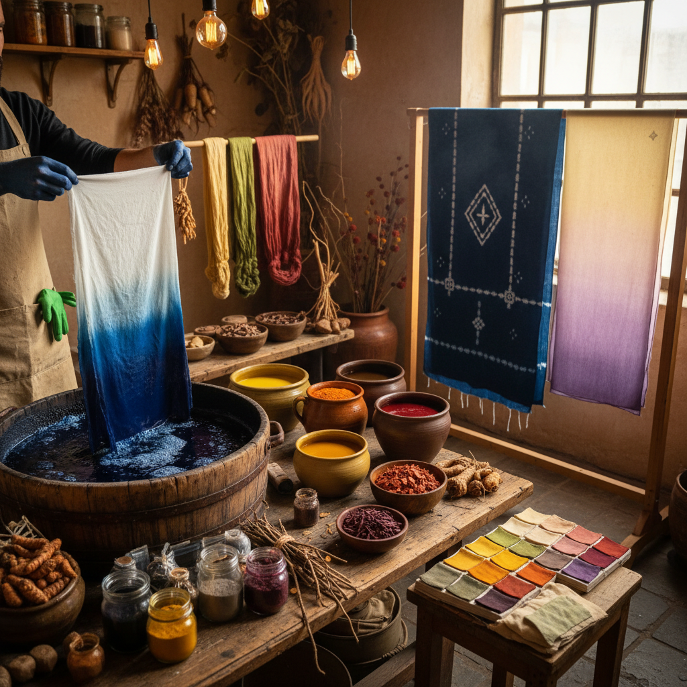

# Dyeing 染色

> "Dyeing is alchemy in water — pigment and fiber meeting in a bath where heat, time, and chemistry conspire to transform white cloth into every color the earth and laboratory can offer." — Unknown

## 概述

染色（Dyeing）是将颜色永久性地附着到纤维、纱线或织物上的工艺。染色是人类最古老的工艺之一——从史前时代使用植物、矿物和动物提取物染色，到现代的合成染料，染色技术经历了数千年的发展。染色的基本原理是：染料分子与纤维分子之间形成化学键或物理吸附，使颜色牢固地附着在纤维上。

染色的主要类别包括：天然染色（natural dyeing，使用植物、昆虫、矿物等天然来源）和合成染色（synthetic dyeing，使用化学合成的染料）。天然染色的复兴是当代慢时尚和可持续纺织运动的重要组成部分。染色技法包括：浸染、扎染（tie-dye）、蜡染（batik）、型染（stencil dyeing）、绞缬（shibori）等。

## 核心特征

| 特征 | 描述 |
|------|------|
| 着色 | 将颜色附着于纤维 |
| 化学 | 化学反应或吸附 |
| 媒染 | 媒染剂固色 |
| 天然 | 天然或合成染料 |
| 多技 | 多种染色技法 |
| 古老 | 最古老的工艺之一 |

## 视觉特征

- **色彩**：丰富的色彩
- **渐变**：自然的色彩渐变
- **渗透**：染料的渗透效果
- **不规则**：天然染色的不规则性
- **层次**：多次染色的层次
- **质感**：染色后的织物质感

## 代表作品

| 作品 | 艺术家 | 年代 | 意义 |
|------|--------|------|------|
| *Tyrian purple* | 腓尼基人 | 古代 | 最珍贵的古代染料 |
| *Indigo dyeing* | 匿名 | 传统 | 靛蓝染色传统 |
| *William Morris textiles* | William Morris | 19世纪 | 天然染色复兴 |
| *Contemporary natural dye* | Various | 当代 | 当代天然染色 |
| *Acid dye art* | Various | 当代 | 当代酸性染色艺术 |

## 历史时间线

| 时期 | 事件 |
|------|------|
| 公元前3000年+ | 最早的染色证据 |
| 古代 | 泰尔紫、靛蓝等珍贵染料 |
| 中世纪 | 染色行会的建立 |
| 1856 | 第一种合成染料（苯胺紫） |
| 20世纪 | 合成染料的全面普及 |
| 当代 | 天然染色的复兴运动 |

## 中国语境

染色在中国有着极其悠久和辉煌的历史——中国是世界上最早掌握植物染色技术的国家之一。中国传统的染色技艺包括：蓝印花布（靛蓝防染）、扎染（云南大理）、蜡染（贵州苗族）、夹缬、绞缬等。中国的丝绸染色技术在历史上领先世界。当代中国的天然染色运动正在复兴——一些设计师和工艺师回归植物染色，探索草木染的可能性。中国的蓝印花布、扎染、蜡染等被列为国家级非物质文化遗产。

## AI生成概念图

## 与其他风格的关系

- **Batik** → 蜡染
- **Shibori** → 绞缬
- **Ikat** → 经纬染
- **Tie-dye** → 扎染
- **Textile Art** → 纺织艺术
- **Natural Dye** → 天然染色

---

*浮光艺志 | Chronicle of Artistry*
