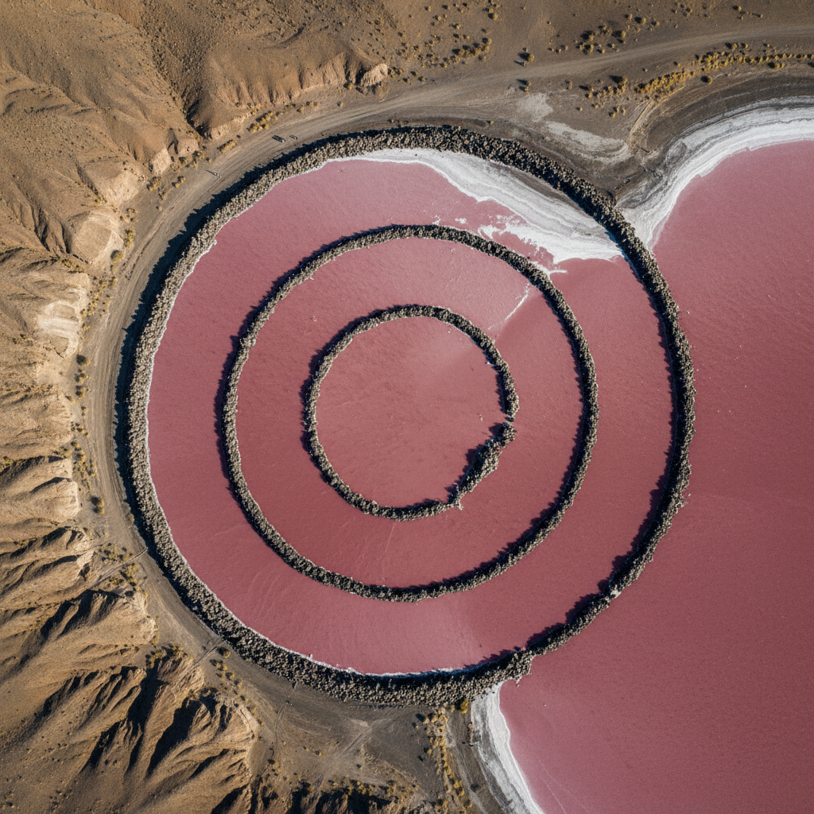

# Earth Art 大地艺术

> "I am for an art that takes into account the direct effect of the elements as they exist from day to day." — Robert Smithson

## 概述

大地艺术（Earth Art / Land Art / Earthworks）是1960年代末至1970年代兴起的艺术运动，艺术家直接以大地本身——泥土、岩石、水、植物——作为材料和画布，在自然景观中创造大规模的雕塑和干预。它是对画廊系统、艺术商品化和城市生活的激进逃离。

大地艺术作品通常位于偏远的沙漠、湖泊或荒野中，无法被搬进博物馆，只能通过亲身体验或照片/影像来接触——这本身就是对艺术体制的挑战。

## 核心特征

| 特征 | 描述 |
|------|------|
| 自然材料 | 泥土、岩石、水、植物、冰、闪电 |
| 巨大尺度 | 从航空视角才能完整看到的规模 |
| 现场特定 | 与特定地点不可分离 |
| 反画廊 | 拒绝白盒子空间和商品化 |
| 时间性 | 接受自然侵蚀和季节变化 |
| 过程性 | 建造过程本身是作品的一部分 |

## 视觉特征

- **材料**：泥土、玄武岩、盐晶、树枝、冰
- **尺度**：数百米到数公里的巨大规模
- **形态**：螺旋、线条、圆形、切割
- **色彩**：大地本色——赭石、黑色、白色（盐）
- **空间**：荒漠、湖泊、山谷、海岸
- **时间**：随季节、天气、年代变化

## 代表作品

| 作品 | 艺术家 | 年代 | 意义 |
|------|--------|------|------|
| *Spiral Jetty* | Robert Smithson | 1970 | 大地艺术的标志——大盐湖中的玄武岩螺旋 |
| *Double Negative* | Michael Heizer | 1969-70 | 在沙漠中挖出两道巨大切口 |
| *Lightning Field* | Walter De Maria | 1977 | 400根不锈钢杆吸引闪电 |
| *Running Fence* | Christo & Jeanne-Claude | 1976 | 39公里的白色织物围栏 |
| *Sun Tunnels* | Nancy Holt | 1973-76 | 混凝土管道框住太阳和星星 |
| *A Line Made by Walking* | Richard Long | 1967 | 最简单的大地艺术——走出一条线 |

## 历史时间线

| 时期 | 事件 |
|------|------|
| 1967 | Richard Long走出第一条线 |
| 1968 | "Earthworks"展览在Dwan Gallery举办 |
| 1969 | Heizer开始Double Negative |
| 1970 | Smithson建造Spiral Jetty |
| 1976 | Christo的Running Fence横跨加州 |
| 1977 | De Maria完成Lightning Field |
| 1980 | Smithson因飞机失事去世（年仅35岁） |
| 1990s-至今 | 大地艺术影响环境艺术和生态艺术 |

## 子类型

| 子类型 | 特征 |
|--------|------|
| 美国大地艺术 | Smithson、Heizer——沙漠中的巨型干预 |
| 英国大地艺术 | Long、Goldsworthy——轻触式的自然介入 |
| 包裹艺术 | Christo——用织物包裹建筑和景观 |
| 天文大地艺术 | Holt、Turrell——与天体运动对话 |
| 生态大地艺术 | 修复性的——用艺术修复受损景观 |

## 中国语境

大地艺术与中国传统的"天人合一"哲学有深层共鸣。中国古代的园林艺术本身就是一种大地艺术——在自然中创造人工与自然融合的景观。当代中国大地艺术实践包括：蔡国强在各地的火药爆破项目、许江的大型户外装置、以及越来越多的乡村艺术节（如越后妻有模式的中国版本）。

## 争议与遗产

- **争议**：在荒野中大规模施工是否破坏了自然？
- **男性主导**：早期大地艺术被批评为"男性征服自然"的英雄主义
- **可及性**：偏远作品普通人难以到达——是否精英主义？
- **保存问题**：自然侵蚀是接受还是修复？
- **遗产**：为环境艺术、生态艺术、公共艺术奠定基础
- **当代回响**：James Turrell的Roden Crater、生态修复项目

## 真实作品（公共领域）

| 作品 | 来源 |
|------|------|
| *Spiral Jetty* (Smithson) | [Dia Art Foundation](https://www.diaart.org/visit/visit-our-locations-702/robert-smithson-spiral-jetty) |
| *A Line Made by Walking* (Long) | [Tate](https://www.tate.org.uk/art/artworks/long-a-line-made-by-walking-p07149) |

> ⚠️ 本条目优先使用真实作品。

## AI生成概念图

## 与其他风格的关系

- **Land Art** → 大地艺术的同义词
- **Minimalism** → 极简主义的几何纯粹性延伸到景观尺度
- **Post-Minimalism** → 后极简主义的材料关注扩展到自然材料
- **Process Art** → 自然过程（侵蚀、生长）成为作品的一部分
- **Environmental Art** → 环境艺术是大地艺术的生态化延伸
- **Site-Specific Art** → 现场特定艺术继承了大地艺术的地点关注

---

*浮光艺志 | Chronicle of Artistry*
