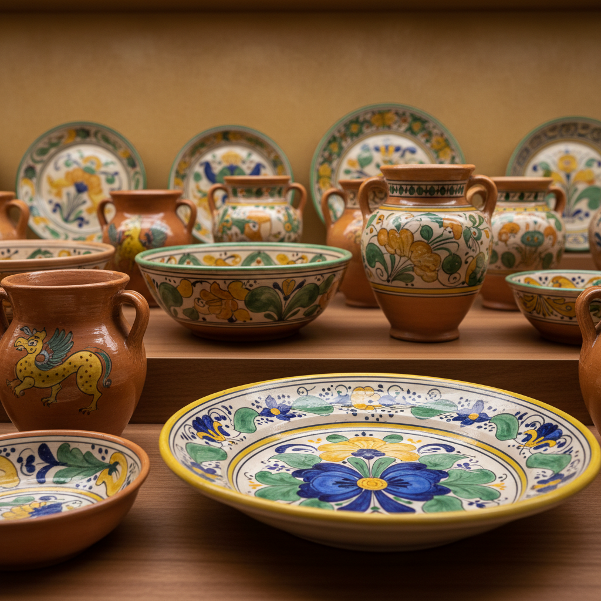

# Earthenware Art 陶器艺术

> "Earthenware is humanity's first partnership with fire — clay dug from the riverbank, shaped by hand, and hardened in flames just hot enough to transform mud into stone, the porous body still breathing like the earth it came from, warm to the touch and resonant when struck, the foundation upon which all ceramic civilization was built and the material that still connects us most directly to our ancestors' hands." — Unknown

## 概述

陶器艺术（Earthenware Art）是一种使用普通粘土在较低温度（900-1150°C）下烧制而成的陶瓷艺术。陶器是人类最早制作的陶瓷类型——比瓷器早了数千年。陶器的特点是烧成温度较低、胎体多孔、不透光，通常需要施釉才能防水。从史前的素陶到伊斯兰的彩釉陶，从意大利的马约利卡到英国的锡釉陶，陶器在世界各地发展出丰富多样的传统。

陶器艺术的核心要素包括：1）低温烧制——900-1150°C的烧制温度；2）多孔胎体——未完全玻化的多孔结构；3）普通粘土——使用普通的低温粘土；4）施釉需求——通常需要施釉防水；5）色彩丰富——低温釉可实现丰富色彩；6）全球传统——世界各地的陶器传统；7）功能与美——兼具实用和装饰功能。

## 核心特征

| 特征 | 描述 |
|------|------|
| 低温烧制 | 较低的烧制温度 |
| 多孔胎体 | 透气的多孔结构 |
| 色彩丰富 | 低温釉的丰富色彩 |
| 历史最久 | 最古老的陶瓷类型 |
| 全球分布 | 世界各地的传统 |
| 实用美观 | 功能与装饰兼备 |

## 视觉特征

- **温暖色调**：红、黄、褐等暖色胎体
- **釉面色彩**：丰富多彩的低温釉
- **质朴质感**：未施釉部分的土质感
- **手工痕迹**：传统手工制作的痕迹
- **装饰多样**：刻花、彩绘、贴花等
- **文化特色**：各地区的独特风格

## 代表作品

| 作品 | 艺术家/文化 | 年代 | 意义 |
|------|-------------|------|------|
| *仰韶彩陶* | 中国新石器 | 公元前5000年 | 中国最早的彩陶 |
| *古希腊彩绘陶* | 古希腊 | 公元前6-4世纪 | 希腊陶器传统 |
| *伊斯兰彩釉陶* | 伊斯兰世界 | 8-15世纪 | 伊斯兰陶器 |
| *马约利卡陶* | 意大利 | 15-16世纪 | 意大利锡釉陶 |
| *当代陶器* | 各地陶艺家 | 当代 | 陶器的现代演绎 |

## 历史时间线

| 时期 | 事件 |
|------|------|
| 公元前20000年 | 最早的陶器出现（中国） |
| 新石器时代 | 陶器在全球普及 |
| 古代文明 | 各大文明的陶器传统 |
| 中世纪 | 伊斯兰和欧洲陶器的发展 |
| 当代 | 陶器在艺术中的持续应用 |

## 中国语境

中国是世界上最早制作陶器的国家之一——江西仙人洞遗址出土的陶片距今约20000年。中国新石器时代的陶器文化极其丰富：仰韶文化的彩陶以其精美的几何纹样著称，马家窑文化的旋涡纹彩陶是史前艺术的杰作，龙山文化的黑陶以薄如蛋壳的工艺闻名。唐三彩是中国低温釉陶的巅峰——以黄、绿、白三色为主的铅釉陶器。中国的陶器传统至今延续——从宜兴的紫砂到各地的民间陶器，陶器仍然是中国人日常生活的一部分。

## AI生成概念图

## 与其他风格的关系

- **Terra Cotta** → 赤陶
- **Stoneware** → 炻器
- **Porcelain** → 瓷器
- **Majolica** → 马约利卡
- **Tin Glaze** → 锡釉
- **Primitive Pottery** → 原始陶器

---

*浮光艺志 | Chronicle of Artistry*
