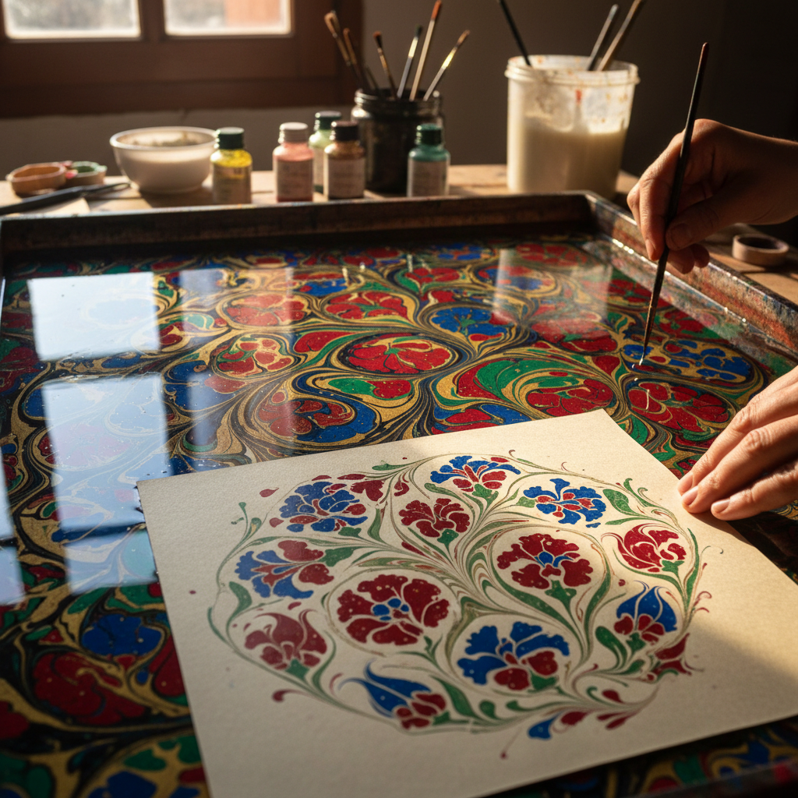

# Ebru Art 土耳其水拓画艺术

> "Ebru is painting on water — pigments are sprinkled onto a bath of thickened water where they float on the surface, then manipulated with combs, needles, and breath into swirling patterns of extraordinary delicacy. A sheet of paper is laid gently on the surface and lifts away carrying the design in a single, unrepeatable moment. Every ebru is unique because the water never holds the same pattern twice." — Unknown

## 概述

土耳其水拓画艺术（Ebru Art）是一种在加稠的水面上用颜料创作图案，然后将图案转印到纸张上的传统艺术——源自中亚和土耳其的古老技法。Ebru（土耳其语，源自波斯语"abru"，意为"水面"或"云彩"）以其流动的大理石纹理和花卉图案著称，2014年被联合国教科文组织列入人类非物质文化遗产代表作名录。

土耳其水拓画艺术的实践包括：1）Battal——自由洒落颜料形成的石纹；2）Gel-git——用梳子拉出的来回纹；3）Tarakli——梳纹图案；4）Hatip——花卉图案；5）Necmeddin——几何花卉；6）当代Ebru——将传统技法与现代表达结合的创作；7）书法Ebru——在水拓画上书写阿拉伯书法。

## 核心特征

| 特征 | 描述 |
|------|------|
| 水面 | 在水面上作画 |
| 唯一 | 每件作品不可重复 |
| 流动 | 流动的图案 |
| 转印 | 从水面转印到纸 |
| 偶然 | 可控的偶然性 |
| 冥想 | 冥想般的创作过程 |

## 视觉特征

- **流动**：流动的大理石纹理
- **色彩**：鲜艳丰富的色彩
- **有机**：有机自然的图案
- **对称**：花卉图案的对称性
- **层次**：多层颜料的层次
- **优雅**：优雅精致的整体感

## 代表作品

| 作品 | 艺术家/文化 | 年代 | 意义 |
|------|-------------|------|------|
| *Ottoman ebru manuscripts* | 奥斯曼 | 15世纪起 | 奥斯曼手抄本装饰 |
| *Hatip Mehmed Efendi works* | 土耳其 | 18世纪 | 花卉水拓画大师 |
| *Necmeddin Okyay works* | 土耳其 | 20世纪 | 现代水拓画大师 |
| *Hikmet Barutçugil works* | 土耳其 | 当代 | 当代水拓画大师 |
| *Contemporary ebru* | 国际 | 当代 | 当代水拓画发展 |

## 历史时间线

| 时期 | 事件 |
|------|------|
| 古代 | 中亚水拓画的起源 |
| 15世纪 | 奥斯曼帝国的水拓画传统 |
| 17-18世纪 | 水拓画的黄金时代 |
| 19世纪 | 传入欧洲成为"大理石纸" |
| 2014年 | 列入UNESCO非遗名录 |

## 中国语境

水拓画艺术在中国有一定的认知和发展。中国古代有类似的"流沙笺"和"洒金纸"技法——虽然与土耳其水拓画有所不同但原理相近。中国当代的艺术教育中，水拓画作为一种创意表达方式正在获得关注——特别是在儿童艺术教育中。中国的一些艺术家开始学习和实践土耳其水拓画——将其与中国传统水墨的流动性结合。中国的非遗保护工作中，对类似的传统纸张装饰技法有所关注——如传统的粉蜡笺制作。中国的一些文创品牌将水拓画图案应用于产品设计——利用其独特的流动美感。中国与土耳其的文化交流中，水拓画是重要的艺术交流项目——两国艺术家互相学习和展示。

## AI生成概念图

## 与其他风格的关系

- **Paper Marbling** → 大理石纸
- **Suminagashi** → 日本墨流
- **Calligraphy** → 书法艺术
- **Islamic Art** → 伊斯兰艺术
- **Fluid Art** → 流体艺术
- **Abstract Art** → 抽象艺术

---

*浮光艺志 | Chronicle of Artistry*
