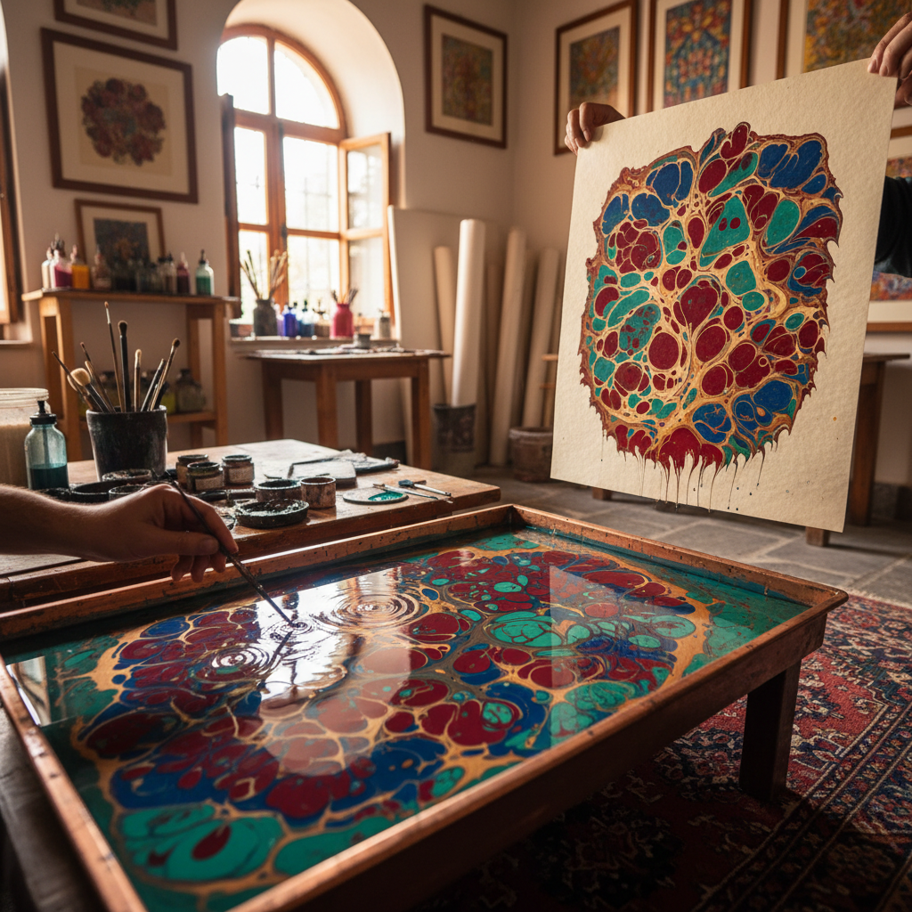

# Ebru 水拓画

> "Ebru is painting on water — capturing the fleeting dance of colors before they disappear." — Unknown

## 概述

水拓画（Ebru，土耳其语"云彩"）是在水面上用特殊颜料创造图案，然后将纸张覆盖在水面上转印图案的古老艺术。颜料在水面上自由流动、扩散、相互推挤，形成如大理石纹般的美丽图案。从奥斯曼帝国的书法装饰到日本的墨流し，从欧洲的大理石纹纸到当代的水拓艺术，这种"水上绘画"以其不可预测的美感和东方的诗意吸引了全世界。

水拓画的哲学在于：与水合作而非对抗——艺术家引导颜料，但最终的图案由水的流动决定。

## 核心特征

| 特征 | 描述 |
|------|------|
| 水面 | 在水面上创作 |
| 流动 | 颜料在水面自由流动 |
| 转印 | 将水面图案转印到纸上 |
| 不可控 | 部分不可预测的效果 |
| 唯一 | 每张都是独一无二的 |
| 大理石纹 | 常产生大理石般的纹理 |

## 视觉特征

- **流动**：颜料流动的有机线条
- **纹理**：大理石般的纹理效果
- **色彩**：鲜艳的色彩对比
- **有机**：自然有机的形态
- **层次**：颜料层叠的效果
- **唯一**：每张图案都不同

## 代表作品

| 作品 | 艺术家 | 年代 | 意义 |
|------|--------|------|------|
| *Ottoman ebru* | 匿名 | 15-19世纪 | 奥斯曼水拓传统 |
| *Hatip ebru* | Hatip Mehmed Efendi | 18世纪 | 花卉水拓的创始 |
| *Japanese suminagashi* | 匿名 | 12世纪+ | 日本墨流 |
| *European marbled papers* | 匿名 | 17世纪+ | 欧洲大理石纹纸 |
| *Contemporary ebru* | Garip Ay | 2010s+ | 当代水拓艺术 |
| *UNESCO recognition* | — | 2014 | 土耳其水拓列入非遗 |

## 历史时间线

| 时期 | 事件 |
|------|------|
| 古代 | 中国和日本的早期水拓 |
| 12世纪 | 日本墨流し的发展 |
| 15世纪 | 奥斯曼帝国的ebru传统 |
| 17世纪 | 水拓传入欧洲 |
| 18-19世纪 | 欧洲书籍装帧的大理石纹纸 |
| 2014 | UNESCO认定土耳其ebru为非遗 |
| 当代 | 水拓艺术的全球复兴 |

## 中国语境

水拓画在中国有古老的渊源——中国的"流沙笺"和"洒金纸"可追溯到唐代，是水拓技法的早期形式。当代中国的水拓画在手工纸艺和儿童美术教育中有广泛应用。中国的水墨画精神——"随水而动"——与水拓画的创作理念有深刻的相通。近年来，水拓画在中国的手工艺爱好者中越来越流行。

## AI生成概念图

## 与其他风格的关系

- **Marbling** → 大理石纹是水拓的欧洲名称
- **Suminagashi** → 日本墨流是水拓的东方形式
- **Ink Wash** → 水墨画与水拓有水的精神
- **Abstract Art** → 水拓的抽象美感
- **Book Art** → 书籍装帧中的水拓纸
- **Fluid Art** → 流体艺术是当代水拓的延伸

---

*浮光艺志 | Chronicle of Artistry*
