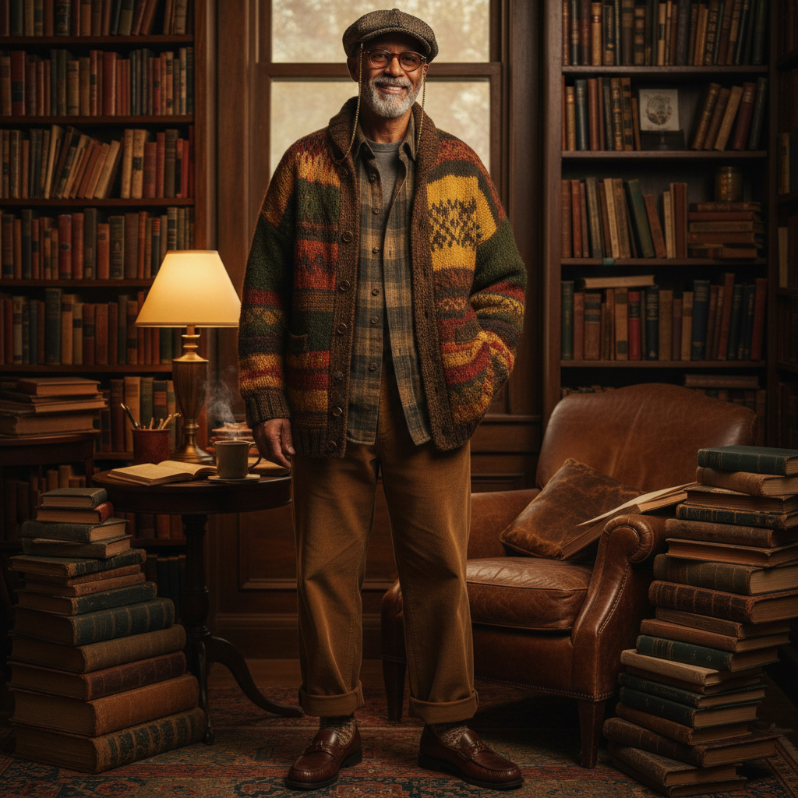

# Eclectic Grandpa 古怪爷爷



> **"超大号针织衫、宽松裤、老花镜链——穿得像你最有品味的爷爷。"**

## 概述

| 维度 | 描述 |
|------|------|
| 时期 | 2024–至今 |
| 别名 | Eclectic Grandpa, Grandpa Style, Grandpacore |
| 核心色彩 | 棕色、米色、橄榄绿、酒红、灰色 |
| 关键元素 | 超大号针织衫、宽松裤、眼镜链、报童帽 |
| 代表人物 | Jeff Goldblum、《Succession》角色 |
| 关联风格 | Normcore, Old Money, Quiet Luxury, Grandmillennial |

---

## 历史脉络

### 从"爷爷衣橱"到时尚前沿

| 年份 | 事件 |
|------|------|
| 永恒 | 老年男性的经典穿着 |
| 2019 | 《Succession》带火"有钱老男人"穿搭 |
| 2023 | Oversized 针织衫趋势 |
| 2024年初 | Pinterest 预测为年度趋势 |
| 2024 | "Eclectic Grandpa" 成为正式美学名称 |

### 核心哲学

Eclectic Grandpa 的精神是**"舒适、有品味、不在乎别人怎么想"**：
- 穿了30年的外套比新买的更有味道
- 舒适 > 性感
- "我不追潮流——潮流追我"
- 混搭是因为"我喜欢"不是因为"它配"
- 年龄是品味的积累

---

## 视觉语法

### 色彩系统

```
主色：
  棕色 (#8B4513) — 皮革、针织
  米色 (#F5F5DC) — 衬衫、裤子
  橄榄绿 (#556B2F) — 外套、帽子
  酒红 (#722F37) — 围巾、毛衣
  灰色 (#808080) — 羊毛、西装

辅色：
  芥末黄 (#FFDB58) — 点缀
  深蓝 (#000080) — 经典
  格纹 — 混合色

质感：
  粗针织 — 毛衣、开衫
  灯芯绒 — 裤子、夹克
  羊毛 — 外套、围巾
  皮革 — 皮带、鞋
  格纹 — 衬衫、围巾
```

### 标志性元素

| 类别 | 元素 |
|------|------|
| 上装 | 超大号针织衫、格纹衬衫、灯芯绒夹克 |
| 下装 | 宽松裤、灯芯绒裤、高腰裤 |
| 配饰 | 眼镜链、报童帽、围巾、怀表 |
| 鞋 | 乐福鞋、德比鞋、New Balance |
| 层次 | 衬衫+毛衣+外套 = 三层叠穿 |

---

## 与千禧怀旧的关系

### 对"年轻=好"的反叛
- 时尚一直崇拜年轻
- Eclectic Grandpa = "老也可以很酷"
- 与 Quiet Luxury 共享"不需要证明"的精神
- 是 Normcore 的"升级版"——从"普通"到"有品味的普通"

---

## 中国语境

- "爷爷风"/"学者风"在小红书的讨论
- 与"文艺风"/"学院风"的交叉
- 中国版：针织开衫+宽松裤+圆框眼镜
- 与"松弛感"审美的高度契合

---

## 设计应用

| 场景 | 应用方式 |
|------|----------|
| 品牌 | 暖棕色+衬线字体+复古质感+舒适 |
| 空间 | 木质+皮革+书架+暖光 |
| 时尚 | 层叠+宽松+天然面料+混搭 |
| 零售 | 复古陈列+温暖氛围+手工感 |

---

## 相关风格

← [Normcore 正常核](normcore.md) | [Old Money 老钱风](old-money.md) →

↑ [返回千禧怀旧目录](README.md) | [返回总目录](../README.md)
